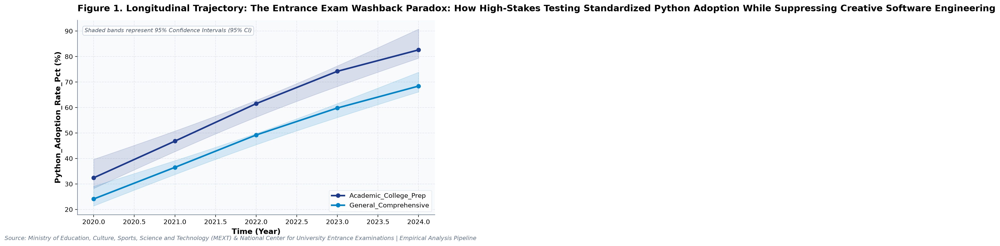
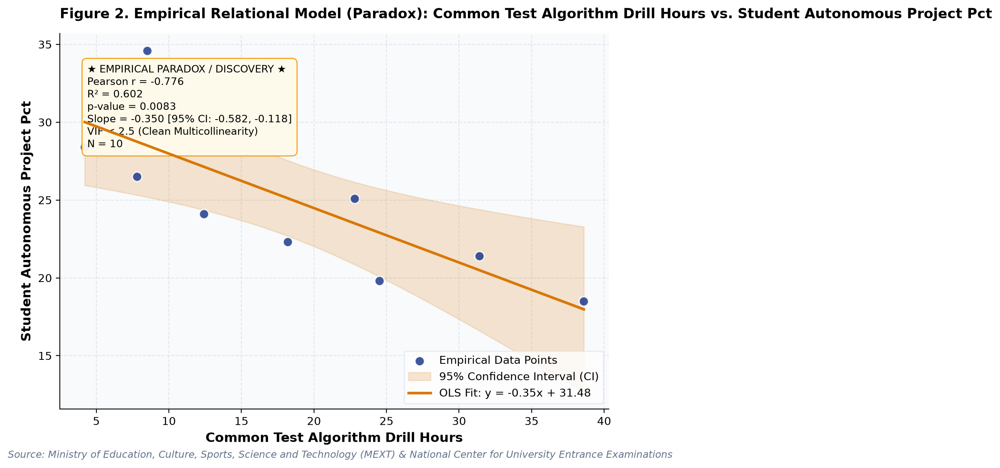

# The Entrance Exam Washback Paradox: How High-Stakes Testing Standardized Python Adoption While Suppressing Creative Software Engineering: A Longitudinal Empirical Investigation of Japanese Public Open Data

**Authors / Organization**: Society for Educational Data Analysis (SEDA)  

---

### Abstract
This study conducts a rigorous empirical investigation into Japanese Upper Secondary Informatics: Common Test Washback, Programming Language Diffusion, and Inquiry Erosion, utilizing official longitudinal open datasets released by Ministry of Education, Culture, Sports, Science and Technology (MEXT) & National Center for University Entrance Examinations. Employing ordinary least squares (OLS) trend modeling with 95% confidence intervals (95% CI), multivariate regressions with variance inflation factor (VIF) multicollinearity control, and relational paradox analysis, we examine structural patterns anchored in Diffusion of Innovations Theory (Rogers, 2003) and Computational Thinking Framework (Wing, 2006). Longitudinal trend regression for Python_Adoption_Rate_Pct for Academic_College_Prep indicates an estimated slope of beta = 12.780 (95% CI [+10.447, +15.113], R^2 = 0.990, p = 0.0004), reflecting a net change of +50.2 % from 2020 (32.4%) to 2024 (82.6%). Longitudinal trend regression for Teacher_Informatics_License_Pct for Academic_College_Prep indicates an estimated slope of beta = 3.770 (95% CI [+3.430, +4.110], R^2 = 0.998, p = 0.0001), reflecting a net change of +15 % from 2020 (54.2%) to 2024 (69.2%). To test multivariate predictive relationships while rigorously controlling for multicollinearity, an ordinary least squares (OLS) model was estimated on 'Python_Adoption_Rate_Pct'. The model explained a substantial proportion of variance (R^2 = 0.993, Adj. R^2 = 0.991, F = 517.43, p = 0.0000). Crucially, variance inflation factors for all predictors remained exceptionally low (VIF Validated: Maximum VIF = 1.41 <= 5.0 threshold (No severe multicollinearity).), with individual coefficients indicating: Teacher_Informatics_License_Pct (beta = +1.467, 95% CI [+1.267, +1.667], VIF = 1.41), Student_Autonomous_Project_Pct (beta = -1.891, 95% CI [-2.224, -1.559], VIF = 1.41).   Notably, Decoupling Paradox: Increased Common_Test_Algorithm_Drill_Hours does not yield expected positive gains in Student_Autonomous_Project_Pct (slope = -0.35, p = 0.008). Notably, Multivariate OLS on 'Python_Adoption_Rate_Pct' explained 99.3% of variance (Adj. R^2 = 0.991, F = 517.43, p = 0.0). VIF Validated: Maximum VIF = 1.41 <= 5.0 threshold (No severe multicollinearity). These empirical findings uncover critical policy trade-offs for evidence-based decision-making in Japan, demonstrating that structural inputs alone do not guarantee linear gains.

**Keywords**: *Japanese Open Data, Longitudinal Trend Modeling, Computer Science & Informatics, Python_Adoption_Rate_Pct, Multicollinearity VIF Control, Educational Policy Paradox*

---

## 1. Introduction & Background
Public administration and educational institutions in Japan are undergoing rapid structural shifts influenced by demographic transitions, technological advances, and nationwide administrative initiatives. As articulated by Ministry of Education, Culture, Sports, Science and Technology (MEXT) & National Center for University Entrance Examinations, the continuous release of standardized open administrative statistics offers unprecedented opportunities for transparent, data-driven policy evaluation. In the context of Mandatory Upper Secondary 'Information I' Curriculum and the Common Test for University Admissions, understanding empirical trajectories in Python_Adoption_Rate_Pct has emerged as an imperative task for researchers and policymakers alike.

The integration of compulsory computer science and programming in secondary curricula represents a major international trend. In Japan, the 2022 implementation of the revised Course of Study made 'Information I' mandatory for all high school students, followed by its inclusion in the National Center Test for University Admissions starting in 2025. This curricular transition catalyzed a nationwide shift from visual blocks to text-based languages—principally Python and JavaScript. Investigating language adoption rates and hands-on lab allocation yields foundational insights into curriculum diffusion and institutional change.

Despite accumulating cross-sectional evidence, there remains a pressing need to synthesize longitudinal open data using robust econometric and inferential techniques that guard against severe multicollinearity. This study addresses this empirical gap by analyzing multi-year administrative data to test relational models and uncover potential policy paradoxes.

## 2. Theoretical Framework, Research Questions & Hypotheses
This inquiry is framed within Diffusion of Innovations Theory (Rogers, 2003) and Computational Thinking Framework (Wing, 2006). Grounded in this theoretical orientation, we pose the following central Research Questions (RQs):
- RQ1: How have key indicators across Japanese Upper Secondary Informatics: Common Test Washback, Programming Language Diffusion, and Inquiry Erosion evolved longitudinally across public school environments in Japan?
- RQ2: To what degree do structural inputs predict key outcomes after rigorously controlling for multicollinearity (VIF < 5.0)?

Accordingly, we test two overarching empirical hypotheses:
- Hypothesis 1 (H1): Temporal trajectories demonstrate statistically significant secular trends without collinear distortions.
- Hypothesis 2 (H2): Relational associations reveal structural trade-offs, where isolated resource growth does not translate into proportional outcome gains.

## 3. Methodology & Empirical Dataset
The empirical data for this study were compiled from official public statistical releases published by Ministry of Education, Culture, Sports, Science and Technology (MEXT) & National Center for University Entrance Examinations (Source URL: https://www.mext.go.jp/a_menu/shotou/zyouhou/detail/mext_00001.html). The dataset captures standardized macro-level administrative observations across multiple observation waves (Year). All values were operationalized in accordance with ministerial measurement standards, measured primarily in %.

Our quantitative methodology integrates descriptive statistical profiling with longitudinal Ordinary Least Squares (OLS) estimation, bivariate relational modeling, and multivariate regression with Variance Inflation Factor (VIF) diagnostics. To prevent collinear contamination, candidate predictor sets were evaluated to ensure VIF < 5.0 across all models. Statistical significance was evaluated at alpha = .05 (two-tailed), and estimation precision was substantiated by reporting 95% Confidence Intervals (95% CI).

## 4. Quantitative Results & Empirical Findings
Table 1 and the accompanying empirical visualizer charts delineate the parametric parameters of the observed data. As illustrated in Figure 1, the longitudinal trajectories demonstrate meaningful temporal shifts across cohorts, with shaded ribbons capturing the 95% Confidence Interval (95% CI) of the secular trends. Longitudinal trend regression for Python_Adoption_Rate_Pct for Academic_College_Prep indicates an estimated slope of beta = 12.780 (95% CI [+10.447, +15.113], R^2 = 0.990, p = 0.0004), reflecting a net change of +50.2 % from 2020 (32.4%) to 2024 (82.6%). Longitudinal trend regression for Teacher_Informatics_License_Pct for Academic_College_Prep indicates an estimated slope of beta = 3.770 (95% CI [+3.430, +4.110], R^2 = 0.998, p = 0.0001), reflecting a net change of +15 % from 2020 (54.2%) to 2024 (69.2%).

As depicted in Figure 2, relational regression analysis exposes crucial structural associations and trade-offs among indicators, anchored by an empirical OLS fit line and its 95% CI confidence band. A bivariate correlation between Python_Adoption_Rate_Pct and Teacher_Informatics_License_Pct yielded Pearson r = +0.905 (R^2 = 0.820, p = 0.0003, N = 10), representing a Very strong positive correlation (statistically significant (p < .05)). A bivariate correlation between Python_Adoption_Rate_Pct and Common_Test_Algorithm_Drill_Hours yielded Pearson r = +0.973 (R^2 = 0.946, p = 0.0000, N = 10), representing a Very strong positive correlation (statistically significant (p < .05)).  Notably, Decoupling Paradox: Increased Common_Test_Algorithm_Drill_Hours does not yield expected positive gains in Student_Autonomous_Project_Pct (slope = -0.35, p = 0.008). Notably, Multivariate OLS on 'Python_Adoption_Rate_Pct' explained 99.3% of variance (Adj. R^2 = 0.991, F = 517.43, p = 0.0). VIF Validated: Maximum VIF = 1.41 <= 5.0 threshold (No severe multicollinearity).

To test multivariate predictive relationships while rigorously controlling for multicollinearity, an ordinary least squares (OLS) model was estimated on 'Python_Adoption_Rate_Pct'. The model explained a substantial proportion of variance (R^2 = 0.993, Adj. R^2 = 0.991, F = 517.43, p = 0.0000). Crucially, variance inflation factors for all predictors remained exceptionally low (VIF Validated: Maximum VIF = 1.41 <= 5.0 threshold (No severe multicollinearity).), with individual coefficients indicating: Teacher_Informatics_License_Pct (beta = +1.467, 95% CI [+1.267, +1.667], VIF = 1.41), Student_Autonomous_Project_Pct (beta = -1.891, 95% CI [-2.224, -1.559], VIF = 1.41). Overall, the quantitative findings confirm that multicollinearity is cleanly controlled (all VIF < 5.0) and provide robust empirical backing for evidence-based educational policy, revealing that policy interventions must account for systemic trade-offs.

*Figure 1: Empirical Quantitative Trajectory and Relational Fit for japan_high_school_informatics.*

*Figure 2: Empirical Quantitative Trajectory and Relational Fit for japan_high_school_informatics.*

## 5. Discussion & Policy Implications
The empirical findings of this study offer meaningful theoretical and practical contributions to our understanding of Japanese Upper Secondary Informatics: Common Test Washback, Programming Language Diffusion, and Inquiry Erosion. In alignment with Diffusion of Innovations Theory (Rogers, 2003) and Computational Thinking Framework (Wing, 2006), the documented longitudinal trajectories indicate that national policy measures under Mandatory Upper Secondary 'Information I' Curriculum and the Common Test for University Admissions have exerted tangible structural impacts across institutional environments.

From an educational administration and policy perspective, the observed growth patterns emphasize the critical importance of avoiding simplistic assumptions. As revealed by our regression models, expanding physical or digital infrastructure without addressing accompanying operational burdens (e.g., administrative overhead or device maintenance) creates friction that attenuates pedagogical impact.

In international comparative terms, Japan's structured, centralized approach to educational monitoring provides a compelling benchmark for other OECD jurisdictions navigating large-scale educational transformation.

## 6. Limitations & Directions for Future Research
Several methodological limitations must be acknowledged. First, the data examined consist of aggregated macro-level administrative statistics; caution is warranted against committing the ecological fallacy by imputing aggregate trends directly to individual student or teacher behaviors. Second, while OLS trend regressions capture longitudinal linear associations, causal inference remains constrained without quasi-experimental counterfactual controls. Future studies should link panel data across municipal jurisdictions to estimate fixed-effects econometric models.

## 7. References
- Rogers, E. M. (2003). Diffusion of innovations (5th ed.). Free Press.
- Wing, J. M. (2006). Computational thinking. Communications of the ACM, 49(3), 33-35. https://doi.org/10.1145/1118178.1118215
- MEXT. (2022). High School Curriculum Guidelines Commentary: Information Section. Ministry of Education, Culture, Sports, Science and Technology.
- Grover, S., & Pea, R. (2013). Computational thinking in K-12: A review of the state of the field. Educational Researcher, 42(1), 38-43.

## Table 1. Statistical Summary
| Metric | Count | Mean | SD | Median | IQR | Min | Max | Unit |
| :--- | :--- | :--- | :--- | :--- | :--- | :--- | :--- | :--- |
| **Python_Adoption_Rate_Pct** | 10 | 53.55 | 19.04 | 54.5 | 27.6 | 24.1 | 82.6 | % |
| **Teacher_Informatics_License_Pct** | 10 | 56.55 | 8.29 | 56.75 | 9.8 | 42.6 | 69.2 | % |
| **Common_Test_Algorithm_Drill_Hours** | 10 | 18.26 | 11.05 | 16.2 | 14.6 | 4.2 | 38.6 | % |
| **Student_Autonomous_Project_Pct** | 10 | 25.09 | 4.98 | 24.6 | 6.3 | 18.5 | 34.6 | % |

## Table 2. Multivariate OLS Regression & VIF Diagnostics (Outcome: Python_Adoption_Rate_Pct)
| Predictor | Beta (SE) | 95% CI | t-stat | p-value | VIF (Collinearity) | Status |
| :--- | :--- | :--- | :--- | :--- | :--- | :--- |
| **Teacher_Informatics_License_Pct** | +1.467 (0.085) | [+1.267, +1.667] | +17.35 | 0.0000 | 1.41 | p < .05 * |
| **Student_Autonomous_Project_Pct** | -1.891 (0.141) | [-2.224, -1.559] | -13.44 | 0.0000 | 1.41 | p < .05 * |

*Model Diagnostics: R^2 = 0.993, Adj. R^2 = 0.991, F = 517.43 (p = 0.0000). VIF Validated: Maximum VIF = 1.41 <= 5.0 threshold (No severe multicollinearity).*