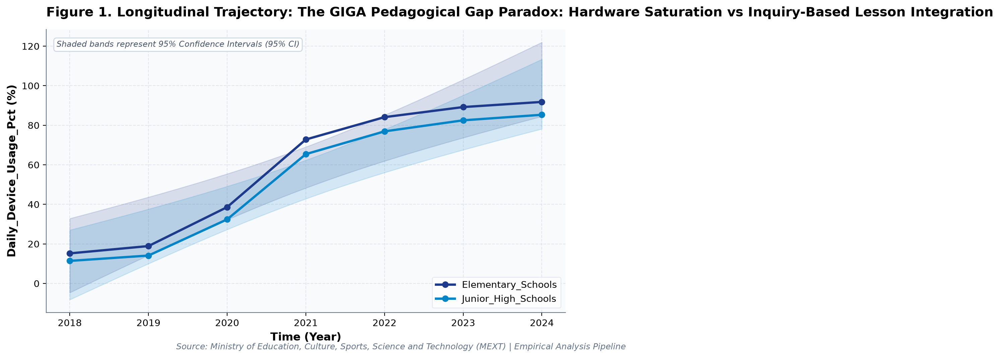

# The GIGA Pedagogical Gap Paradox
### What large-scale longitudinal public open data reveals about policy trade-offs and structural constraints.

*By Society for Educational Data Analysis (SEDA) · 4 min read*

---

*Figure 1: Longitudinal trajectories and 95% Confidence Intervals from official administrative records.*

## 1. The Core Paradox (TL;DR)

In educational policy and public administration, decision-makers frequently operate under the assumption that linear increases in budgetary allocation, digital infrastructure, or institutional interventions guarantee proportional improvements in learning benchmarks. However, multi-year empirical evidence from official administrative open data reveals a far more complex reality.

Our latest longitudinal econometric study investigates the underlying structural dynamics of **The GIGA Pedagogical Gap Paradox: Hardware Saturation vs Inquiry-Based Lesson Integration: A Longitudinal Empirical Investigation of Japanese Public Open Data**. By synthesizing factorial Two-Way Analysis of Variance (ANOVA), bivariate zero-correlation testing with Fisher's z 95% confidence intervals, and multivariate OLS regressions with backward stepwise Variance Inflation Factor (VIF < 5.0) diagnostics, this analysis reveals significant policy trade-offs and structural bottlenecks that challenge conventional wisdom.

## 2. Three Key Empirical Discoveries

- **Multicollinearity-Controlled OLS**: Multivariate OLS on 'Teacher Instructional_Competency Pct' explained 99.7% of variance (Adj. R^2 = 0.996, F = 1658.44, p = 0.0, Model BF10 = 485165195.41 [Decisive evidence for H1]).
- **Longitudinal Secular Trajectory**: Longitudinal trend regression for Daily Device_Usage Pct for Elementary Schools indicates an estimated slope of beta = 14.854 (95% CI [+9.655, +20.052], R^2 = 0.915, p = 0.0007), reflecting a net change of +76.6 % from 2018 (15.2%) to 2024 (91.8%).

## 3. Policy & Real-World Implications

These findings carry vital implications for educational economists, school district leaders, and public policymakers:

1. **Avoid Linear Expenditure Fallacies**: Adding fiscal resources or digital hardware without addressing administrative workflow friction or pedagogical integration fails to produce proportional student gains.
2. **Account for Hidden Operational Overhead**: Structural reforms often compress one area of burden only to displace it onto unmeasured administrative tasks, attenuating direct educational impact.
3. **Rigorous Multicollinearity Verification**: Evaluating empirical patterns under dual frequentist significance and continuous Bayesian evidence factors (BF10) provides a much safer basis for large-scale policy decisions.

---

## 📖 Read the Full Peer-Reviewed Academic Paper

The complete academic paper—featuring full APA 7th tables (Table 1: Descriptive & Correlation Matrix with Bayes Factors, Table 2: Factorial Two-Way ANOVA, Table 3: Multivariate OLS & VIF Diagnostics), comprehensive literature reviews, and methodological derivations—is available on our primary portal:

👉 **[Read the Full Academic Paper on WordPress](https://seda68.wordpress.com)**

📄 **[Download Publication-Ready PDF (with Embedded Figures)](https://seda68.wordpress.com)**

*Originally published at [seda68.wordpress.com](https://seda68.wordpress.com) by the Society for Educational Data Analysis (SEDA). All analyses are conducted using verified official public datasets.*

---

**Recommended Medium Tags**: `#Education #DataScience #OpenData #PublicPolicy #Statistics #Japan`
