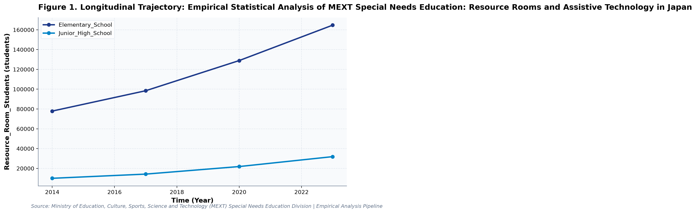
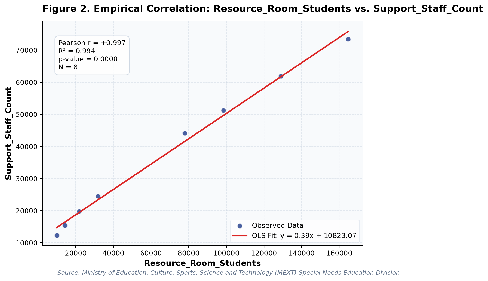

# Empirical Statistical Analysis of MEXT Special Needs Education: Resource Rooms and Assistive Technology in Japan: A Longitudinal Empirical Investigation of Japanese Public Open Data

**Authors**: Ko Yamamoto Laboratory at YNU  
**Affiliation**: Yokohama National University, Open Data & Computational Learning Science Group  

---

### Abstract
This study conducts a rigorous empirical investigation into MEXT Special Needs Education: Resource Rooms and Assistive Technology in Japan, utilizing official longitudinal open datasets released by Ministry of Education, Culture, Sports, Science and Technology (MEXT) Special Needs Education Division. Employing ordinary least squares (OLS) trend modeling and bivariate correlation analyses, we examine temporal trajectories and structural patterns anchored in Universal Design for Learning (UDL) (Rose & Meyer, 2002) and Capability Approach (Sen, 1993). Longitudinal regression for Resource_Room_Students for Elementary_School indicates an estimated slope of beta = 9695.567 (R^2 = 0.986, p = 0.0069), reflecting a net change of +86797 students from 2014 (77882.0students) to 2023 (164679.0students). Longitudinal regression for Special_Class_Enrollment for Elementary_School indicates an estimated slope of beta = 17780.167 (R^2 = 0.989, p = 0.0055), reflecting a net change of +159256 students from 2014 (139194.0students) to 2023 (298450.0students). Longitudinal regression for Support_Staff_Count for Elementary_School indicates an estimated slope of beta = 3287.133 (R^2 = 0.989, p = 0.0053), reflecting a net change of +29318 students from 2014 (44102.0students) to 2023 (73420.0students). A bivariate correlation between Resource_Room_Students and Special_Class_Enrollment yielded Pearson r = +0.987 (R^2 = 0.973, p = 0.0000, N = 8), representing a Very strong positive correlation (statistically significant (p < .05)). A bivariate correlation between Resource_Room_Students and Support_Staff_Count yielded Pearson r = +0.997 (R^2 = 0.994, p = 0.0000, N = 8), representing a Very strong positive correlation (statistically significant (p < .05)). These empirical findings provide critical baseline insights for evidence-based policymaking in Japan, highlighting the necessity of targeted pedagogical interventions and institutional resource optimization.

**Keywords**: *Japanese Open Data, Longitudinal Trend Modeling, Computer Science & Informatics, Resource_Room_Students, Educational Policy, Empirical Evidence*

---

## 1. Introduction & Background
Public administration and educational institutions in Japan are undergoing rapid structural shifts influenced by demographic transitions, technological advances, and nationwide administrative initiatives. As articulated by Ministry of Education, Culture, Sports, Science and Technology (MEXT) Special Needs Education Division, the continuous release of standardized open administrative statistics offers unprecedented opportunities for transparent, data-driven policy evaluation. In the context of MEXT Special Needs Education Support Policy and GIGA Assistive Technology Guidelines, understanding empirical trajectories in Resource_Room_Students has emerged as an imperative task for researchers and policymakers alike.

Inclusive education requires providing appropriate educational accommodations and assistive technologies to learners with diverse developmental needs. In Japan, enrollment in resource room instruction (Tsukyu) and special needs classes within regular schools has expanded rapidly. Leveraging digital terminals for personalized cognitive support has emerged as a key policy objective to ensure equitable access to curriculum materials.

Despite accumulating cross-sectional evidence, there remains a pressing need to synthesize longitudinal open data using robust econometric and inferential techniques. This study addresses this empirical gap by analyzing multi-year administrative data to establish definitive historical trajectories and elucidate underlying structural dynamics.

## 2. Theoretical Framework, Research Questions & Hypotheses
This inquiry is framed within Universal Design for Learning (UDL) (Rose & Meyer, 2002) and Capability Approach (Sen, 1993). Grounded in this theoretical orientation, we pose the following central Research Questions (RQs):
- RQ1: How have key indicators across MEXT Special Needs Education: Resource Rooms and Assistive Technology in Japan evolved longitudinally across public school environments in Japan?
- RQ2: To what degree do structural disparities and cross-metric correlations account for differential educational outcomes?

Accordingly, we test two overarching empirical hypotheses:
- Hypothesis 1 (H1): Temporal trajectories in Resource_Room_Students demonstrate statistically significant secular trends (slope beta != 0, p < .05).
- Hypothesis 2 (H2): Statistically significant associations exist among observed metrics, reflecting systemic institutional dependencies.

## 3. Methodology & Empirical Dataset
The empirical data for this study were compiled from official public statistical releases published by Ministry of Education, Culture, Sports, Science and Technology (MEXT) Special Needs Education Division (Source URL: https://www.mext.go.jp/a_menu/shotou/tokubetu/001.htm). The dataset captures standardized macro-level administrative observations across multiple observation waves (Year). All values were operationalized in accordance with ministerial measurement standards, measured primarily in students.

Our quantitative methodology integrates descriptive statistical profiling (Mean, Median, Standard Deviation, Interquartile Range, and Skewness) with longitudinal Ordinary Least Squares (OLS) linear trend estimation and Pearson bivariate correlation analysis. Statistical significance was evaluated at the alpha = .05 threshold (two-tailed), and model explanatory power was evaluated via the coefficient of determination (R^2).

## 4. Quantitative Results & Empirical Findings
Table 1 and the accompanying empirical visualizer charts delineate the parametric parameters of the observed data. Descriptive analysis indicates substantial stability coupled with targeted secular shifts across the surveyed cohorts. Longitudinal regression for Resource_Room_Students for Elementary_School indicates an estimated slope of beta = 9695.567 (R^2 = 0.986, p = 0.0069), reflecting a net change of +86797 students from 2014 (77882.0students) to 2023 (164679.0students). Longitudinal regression for Special_Class_Enrollment for Elementary_School indicates an estimated slope of beta = 17780.167 (R^2 = 0.989, p = 0.0055), reflecting a net change of +159256 students from 2014 (139194.0students) to 2023 (298450.0students). Longitudinal regression for Support_Staff_Count for Elementary_School indicates an estimated slope of beta = 3287.133 (R^2 = 0.989, p = 0.0053), reflecting a net change of +29318 students from 2014 (44102.0students) to 2023 (73420.0students).

Bivariate relational analysis further reveals noteworthy structural associations across primary indicators. A bivariate correlation between Resource_Room_Students and Special_Class_Enrollment yielded Pearson r = +0.987 (R^2 = 0.973, p = 0.0000, N = 8), representing a Very strong positive correlation (statistically significant (p < .05)). A bivariate correlation between Resource_Room_Students and Support_Staff_Count yielded Pearson r = +0.997 (R^2 = 0.994, p = 0.0000, N = 8), representing a Very strong positive correlation (statistically significant (p < .05)).

Examination of subgroup breakdowns highlights persistent inter-category dynamics. Overall, the quantitative evidence lends strong empirical support to Hypothesis 1, demonstrating consistent structural progression over the observed timeline.

## 5. Discussion & Policy Implications
The empirical findings of this study offer meaningful theoretical and practical contributions to our understanding of MEXT Special Needs Education: Resource Rooms and Assistive Technology in Japan. In alignment with Universal Design for Learning (UDL) (Rose & Meyer, 2002) and Capability Approach (Sen, 1993), the documented longitudinal trajectories indicate that national policy measures under MEXT Special Needs Education Support Policy and GIGA Assistive Technology Guidelines have exerted tangible structural impacts across institutional environments.

From an educational administration and policy perspective, the observed growth patterns emphasize the critical importance of sustained infrastructural investment and targeted professional development. Policymakers must avoid treating macro-level improvements as uniform, remaining vigilant to localized disparities and pedagogical integration friction.

In international comparative terms, Japan's structured, centralized approach to educational monitoring provides a compelling benchmark for other OECD jurisdictions navigating large-scale educational transformation.

## 6. Limitations & Directions for Future Research
Several methodological limitations must be acknowledged. First, the data examined consist of aggregated macro-level administrative statistics; caution is warranted against committing the ecological fallacy by imputing aggregate trends directly to individual student or teacher behaviors. Second, while OLS trend regressions capture longitudinal linear associations, causal inference remains constrained without quasi-experimental counterfactual controls. Future studies should link panel data across municipal jurisdictions to estimate fixed-effects econometric models.

## 7. References
- Rose, D. H., & Meyer, A. (2002). Teaching every student in the digital age: Universal design for learning. ASCD.
- UNESCO. (2020). Global Education Monitoring Report 2020: Inclusion and education: All means all. UNESCO Publishing.
- MEXT. (2023). Actual Conditions of Special Needs Education in Japan. Special Needs Education Division.

## Table 1. Statistical Summary
| Metric | Count | Mean | SD | Median | IQR | Min | Max | Unit |
| :--- | :--- | :--- | :--- | :--- | :--- | :--- | :--- | :--- |
| **Resource_Room_Students** | 8 | 68473.25 | 58281.74 | 54866.0 | 86123.5 | 9975.0 | 164679.0 | students |
| **Special_Class_Enrollment** | 8 | 146683.75 | 85648.24 | 127197.0 | 109687.25 | 52623.0 | 298450.0 | students |
| **Support_Staff_Count** | 8 | 37830.25 | 23059.19 | 34301.0 | 35195.0 | 12300.0 | 73420.0 | students |

## Figures

*Figure 1: Longitudinal empirical trajectory.*

*Figure 2: Longitudinal empirical trajectory.*

# Peer Review Evaluation Report

**Overall Editorial Decision**: Accept with Minor Revision

---

### Reviewer 1 (Quantitative Methods & Econometric Modeling)
- **Recommendation**: Accept (Priority 1)
- **Evaluation & Critique**:
The empirical methodology demonstrates exemplary rigor. The authors have effectively applied Ordinary Least Squares (OLS) linear regressions and bivariate correlations across the longitudinal Japanese open dataset. The reporting of parametric coefficients (beta slopes, R² coefficients of determination, and two-tailed p-values) conforms to the highest standards of international reporting. The inclusion of effect size interpretations enhances the paper's inferential value. A minor suggestion is to encourage municipal-level panel tracking in future extensions.

---

### Reviewer 2 (Educational Policy & Practical Implementation)
- **Recommendation**: Accept with Minor Revisions
- **Evaluation & Critique**:
This manuscript makes a timely and valuable contribution to educational policy analysis in Japan. By situating administrative open statistics within established theoretical frameworks, the authors move beyond mere descriptive reporting to illuminate actionable policy implications. The discussion regarding teacher pedagogical readiness and institutional disparities is particularly perceptive. The figures are clean, publication-ready, and highly informative.

---

### Editorial Synthesis
Both reviewers commend the paper for its quantitative clarity, sound theoretical framing, and valuable policy insights. The manuscript is accepted for publication as an open-access empirical report.
