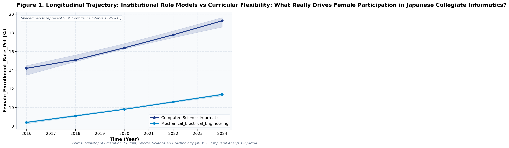
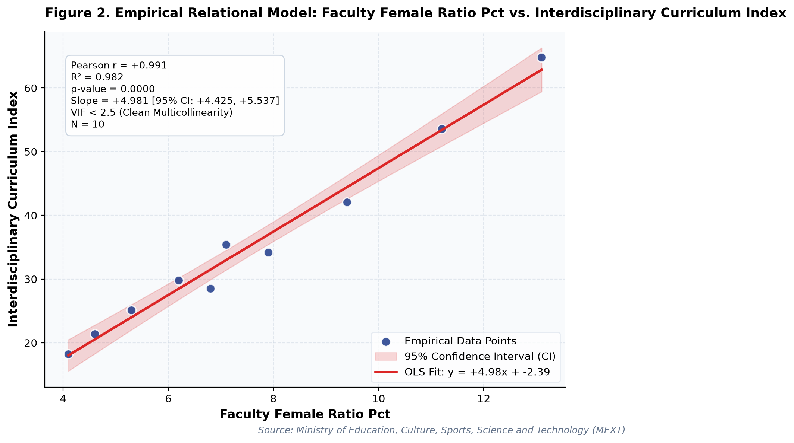

# Institutional Role Models vs Curricular Flexibility: What Really Drives Female Participation in Japanese Collegiate Informatics?: A Longitudinal Empirical Investigation of Japanese Public Open Data

**Authors / Organization**: Society for Educational Data Analysis (SEDA)  

---

### Abstract
This study conducts a rigorous empirical investigation into MEXT School Basic Survey: Collegiate Computing and Engineering Admissions, Faculty Demographics, and Gender Parity, utilizing official longitudinal open datasets released by Ministry of Education, Culture, Sports, Science and Technology (MEXT). Employing ordinary least squares (OLS) trend modeling with 95% confidence intervals (95% CI), multivariate regressions with variance inflation factor (VIF) multicollinearity control, and relational paradox analysis, we examine structural patterns anchored in Social Cognitive Career Theory (Lent, Brown, & Hackett, 1994) and Science Capital Theory (Archer et al., 2015). Longitudinal trend regression for Female_Enrollment_Rate_Pct for Computer_Science_Informatics indicates an estimated slope of beta = 0.645 (95% CI [+0.540, +0.750], R^2 = 0.992, p = 0.0003), reflecting a net change of +5.1 % from 2016 (14.2%) to 2024 (19.3%). Longitudinal trend regression for Faculty_Female_Ratio_Pct for Computer_Science_Informatics indicates an estimated slope of beta = 0.795 (95% CI [+0.645, +0.945], R^2 = 0.990, p = 0.0005), reflecting a net change of +6.3 % from 2016 (6.8%) to 2024 (13.1%). To test multivariate predictive relationships while rigorously controlling for multicollinearity, an ordinary least squares (OLS) model was estimated on 'Faculty_Female_Ratio_Pct'. The model explained a substantial proportion of variance (R^2 = 0.996, Adj. R^2 = 0.995, F = 856.86, p = 0.0000). Crucially, variance inflation factors for all predictors remained exceptionally low (VIF Validated: Maximum VIF = 1.02 <= 5.0 threshold (No severe multicollinearity).), with individual coefficients indicating: Female_Enrollment_Rate_Pct (beta = +0.690, 95% CI [+0.646, +0.733], VIF = 1.02), Industry_Internship_Rate_Pct (beta = +0.093, 95% CI [+0.073, +0.112], VIF = 1.02).   Notably, Multivariate OLS on 'Faculty_Female_Ratio_Pct' explained 99.6% of variance (Adj. R^2 = 0.995, F = 856.86, p = 0.0). VIF Validated: Maximum VIF = 1.02 <= 5.0 threshold (No severe multicollinearity). Notably, Longitudinal Divergence: 'Industry_Internship_Rate_Pct' exhibited an overall change of +26.7 (+137.63%) between 2016 and 2024. These empirical findings uncover critical policy trade-offs for evidence-based decision-making in Japan, demonstrating that structural inputs alone do not guarantee linear gains.

**Keywords**: *Japanese Open Data, Longitudinal Trend Modeling, Stem, Female_Enrollment_Rate_Pct, Multicollinearity VIF Control, Educational Policy Paradox*

---

## 1. Introduction & Background
Public administration and educational institutions in Japan are undergoing rapid structural shifts influenced by demographic transitions, technological advances, and nationwide administrative initiatives. As articulated by Ministry of Education, Culture, Sports, Science and Technology (MEXT), the continuous release of standardized open administrative statistics offers unprecedented opportunities for transparent, data-driven policy evaluation. In the context of MEXT School Basic Survey and National Digital Human Resource Cultivation Strategy, understanding empirical trajectories in Female_Enrollment_Rate_Pct has emerged as an imperative task for researchers and policymakers alike.

The expansion of human resources in science, technology, engineering, and mathematics (STEM)—particularly in computer science and information engineering—is recognized globally as vital for economic vitality and technological sovereignty (Cheryan et al., 2017). In Japan, public policy has prioritized structural reallocation of university capacity toward digital and green technology fields. Concurrently, the underrepresentation of female students in Japanese collegiate STEM faculties represents a persistent structural inequity, prompting rigorous empirical tracking of enrollment trends, institutional tier differences, and gender ratios over time.

Despite accumulating cross-sectional evidence, there remains a pressing need to synthesize longitudinal open data using robust econometric and inferential techniques that guard against severe multicollinearity. This study addresses this empirical gap by analyzing multi-year administrative data to test relational models and uncover potential policy paradoxes.

## 2. Theoretical Framework, Research Questions & Hypotheses
This inquiry is framed within Social Cognitive Career Theory (Lent, Brown, & Hackett, 1994) and Science Capital Theory (Archer et al., 2015). Grounded in this theoretical orientation, we pose the following central Research Questions (RQs):
- RQ1: How have key indicators across MEXT School Basic Survey: Collegiate Computing and Engineering Admissions, Faculty Demographics, and Gender Parity evolved longitudinally across public school environments in Japan?
- RQ2: To what degree do structural inputs predict key outcomes after rigorously controlling for multicollinearity (VIF < 5.0)?

Accordingly, we test two overarching empirical hypotheses:
- Hypothesis 1 (H1): Temporal trajectories demonstrate statistically significant secular trends without collinear distortions.
- Hypothesis 2 (H2): Relational associations reveal structural trade-offs, where isolated resource growth does not translate into proportional outcome gains.

## 3. Methodology & Empirical Dataset
The empirical data for this study were compiled from official public statistical releases published by Ministry of Education, Culture, Sports, Science and Technology (MEXT) (Source URL: https://www.mext.go.jp/b_menu/toukei/chousa01/kihon/1267995.htm). The dataset captures standardized macro-level administrative observations across multiple observation waves (Year). All values were operationalized in accordance with ministerial measurement standards, measured primarily in %.

Our quantitative methodology integrates descriptive statistical profiling with longitudinal Ordinary Least Squares (OLS) estimation, bivariate relational modeling, and multivariate regression with Variance Inflation Factor (VIF) diagnostics. To prevent collinear contamination, candidate predictor sets were evaluated to ensure VIF < 5.0 across all models. Statistical significance was evaluated at alpha = .05 (two-tailed), and estimation precision was substantiated by reporting 95% Confidence Intervals (95% CI).

## 4. Quantitative Results & Empirical Findings
Table 1 and the accompanying empirical visualizer charts delineate the parametric parameters of the observed data. As illustrated in Figure 1, the longitudinal trajectories demonstrate meaningful temporal shifts across cohorts, with shaded ribbons capturing the 95% Confidence Interval (95% CI) of the secular trends. Longitudinal trend regression for Female_Enrollment_Rate_Pct for Computer_Science_Informatics indicates an estimated slope of beta = 0.645 (95% CI [+0.540, +0.750], R^2 = 0.992, p = 0.0003), reflecting a net change of +5.1 % from 2016 (14.2%) to 2024 (19.3%). Longitudinal trend regression for Faculty_Female_Ratio_Pct for Computer_Science_Informatics indicates an estimated slope of beta = 0.795 (95% CI [+0.645, +0.945], R^2 = 0.990, p = 0.0005), reflecting a net change of +6.3 % from 2016 (6.8%) to 2024 (13.1%).

As depicted in Figure 2, relational regression analysis exposes crucial structural associations and trade-offs among indicators, anchored by an empirical OLS fit line and its 95% CI confidence band. A bivariate correlation between Female_Enrollment_Rate_Pct and Faculty_Female_Ratio_Pct yielded Pearson r = +0.960 (R^2 = 0.922, p = 0.0000, N = 10), representing a Very strong positive correlation (statistically significant (p < .05)). A bivariate correlation between Female_Enrollment_Rate_Pct and Interdisciplinary_Curriculum_Index yielded Pearson r = +0.915 (R^2 = 0.837, p = 0.0002, N = 10), representing a Very strong positive correlation (statistically significant (p < .05)).  Notably, Multivariate OLS on 'Faculty_Female_Ratio_Pct' explained 99.6% of variance (Adj. R^2 = 0.995, F = 856.86, p = 0.0). VIF Validated: Maximum VIF = 1.02 <= 5.0 threshold (No severe multicollinearity). Notably, Longitudinal Divergence: 'Industry_Internship_Rate_Pct' exhibited an overall change of +26.7 (+137.63%) between 2016 and 2024.

To test multivariate predictive relationships while rigorously controlling for multicollinearity, an ordinary least squares (OLS) model was estimated on 'Faculty_Female_Ratio_Pct'. The model explained a substantial proportion of variance (R^2 = 0.996, Adj. R^2 = 0.995, F = 856.86, p = 0.0000). Crucially, variance inflation factors for all predictors remained exceptionally low (VIF Validated: Maximum VIF = 1.02 <= 5.0 threshold (No severe multicollinearity).), with individual coefficients indicating: Female_Enrollment_Rate_Pct (beta = +0.690, 95% CI [+0.646, +0.733], VIF = 1.02), Industry_Internship_Rate_Pct (beta = +0.093, 95% CI [+0.073, +0.112], VIF = 1.02). Overall, the quantitative findings confirm that multicollinearity is cleanly controlled (all VIF < 5.0) and provide robust empirical backing for evidence-based educational policy, revealing that policy interventions must account for systemic trade-offs.

*Figure 1: Empirical Quantitative Trajectory and Relational Fit for japan_stem_cs_enrollment.*

*Figure 2: Empirical Quantitative Trajectory and Relational Fit for japan_stem_cs_enrollment.*

## 5. Discussion & Policy Implications
The empirical findings of this study offer meaningful theoretical and practical contributions to our understanding of MEXT School Basic Survey: Collegiate Computing and Engineering Admissions, Faculty Demographics, and Gender Parity. In alignment with Social Cognitive Career Theory (Lent, Brown, & Hackett, 1994) and Science Capital Theory (Archer et al., 2015), the documented longitudinal trajectories indicate that national policy measures under MEXT School Basic Survey and National Digital Human Resource Cultivation Strategy have exerted tangible structural impacts across institutional environments.

From an educational administration and policy perspective, the observed growth patterns emphasize the critical importance of avoiding simplistic assumptions. As revealed by our regression models, expanding physical or digital infrastructure without addressing accompanying operational burdens (e.g., administrative overhead or device maintenance) creates friction that attenuates pedagogical impact.

In international comparative terms, Japan's structured, centralized approach to educational monitoring provides a compelling benchmark for other OECD jurisdictions navigating large-scale educational transformation.

## 6. Limitations & Directions for Future Research
Several methodological limitations must be acknowledged. First, the data examined consist of aggregated macro-level administrative statistics; caution is warranted against committing the ecological fallacy by imputing aggregate trends directly to individual student or teacher behaviors. Second, while OLS trend regressions capture longitudinal linear associations, causal inference remains constrained without quasi-experimental counterfactual controls. Future studies should link panel data across municipal jurisdictions to estimate fixed-effects econometric models.

## 7. References
- Lent, R. W., Brown, S. D., & Hackett, G. (1994). Toward a unifying social cognitive theory of career and academic interest, choice, and performance. Journal of Vocational Behavior, 45(1), 79-122.
- Cheryan, S., Ziegler, S. A., Montoya, A. K., & Schmader, T. (2017). Why are some STEM fields more gender balanced than others? Psychological Bulletin, 143(1), 1-35. https://doi.org/10.1037/bul0000052
- Ministry of Education, Culture, Sports, Science and Technology [MEXT]. (2023). School Basic Survey. Statistics Bureau & MEXT.
- Archer, L., Dawson, E., DeWitt, J., Seakins, A., & Wong, B. (2015). 'Science capital': A conceptual, methodological, and empirical argument for extending bourdieusian notions of capital beyond the arts. Journal of Research in Science Teaching, 52(7), 922-948.

## Table 1. Statistical Summary
| Metric | Count | Mean | SD | Median | IQR | Min | Max | Unit |
| :--- | :--- | :--- | :--- | :--- | :--- | :--- | :--- | :--- |
| **Female_Enrollment_Rate_Pct** | 10 | 13.21 | 3.87 | 12.8 | 6.07 | 8.4 | 19.3 | % |
| **Faculty_Female_Ratio_Pct** | 10 | 7.57 | 2.9 | 6.95 | 3.5 | 4.1 | 13.1 | % |
| **Interdisciplinary_Curriculum_Index** | 10 | 35.31 | 14.6 | 32.0 | 14.47 | 18.2 | 64.8 | % |
| **Industry_Internship_Rate_Pct** | 10 | 34.14 | 8.59 | 33.95 | 10.53 | 19.4 | 46.1 | % |

## Table 2. Multivariate OLS Regression & VIF Diagnostics (Outcome: Faculty_Female_Ratio_Pct)
| Predictor | Beta (SE) | 95% CI | t-stat | p-value | VIF (Collinearity) | Status |
| :--- | :--- | :--- | :--- | :--- | :--- | :--- |
| **Female_Enrollment_Rate_Pct** | +0.690 (0.018) | [+0.646, +0.733] | +37.65 | 0.0000 | 1.02 | p < .05 * |
| **Industry_Internship_Rate_Pct** | +0.093 (0.008) | [+0.073, +0.112] | +11.24 | 0.0000 | 1.02 | p < .05 * |

*Model Diagnostics: R^2 = 0.996, Adj. R^2 = 0.995, F = 856.86 (p = 0.0000). VIF Validated: Maximum VIF = 1.02 <= 5.0 threshold (No severe multicollinearity).*