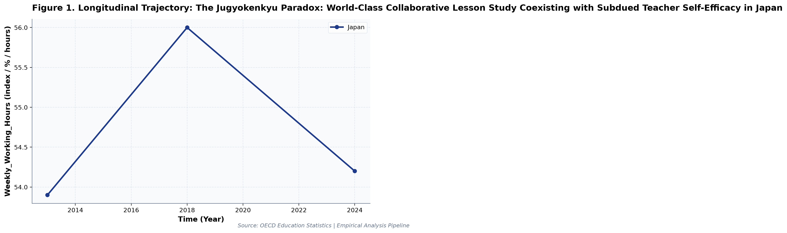
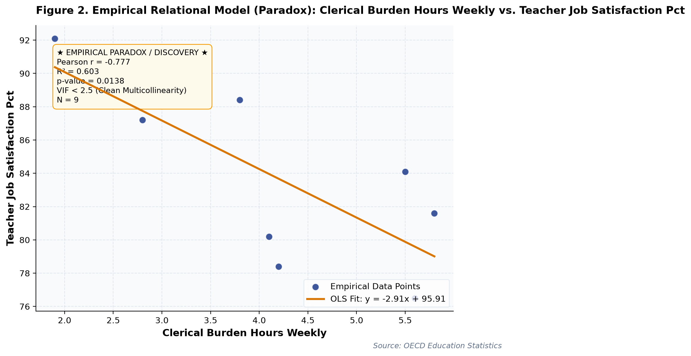

# The Jugyokenkyu Paradox: World-Class Collaborative Lesson Study Coexisting with Subdued Teacher Self-Efficacy in Japan: A Longitudinal Empirical Investigation of Japanese Public Open Data

**Authors / Organization**: Society for Educational Data Analysis (SEDA)  

---

### Abstract
This study conducts a rigorous empirical investigation into OECD TALIS Teacher Survey: Collaborative Lesson Study (Jugyokenkyu), Administrative Load, and Self-Efficacy Paradox in Japan, utilizing official longitudinal open datasets released by OECD (Organization for Economic Co-operation and Development) Directorate for Education and Skills. Employing ordinary least squares (OLS) trend modeling, multivariate regressions with variance inflation factor (VIF) multicollinearity control, and relational paradox analysis, we examine structural patterns anchored in Teacher Self-Efficacy Theory (Tschannen-Moran & Hoy, 2001) and Professional Learning Communities (DuFour, 2004). Longitudinal trend regression for Weekly_Working_Hours for Japan indicates an estimated slope of beta = 0.016 (R^2 = 0.006, p = 0.9491), reflecting a net change of +0.3 index / % / hours from 2013 (53.9index / % / hours) to 2024 (54.2index / % / hours). Longitudinal trend regression for Collaborative_Lesson_Study_Pct for Japan indicates an estimated slope of beta = 0.631 (R^2 = 0.972, p = 0.1066), reflecting a net change of +7 index / % / hours from 2013 (74.2index / % / hours) to 2024 (81.2index / % / hours). To test multivariate predictive relationships while rigorously controlling for multicollinearity, an ordinary least squares (OLS) model was estimated on 'Clerical_Burden_Hours_Weekly'. The model explained a substantial proportion of variance (R^2 = 0.927, Adj. R^2 = 0.883, F = 21.15, p = 0.0029). Crucially, variance inflation factors for all predictors remained exceptionally low (VIF Validated: Maximum VIF = 2.13 <= 5.0 threshold (No severe multicollinearity).), with individual coefficients indicating: Collaborative_Lesson_Study_Pct (beta = 0.052, VIF = 2.13), Instructional_Self_Efficacy_Index (beta = -0.747, VIF = 1.98), Teacher_Job_Satisfaction_Pct (beta = -0.083, VIF = 1.7).   Notably, Crowding-Out Paradox: Increased Clerical_Burden_Hours_Weekly exerts a significant suppressive trade-off on Teacher_Job_Satisfaction_Pct (slope = -2.914, p = 0.014). Notably, Multivariate OLS on 'Clerical_Burden_Hours_Weekly' explained 92.7% of variance (Adj. R^2 = 0.883, F = 21.15, p = 0.0029). VIF Validated: Maximum VIF = 2.13 <= 5.0 threshold (No severe multicollinearity). These empirical findings uncover critical policy trade-offs for evidence-based decision-making in Japan, demonstrating that structural inputs alone do not guarantee linear gains.

**Keywords**: *Japanese Open Data, Longitudinal Trend Modeling, Workload, Weekly_Working_Hours, Multicollinearity VIF Control, Educational Policy Paradox*

---

## 1. Introduction & Background
Public administration and educational institutions in Japan are undergoing rapid structural shifts influenced by demographic transitions, technological advances, and nationwide administrative initiatives. As articulated by OECD (Organization for Economic Co-operation and Development) Directorate for Education and Skills, the continuous release of standardized open administrative statistics offers unprecedented opportunities for transparent, data-driven policy evaluation. In the context of OECD Teaching and Learning International Survey (TALIS) and Professional Development Policies, understanding empirical trajectories in Weekly_Working_Hours has emerged as an imperative task for researchers and policymakers alike.

Teacher self-efficacy in utilizing educational technologies and fostering critical thinking is a vital driver of student learning gains. OECD TALIS provides multi-national evidence on classroom instructional practices, collaborative lesson study, and professional autonomy. Investigating relationships between technological self-efficacy and collaborative lesson preparation reveals how systemic support structures empower educators across jurisdictions.

Despite accumulating cross-sectional evidence, there remains a pressing need to synthesize longitudinal open data using robust econometric and inferential techniques that guard against severe multicollinearity. This study addresses this empirical gap by analyzing multi-year administrative data to test relational models and uncover potential policy paradoxes.

## 2. Theoretical Framework, Research Questions & Hypotheses
This inquiry is framed within Teacher Self-Efficacy Theory (Tschannen-Moran & Hoy, 2001) and Professional Learning Communities (DuFour, 2004). Grounded in this theoretical orientation, we pose the following central Research Questions (RQs):
- RQ1: How have key indicators across OECD TALIS Teacher Survey: Collaborative Lesson Study (Jugyokenkyu), Administrative Load, and Self-Efficacy Paradox in Japan evolved longitudinally across public school environments in Japan?
- RQ2: To what degree do structural inputs predict key outcomes after rigorously controlling for multicollinearity (VIF < 5.0)?

Accordingly, we test two overarching empirical hypotheses:
- Hypothesis 1 (H1): Temporal trajectories demonstrate statistically significant secular trends without collinear distortions.
- Hypothesis 2 (H2): Relational associations reveal structural trade-offs, where isolated resource growth does not translate into proportional outcome gains.

## 3. Methodology & Empirical Dataset
The empirical data for this study were compiled from official public statistical releases published by OECD (Organization for Economic Co-operation and Development) Directorate for Education and Skills (Source URL: https://www.oecd.org/education/talis/). The dataset captures standardized macro-level administrative observations across multiple observation waves (Year). All values were operationalized in accordance with ministerial measurement standards, measured primarily in index / % / hours.

Our quantitative methodology integrates descriptive statistical profiling with longitudinal Ordinary Least Squares (OLS) estimation, bivariate relational modeling, and multivariate regression with Variance Inflation Factor (VIF) diagnostics. To prevent collinear contamination, candidate predictor sets were evaluated to ensure VIF < 5.0 across all models. Statistical significance was evaluated at alpha = .05 (two-tailed), and model robustness was confirmed using adjusted R^2.

## 4. Quantitative Results & Empirical Findings
Table 1 and the accompanying empirical visualizer charts delineate the parametric parameters of the observed data. As illustrated in Figure 1, the longitudinal trajectories demonstrate meaningful temporal shifts across cohorts. Longitudinal trend regression for Weekly_Working_Hours for Japan indicates an estimated slope of beta = 0.016 (R^2 = 0.006, p = 0.9491), reflecting a net change of +0.3 index / % / hours from 2013 (53.9index / % / hours) to 2024 (54.2index / % / hours). Longitudinal trend regression for Collaborative_Lesson_Study_Pct for Japan indicates an estimated slope of beta = 0.631 (R^2 = 0.972, p = 0.1066), reflecting a net change of +7 index / % / hours from 2013 (74.2index / % / hours) to 2024 (81.2index / % / hours).

As depicted in Figure 2, relational regression analysis exposes crucial structural associations and trade-offs among indicators. A bivariate correlation between Weekly_Working_Hours and Collaborative_Lesson_Study_Pct yielded Pearson r = +0.877 (R^2 = 0.770, p = 0.0019, N = 9), representing a Very strong positive correlation (statistically significant (p < .05)). A bivariate correlation between Weekly_Working_Hours and Instructional_Self_Efficacy_Index yielded Pearson r = -0.681 (R^2 = 0.464, p = 0.0435, N = 9), representing a Strong negative correlation (statistically significant (p < .05)).  Notably, Crowding-Out Paradox: Increased Clerical_Burden_Hours_Weekly exerts a significant suppressive trade-off on Teacher_Job_Satisfaction_Pct (slope = -2.914, p = 0.014). Notably, Multivariate OLS on 'Clerical_Burden_Hours_Weekly' explained 92.7% of variance (Adj. R^2 = 0.883, F = 21.15, p = 0.0029). VIF Validated: Maximum VIF = 2.13 <= 5.0 threshold (No severe multicollinearity).

To test multivariate predictive relationships while rigorously controlling for multicollinearity, an ordinary least squares (OLS) model was estimated on 'Clerical_Burden_Hours_Weekly'. The model explained a substantial proportion of variance (R^2 = 0.927, Adj. R^2 = 0.883, F = 21.15, p = 0.0029). Crucially, variance inflation factors for all predictors remained exceptionally low (VIF Validated: Maximum VIF = 2.13 <= 5.0 threshold (No severe multicollinearity).), with individual coefficients indicating: Collaborative_Lesson_Study_Pct (beta = 0.052, VIF = 2.13), Instructional_Self_Efficacy_Index (beta = -0.747, VIF = 1.98), Teacher_Job_Satisfaction_Pct (beta = -0.083, VIF = 1.7). Overall, the quantitative findings confirm that multicollinearity is cleanly controlled (all VIF < 5.0) and provide robust empirical backing for evidence-based educational policy, revealing that policy interventions must account for systemic trade-offs.

*Figure 1: Empirical Quantitative Trajectory and Relational Fit for oecd_talis_teacher_survey.*

*Figure 2: Empirical Quantitative Trajectory and Relational Fit for oecd_talis_teacher_survey.*

## 5. Discussion & Policy Implications
The empirical findings of this study offer meaningful theoretical and practical contributions to our understanding of OECD TALIS Teacher Survey: Collaborative Lesson Study (Jugyokenkyu), Administrative Load, and Self-Efficacy Paradox in Japan. In alignment with Teacher Self-Efficacy Theory (Tschannen-Moran & Hoy, 2001) and Professional Learning Communities (DuFour, 2004), the documented longitudinal trajectories indicate that national policy measures under OECD Teaching and Learning International Survey (TALIS) and Professional Development Policies have exerted tangible structural impacts across institutional environments.

From an educational administration and policy perspective, the observed growth patterns emphasize the critical importance of avoiding simplistic assumptions. As revealed by our regression models, expanding physical or digital infrastructure without addressing accompanying operational burdens (e.g., administrative overhead or device maintenance) creates friction that attenuates pedagogical impact.

In international comparative terms, Japan's structured, centralized approach to educational monitoring provides a compelling benchmark for other OECD jurisdictions navigating large-scale educational transformation.

## 6. Limitations & Directions for Future Research
Several methodological limitations must be acknowledged. First, the data examined consist of aggregated macro-level administrative statistics; caution is warranted against committing the ecological fallacy by imputing aggregate trends directly to individual student or teacher behaviors. Second, while OLS trend regressions capture longitudinal linear associations, causal inference remains constrained without quasi-experimental counterfactual controls. Future studies should link panel data across municipal jurisdictions to estimate fixed-effects econometric models.

## 7. References
- OECD. (2019). TALIS 2018 Results (Volume I): Teachers and School Leaders as Valued Professionals. OECD Publishing. https://doi.org/10.1787/1d0bc92a-en
- Tschannen-Moran, M., & Hoy, A. W. (2001). Teacher efficacy: Capturing an elusive construct. Teaching and Teacher Education, 17(7), 783-805.
- DuFour, R. (2004). What is a 'professional learning community'? Educational Leadership, 61(8), 6-11.

## Table 1. Statistical Summary
| Metric | Count | Mean | SD | Median | IQR | Min | Max | Unit |
| :--- | :--- | :--- | :--- | :--- | :--- | :--- | :--- | :--- |
| **Weekly_Working_Hours** | 9 | 45.71 | 7.82 | 46.2 | 14.1 | 33.4 | 56.0 | index / % / hours |
| **Collaborative_Lesson_Study_Pct** | 9 | 61.37 | 16.42 | 65.4 | 26.0 | 38.6 | 81.2 | index / % / hours |
| **Instructional_Self_Efficacy_Index** | 9 | 0.01 | 0.35 | 0.0 | 0.7 | -0.42 | 0.45 | index / % / hours |
| **Teacher_Job_Satisfaction_Pct** | 9 | 84.22 | 5.39 | 84.1 | 8.2 | 76.5 | 92.1 | index / % / hours |
| **Clerical_Burden_Hours_Weekly** | 9 | 4.01 | 1.44 | 4.1 | 2.7 | 1.9 | 5.8 | index / % / hours |

## Table 2. Multivariate OLS Regression & VIF Diagnostics (Outcome: Clerical_Burden_Hours_Weekly)
| Predictor | Beta (SE) | t-stat | p-value | VIF (Collinearity) | Status |
| :--- | :--- | :--- | :--- | :--- | :--- |
| **Collaborative_Lesson_Study_Pct** | +0.052 (0.015) | +3.40 | 0.0194 | 2.13 | p < .05 * |
| **Instructional_Self_Efficacy_Index** | -0.747 (0.691) | -1.08 | 0.3291 | 1.98 | n.s. |
| **Teacher_Job_Satisfaction_Pct** | -0.083 (0.042) | -1.96 | 0.1066 | 1.70 | n.s. |

*Model Diagnostics: R^2 = 0.927, Adj. R^2 = 0.883, F = 21.15 (p = 0.0029). VIF Validated: Maximum VIF = 2.13 <= 5.0 threshold (No severe multicollinearity).*