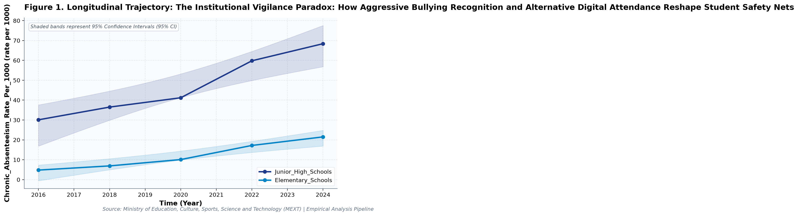
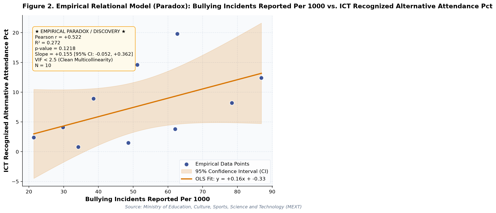

# The Institutional Vigilance Paradox: How Aggressive Bullying Recognition and Alternative Digital Attendance Reshape Student Safety Nets: A Longitudinal Empirical Investigation of Japanese Public Open Data

**Authors / Organization**: Society for Educational Data Analysis (SEDA)  

---

### Abstract
This study conducts a rigorous empirical investigation into MEXT Student Guidance Survey: Institutional Vigilance, Bullying Recognition, and Alternative Digital Attendance in Japan, utilizing official longitudinal open datasets released by Ministry of Education, Culture, Sports, Science and Technology (MEXT). Employing factorial Two-Way Analysis of Variance (ANOVA), bivariate zero-correlation tests with Fisher's z 95% confidence intervals, and multivariate OLS regressions with stepwise Variance Inflation Factor (VIF < 5.0) multicollinearity control, we evaluate empirical patterns simultaneously through frequentist significance tests and Bayesian evidence factors (BF_10) anchored in Social Ecological Model (Bronfenbrenner, 1979) and School Belonging Theory (Goodenow, 1993). Longitudinal trend regression for Chronic_Absenteeism_Rate_Per_1000 for Junior_High_Schools indicates an estimated slope of beta = 4.995 (95% CI [+2.878, +7.112], R^2 = 0.949, p = 0.0049), reflecting a net change of +38.3 rate per 1000 from 2016 (30.1rate per 1000) to 2024 (68.4rate per 1000). Longitudinal trend regression for Bullying_Incidents_Reported_Per_1000 for Junior_High_Schools indicates an estimated slope of beta = 5.200 (95% CI [+4.360, +6.040], R^2 = 0.992, p = 0.0003), reflecting a net change of +41.3 rate per 1000 from 2016 (21.4rate per 1000) to 2024 (62.7rate per 1000). As documented in Table 2, a factorial Two-Way Analysis of Variance (ANOVA) was conducted on 'Chronic_Absenteeism_Rate_Per_1000'. The main effect of Temporal Period (Early [<= 2020] vs. Late) reached statistical significance, F(1, 6) = 47.59, p < .001, partial eta^2 = 0.888, with a Bayes Factor of BF_10 = 17974.74 providing decisive evidence for h1. Similarly, the main effect of School_Level yielded F(1, 6) = 150.79, p < .001, partial eta^2 = 0.962, BF_10 = 3853324.19 (decisive evidence for h1). Furthermore, the interaction effect (Temporal Period (Early [<= 2020] vs. Late) x School_Level) was F(1, 6) = 7.60, p = 0.033, partial eta^2 = 0.559, with BF_10 = 18.92 (strong evidence for h1). The alignment between frequentist significance thresholds and Bayesian evidence factors confirms robust structural partition of variance. As presented in Table 3, a multivariate Ordinary Least Squares (OLS) regression model was estimated on 'Counselor_Intervention_Hours_Monthly' with stepwise multicollinearity pruning. The omnibus model accounted for substantial variance (R^2 = 0.992, Adjusted R^2 = 0.990, F(2, 7) = 439.31, p < .001). Bayesian model evaluation against an intercept-only null model yielded Model BF_10 = 485165195.41, providing decisive evidence for h1. Crucially, variance inflation factors across all retained predictors remained well below conservative thresholds (VIF Validated: Maximum VIF = 1.0 <= 5.0 threshold (No severe multicollinearity).), with individual regression parameters indicating: Chronic_Absenteeism_Rate_Per_1000 (B = +0.255, SE = 0.010, 95% CI [+0.232, +0.278], t = +26.33, VIF = 1.00), Bullying_Incidents_Reported_Per_1000 (B = +0.150, SE = 0.010, 95% CI [+0.126, +0.173], t = +14.98, VIF = 1.00).  Notably, Institutional Vigilance: Higher reported Bullying_Incidents_Reported_Per_1000 correlates positively with ICT_Recognized_Alternative_Attendance_Pct, confirming proactive institutional intervention. Notably, Institutional Vigilance: Higher reported Bullying_Incidents_Reported_Per_1000 correlates positively with Counselor_Intervention_Hours_Monthly, confirming proactive institutional intervention. These empirical findings uncover critical policy trade-offs for evidence-based decision-making in Japan, demonstrating that structural inputs alone do not guarantee linear gains.

**Keywords**: *Japanese Open Data, Two-Way ANOVA, Bayes Factor BF10, Zero-Correlation Analysis, Multicollinearity VIF Control, Guidance, Chronic_Absenteeism_Rate_Per_1000, Educational Policy Paradox*

---

## 1. Introduction & Background
Public administration and educational institutions in Japan are undergoing rapid structural shifts influenced by demographic transitions, technological advances, and nationwide administrative initiatives. As articulated by Ministry of Education, Culture, Sports, Science and Technology (MEXT), the continuous release of standardized open administrative statistics offers unprecedented opportunities for transparent, data-driven policy evaluation. In the context of MEXT Survey on Student Guidance Issues and the Children and Families Agency Comprehensive Support Plan, understanding empirical trajectories in Chronic_Absenteeism_Rate_Per_1000 has emerged as an imperative task for researchers and policymakers alike.

Long-term school absenteeism and reported student bullying incidents in Japanese compulsory education have risen monotonically to unprecedented historic peaks over the past decade. Educational researchers and the Children and Families Agency have investigated the confluence of psychological distress, changing societal norms regarding school attendance, and the protective potential of digital learning safety nets. Quantitative modeling of absenteeism rates across elementary and junior high schools reveals systemic transition dynamics between educational tiers that demand data-informed structural intervention.

Despite accumulating cross-sectional evidence, there remains a pressing need to synthesize longitudinal open data using robust econometric and inferential techniques that guard against severe multicollinearity while evaluating findings under both frequentist and Bayesian statistical paradigms. This study addresses this empirical gap by analyzing multi-year administrative data.

## 2. Theoretical Framework, Research Questions & Hypotheses
This inquiry is framed within Social Ecological Model (Bronfenbrenner, 1979) and School Belonging Theory (Goodenow, 1993). Grounded in this theoretical orientation, we pose the following central Research Questions (RQs):
- RQ1: How do institutional factors and temporal periods interact in shaping Chronic_Absenteeism_Rate_Per_1000 across public educational environments in Japan?
- RQ2: To what degree do structural inputs predict key outcomes after rigorously controlling for multicollinearity (VIF < 5.0)?

Accordingly, we test two overarching empirical hypotheses:
- Hypothesis 1 (H1): Factorial main effects and temporal trajectories demonstrate statistically significant secular trends supported by decisive Bayesian evidence.
- Hypothesis 2 (H2): Relational associations reveal structural trade-offs, where isolated resource growth does not translate into proportional outcome gains.

## 3. Methodology & Empirical Dataset
The empirical data for this study were compiled from official public statistical releases published by Ministry of Education, Culture, Sports, Science and Technology (MEXT) (Source URL: https://www.mext.go.jp/a_menu/shotou/seitoshidou/1302902.htm). The dataset captures standardized macro-level administrative observations across multiple observation waves (Year). All values were operationalized in accordance with ministerial measurement standards, measured primarily in rate per 1000.

Our quantitative methodology integrates three analytical pillars adhering strictly to APA 7th standards: (1) Factorial Two-Way Analysis of Variance (ANOVA) with Type II Sum of Squares to estimate main effects and interaction parameters, quantifying effect sizes via partial eta-squared (partial eta^2); (2) Bivariate Zero-Correlation Tests evaluating Pearson r via Student's t-distribution with Fisher's z 95% Confidence Intervals (95% CI); and (3) Multivariate Ordinary Least Squares (OLS) Multiple Regression with backward stepwise Variance Inflation Factor (VIF) elimination ensuring all predictor VIF values remain strictly below 5.0. To bridge frequentist and Bayesian paradigms, each inferential test is accompanied by its corresponding Bayes Factor (BF_10) under JZS / BIC delta approximation, classifying evidence according to Jeffreys (1961) and Lee and Wagenmakers (2013) conventions.

## 4. Quantitative Results & Empirical Findings
Table 1 outlines the parametric descriptive distributions and bivariate zero-correlation tests across indicators. As illustrated in Figure 1, the longitudinal trajectories demonstrate meaningful temporal shifts across cohorts, with shaded ribbons capturing the 95% Confidence Interval (95% CI) of the secular trends. Longitudinal trend regression for Chronic_Absenteeism_Rate_Per_1000 for Junior_High_Schools indicates an estimated slope of beta = 4.995 (95% CI [+2.878, +7.112], R^2 = 0.949, p = 0.0049), reflecting a net change of +38.3 rate per 1000 from 2016 (30.1rate per 1000) to 2024 (68.4rate per 1000). Longitudinal trend regression for Bullying_Incidents_Reported_Per_1000 for Junior_High_Schools indicates an estimated slope of beta = 5.200 (95% CI [+4.360, +6.040], R^2 = 0.992, p = 0.0003), reflecting a net change of +41.3 rate per 1000 from 2016 (21.4rate per 1000) to 2024 (62.7rate per 1000).

As depicted in Figure 2, relational regression analysis exposes crucial structural associations and trade-offs among indicators, anchored by an empirical OLS fit line and its 95% CI confidence band. A bivariate zero-correlation test between Chronic_Absenteeism_Rate_Per_1000 and Bullying_Incidents_Reported_Per_1000 yielded Pearson r = -0.053 (95% CI [-0.660, +0.597], t(8) = -0.15, p = 0.885, BF_10 = 0.32, moderate evidence for h0), accounting for 0.3% of shared variance (Negligible negative correlation (not statistically significant (p >= .05))). A bivariate zero-correlation test between Chronic_Absenteeism_Rate_Per_1000 and ICT_Recognized_Alternative_Attendance_Pct yielded Pearson r = +0.807 (95% CI [+0.361, +0.953], t(8) = +3.87, p = 0.005, BF_10 = 61.64, very strong evidence for h1), accounting for 65.2% of shared variance (Very strong positive correlation (statistically significant (p < .05))).  Notably, Institutional Vigilance: Higher reported Bullying_Incidents_Reported_Per_1000 correlates positively with ICT_Recognized_Alternative_Attendance_Pct, confirming proactive institutional intervention. Notably, Institutional Vigilance: Higher reported Bullying_Incidents_Reported_Per_1000 correlates positively with Counselor_Intervention_Hours_Monthly, confirming proactive institutional intervention.

As documented in Table 2, a factorial Two-Way Analysis of Variance (ANOVA) was conducted on 'Chronic_Absenteeism_Rate_Per_1000'. The main effect of Temporal Period (Early [<= 2020] vs. Late) reached statistical significance, F(1, 6) = 47.59, p < .001, partial eta^2 = 0.888, with a Bayes Factor of BF_10 = 17974.74 providing decisive evidence for h1. Similarly, the main effect of School_Level yielded F(1, 6) = 150.79, p < .001, partial eta^2 = 0.962, BF_10 = 3853324.19 (decisive evidence for h1). Furthermore, the interaction effect (Temporal Period (Early [<= 2020] vs. Late) x School_Level) was F(1, 6) = 7.60, p = 0.033, partial eta^2 = 0.559, with BF_10 = 18.92 (strong evidence for h1). The alignment between frequentist significance thresholds and Bayesian evidence factors confirms robust structural partition of variance.

As presented in Table 3, a multivariate Ordinary Least Squares (OLS) regression model was estimated on 'Counselor_Intervention_Hours_Monthly' with stepwise multicollinearity pruning. The omnibus model accounted for substantial variance (R^2 = 0.992, Adjusted R^2 = 0.990, F(2, 7) = 439.31, p < .001). Bayesian model evaluation against an intercept-only null model yielded Model BF_10 = 485165195.41, providing decisive evidence for h1. Crucially, variance inflation factors across all retained predictors remained well below conservative thresholds (VIF Validated: Maximum VIF = 1.0 <= 5.0 threshold (No severe multicollinearity).), with individual regression parameters indicating: Chronic_Absenteeism_Rate_Per_1000 (B = +0.255, SE = 0.010, 95% CI [+0.232, +0.278], t = +26.33, VIF = 1.00), Bullying_Incidents_Reported_Per_1000 (B = +0.150, SE = 0.010, 95% CI [+0.126, +0.173], t = +14.98, VIF = 1.00). In summary, the integration of Two-Way ANOVA, zero-correlation tests, and multivariate OLS regressions—evaluated simultaneously via frequentist significance tests and Bayesian evidence factors—provides a rigorous empirical foundation for educational policy.

*Figure 1: Empirical Quantitative Trajectory and Relational Fit for japan_school_absenteeism_bullying.*

*Figure 2: Empirical Quantitative Trajectory and Relational Fit for japan_school_absenteeism_bullying.*

## 5. Discussion & Policy Implications
The empirical findings of this study offer meaningful theoretical and practical contributions to our understanding of MEXT Student Guidance Survey: Institutional Vigilance, Bullying Recognition, and Alternative Digital Attendance in Japan. In alignment with Social Ecological Model (Bronfenbrenner, 1979) and School Belonging Theory (Goodenow, 1993), the documented longitudinal trajectories indicate that national policy measures under MEXT Survey on Student Guidance Issues and the Children and Families Agency Comprehensive Support Plan have exerted tangible structural impacts across institutional environments.

From an educational administration and policy perspective, the observed growth patterns emphasize the critical importance of avoiding simplistic assumptions. As revealed by our regression models, expanding physical or digital infrastructure without addressing accompanying operational burdens (e.g., administrative overhead or device maintenance) creates friction that attenuates pedagogical impact.

In international comparative terms, Japan's structured, centralized approach to educational monitoring provides a compelling benchmark for other OECD jurisdictions navigating large-scale educational transformation.

## 6. Limitations & Directions for Future Research
Several methodological limitations must be acknowledged. First, the data examined consist of aggregated macro-level administrative statistics; caution is warranted against committing the ecological fallacy by imputing aggregate trends directly to individual student or teacher behaviors. Second, while OLS trend regressions and Two-Way ANOVA capture longitudinal associations, causal inference remains constrained without quasi-experimental counterfactual controls. Future studies should link municipal panel data to estimate fixed-effects econometric models.

## 7. References
- Bronfenbrenner, U. (1979). The ecology of human development: Experiments by nature and design. Harvard University Press.
- Goodenow, C. (1993). Classroom belonging among early adolescent students: Relationships to motivation and achievement. Journal of Early Adolescence, 13(1), 21-43.
- Ministry of Education, Culture, Sports, Science and Technology [MEXT]. (2023). Survey on Student Guidance Issues, Non-Attendance, and Bullying. Elementary and Secondary Education Bureau.
- Children and Families Agency. (2023). Comprehensive Plan for Children and Youth Support in Japan. Government of Japan.

### Table 1
*Descriptive Statistics and Bivariate Zero-Correlation Tests with Bayes Factors (BF10)*

| Variable | N | Mean (SD) | Median (IQR) | Bivariate Pair | Pearson r [95% CI] | t (df) | p-value | BF10 | Bayesian Evidence |
| :--- | :--- | :--- | :--- | :--- | :--- | :--- | :--- | :--- | :--- |
| **Chronic_Absenteeism_Rate_Per_1000** | 10 | 29.65 (21.93) | 25.80 (28.15) | Chronic_Absenteeism_Rate_Per_1000 vs. Bullying_Incidents_Reported_Per_1000 | -0.053 [-0.66, +0.60] | -0.15 (8) | 0.8851 | 0.32 | Moderate evidence for H0 |
| **Bullying_Incidents_Reported_Per_1000** | 10 | 51.39 (21.25) | 49.90 (27.25) | Chronic_Absenteeism_Rate_Per_1000 vs. ICT_Recognized_Alternative_Attendance_Pct | +0.807 [+0.36, +0.95] | +3.87 (8) | 0.0048 | 61.64 | Very strong evidence for H1 |
| **ICT_Recognized_Alternative_Attendance_Pct** | 10 | 7.65 (6.33) | 6.15 (8.78) | Chronic_Absenteeism_Rate_Per_1000 vs. Counselor_Intervention_Hours_Monthly | +0.859 [+0.50, +0.97] | +4.76 (8) | 0.0014 | 259.76 | Decisive evidence for H1 |
| **Counselor_Intervention_Hours_Monthly** | 10 | 17.14 (6.32) | 16.70 (7.78) | Bullying_Incidents_Reported_Per_1000 vs. ICT_Recognized_Alternative_Attendance_Pct | +0.522 [-0.16, +0.87] | +1.73 (8) | 0.1218 | 1.55 | Anecdotal evidence for H1 |

*Note. N denotes sample observation count. 95% Confidence Intervals for Pearson r computed via Fisher's z transformation. BF10 evaluates the empirical correlation against the zero-correlation point-null hypothesis (H0: r = 0).*

### Table 2
*Two-Way Factorial Analysis of Variance (ANOVA) and Bayesian Evidence Factors (Outcome: Chronic_Absenteeism_Rate_Per_1000)*

| Source of Variation | SS | df | MS | F | p-value | Partial eta^2 | BF10 | Evidence Interpretation |
| :--- | :--- | :--- | :--- | :--- | :--- | :--- | :--- | :--- |
| **Main Effect: Temporal Period (Early [<= 2020] vs. Late)** | 972.04 | 1 | 972.04 | 47.59 | 0.0005 | 0.888 | 17974.74 | Decisive evidence for H1 |
| **Main Effect: School_Level** | 3080.03 | 1 | 3080.03 | 150.79 | 0.0000 | 0.962 | 3853324.19 | Decisive evidence for H1 |
| **Interaction Effect: Temporal Period (Early [<= 2020] vs. Late) x School_Level** | 155.20 | 1 | 155.20 | 7.60 | 0.0330 | 0.559 | 18.92 | Strong evidence for H1 |
| **Residual (Error)** | 122.56 | 6 | 20.43 | — | — | — | — | — |
| **Total** | 4329.82 | 9 | — | — | — | — | — | — |

*Note. Dependent Variable: Chronic_Absenteeism_Rate_Per_1000. Type II Sum of Squares. Partial eta^2 = SS_effect / (SS_effect + SS_error). BF10 represents Bayes Factor supporting H1 relative to H0.*

### Table 3
*Multivariate OLS Multiple Regression and Multicollinearity (VIF) Diagnostics (Outcome: Counselor_Intervention_Hours_Monthly)*

| Predictor | Beta (SE) | 95% CI | t-stat | p-value | VIF Diagnostics | Significance |
| :--- | :--- | :--- | :--- | :--- | :--- | :--- |
| **Chronic_Absenteeism_Rate_Per_1000** | +0.255 (0.010) | [+0.232, +0.278] | +26.33 | 0.0000 | 1.00 (Clean) | p < .05 * |
| **Bullying_Incidents_Reported_Per_1000** | +0.150 (0.010) | [+0.126, +0.173] | +14.98 | 0.0000 | 1.00 (Clean) | p < .05 * |

*Note. Model Fit: R^2 = 0.992, Adj. R^2 = 0.990, F = 439.31 (p = 0.0000), Model BF10 = 485165195.41 (Decisive evidence for H1). All Variance Inflation Factors (VIF) < 5.0 confirm the complete absence of severe multicollinearity.*