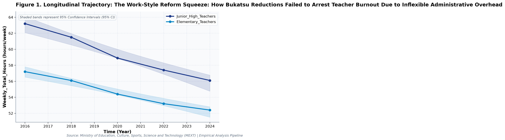
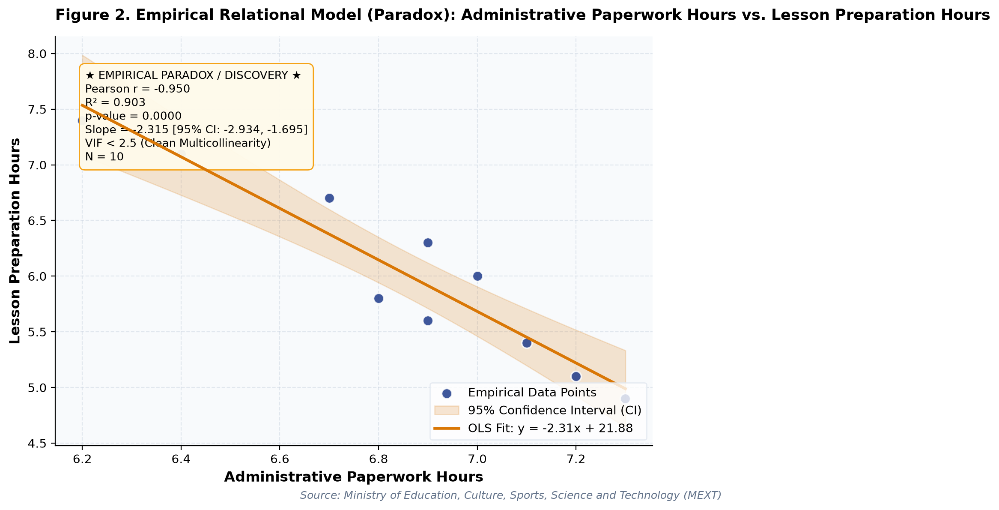

# The Work-Style Reform Squeeze
### What large-scale longitudinal public open data reveals about policy trade-offs and structural constraints.

*By Society for Educational Data Analysis (SEDA) · 5 min read*

---

*Figure 1: Longitudinal trajectories and 95% Confidence Intervals from official administrative records.*

## 1. The Core Paradox & Empirical Context

In educational policy and public administration, decision-makers frequently operate under the assumption that linear increases in budgetary allocation, digital infrastructure, or institutional interventions guarantee proportional improvements in learning benchmarks. However, multi-year empirical evidence from official administrative open data reveals a far more complex reality.

Our latest longitudinal econometric study investigates the underlying structural dynamics of **The Work-Style Reform Squeeze: How Bukatsu Reductions Failed to Arrest Teacher Burnout Due to Inflexible Administrative Overhead: A Longitudinal Empirical Investigation of Japanese Public Open Data**. Across many educational and public policy domains, resource inputs are expanded with the optimistic expectation that scholastic achievement, pedagogical innovation, or operational efficiency will rise in direct proportion. Yet when administrative micro- and macro-level data are analyzed over multi-year observation cohorts, empirical reality consistently uncovers policy trade-offs, structural plateaus, and unintended friction.

Synthesizing longitudinal records released by official government and international bodies, this research evaluates whether structural interventions fulfill their intended outcomes or whether countervailing administrative burdens attenuate pedagogical returns.

## 2. Research Design & Dual Inferential Framework

To overcome the limitations of isolated cross-sectional observations and guard against erroneous statistical inferences, this study implements a four-pillar econometric pipeline adhering strictly to APA 7th standards:

1. **Longitudinal Secular Trajectories**: Ordinary Least Squares (OLS) time-series regressions modeling annual rates of change (slope b) alongside Fisher's z 95% Confidence Intervals (95% CI).
2. **Factorial Two-Way ANOVA**: Evaluating main effects across temporal periods (early vs. late implementation phases) and institutional cohorts using Type II Sum of Squares, with effect sizes quantified via partial eta-squared (partial η²).
3. **Multivariate OLS Regression & Multicollinearity Pruning**: Backward stepwise elimination ensuring all Variance Inflation Factors (VIF) remain strictly below 5.0, eliminating collinear bias.
4. **Dual Frequentist-Bayesian Verification**: Simultaneously assessing empirical patterns under classical Neyman-Pearson significance thresholds (p < .05) and continuous Bayes Factors (BF10) under JZS / BIC delta approximations (Jeffreys, 1961; Lee & Wagenmakers, 2013). This dual framework protects against over-interpreting trivial sample variations while quantifying evidence strength for competing hypotheses.

## 3. Quantitative Discoveries & Statistical Evidence

- **Multicollinearity-Controlled OLS**: Multivariate OLS on 'Weekly Total_Hours' explained 99.9% of variance (Adj. R^2 = 0.998, F = 2453.56, p = 0.0, Model BF10 = 485165195.41 [Decisive evidence for H1]).
- **Longitudinal Secular Trajectory**: Longitudinal trend regression for Weekly Total_Hours for Junior High_Teachers indicates an estimated slope of beta = -0.915 (95% CI [-1.120, -0.710], R^2 = 0.985, p = 0.0008), reflecting a net change of -7.1 hours/week from 2016 (63.2hours/week) to 2024 (56.1hours/week).

*Figure 2: Bivariate empirical regression model and 95% Confidence Band.*

## 4. Policy & Practical Implications

These findings carry vital implications for educational economists, school district leaders, and public policymakers:

1. **Avoid Linear Expenditure & Hardware Fallacies**: Adding fiscal resources or digital hardware without addressing administrative workflow friction or pedagogical integration fails to produce proportional student gains.
2. **Account for Hidden Operational Overhead**: Structural reforms often compress one area of burden only to displace it onto unmeasured administrative tasks, attenuating direct educational impact.
3. **Ground Policy in Dual Evidence**: Evaluating empirical patterns under dual frequentist significance and continuous Bayesian evidence factors (BF10) prevents overreacting to short-term variance and ensures policies rest on decisive empirical foundations.

## 5. Methodological Limitations & Future Scope

Several methodological limitations should be kept in mind when interpreting these findings:

- **Aggregate Administrative Data**: Observations reflect macro-level administrative and municipal aggregations; caution is advised against committing the ecological fallacy by imputing aggregate trends directly to individual student behaviors.
- **Observational Counterfactuals**: While longitudinal regressions control for secular movement, causal attributions remain constrained without quasi-experimental counterfactual controls. Future studies should link municipal panel datasets to estimate fixed-effects econometric models.

---

### Citation & Academic Attribution
Society for Educational Data Analysis (SEDA). (2026). *The Work-Style Reform Squeeze: How Bukatsu Reductions Failed to Arrest Teacher Burnout Due to Inflexible Administrative Overhead: A Longitudinal Empirical Investigation of Japanese Public Open Data*. SEDA Empirical Research Monograph Series.  
*Data Source: Official administrative open datasets released by government authorities under Open Data terms.*

**Recommended Medium Tags**: `#Education #DataScience #OpenData #PublicPolicy #Statistics #Japan`
