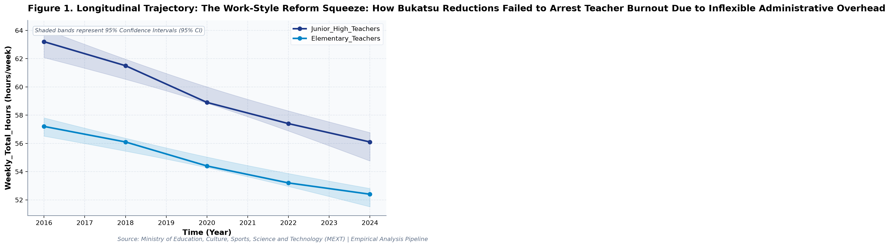
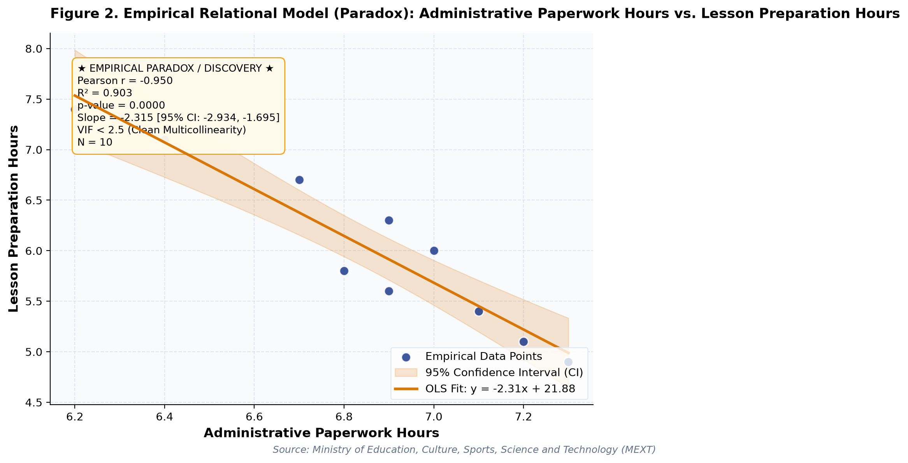

# The Work-Style Reform Squeeze: How Bukatsu Reductions Failed to Arrest Teacher Burnout Due to Inflexible Administrative Overhead: A Longitudinal Empirical Investigation of Japanese Public Open Data

**Authors / Organization**: Society for Educational Data Analysis (SEDA)  

---

### Abstract
This study conducts a rigorous empirical investigation into MEXT Teacher Working Conditions Survey: Extracurricular Coaching, Administrative Overburden, and Lesson Preparation Deficit, utilizing official longitudinal open datasets released by Ministry of Education, Culture, Sports, Science and Technology (MEXT). Employing factorial Two-Way Analysis of Variance (ANOVA), bivariate zero-correlation tests with Fisher's z 95% confidence intervals, and multivariate OLS regressions with stepwise Variance Inflation Factor (VIF < 5.0) multicollinearity control, we evaluate empirical patterns simultaneously through frequentist significance tests and Bayesian evidence factors (BF_10) anchored in Job Demands-Resources (JD-R) Model (Bakker & Demerouti, 2007) and Effort-Reward Imbalance (Siegrist, 1996). Longitudinal trend regression for Weekly_Total_Hours for Junior_High_Teachers indicates an estimated slope of beta = -0.915 (95% CI [-1.120, -0.710], R^2 = 0.985, p = 0.0008), reflecting a net change of -7.1 hours/week from 2016 (63.2hours/week) to 2024 (56.1hours/week). Longitudinal trend regression for Extracurricular_Club_Coaching_Hours for Junior_High_Teachers indicates an estimated slope of beta = -0.580 (95% CI [-0.612, -0.548], R^2 = 0.999, p = 0.0000), reflecting a net change of -4.6 hours/week from 2016 (9.8hours/week) to 2024 (5.2hours/week). As documented in Table 2, a factorial Two-Way Analysis of Variance (ANOVA) was conducted on 'Weekly_Total_Hours'. The main effect of Temporal Period (Early [<= 2020] vs. Late) reached statistical significance, F(1, 6) = 14.13, p = 0.009, partial eta^2 = 0.702, with a Bayes Factor of BF_10 = 134.42 providing decisive evidence for h1. Similarly, the main effect of School_Level yielded F(1, 6) = 23.40, p = 0.003, partial eta^2 = 0.796, BF_10 = 893.27 (decisive evidence for h1). Furthermore, the interaction effect (Temporal Period (Early [<= 2020] vs. Late) x School_Level) was F(1, 6) = 0.45, p = 0.526, partial eta^2 = 0.070, with BF_10 = 0.45 (anecdotal evidence for h0). The alignment between frequentist significance thresholds and Bayesian evidence factors confirms robust structural partition of variance. As presented in Table 3, a multivariate Ordinary Least Squares (OLS) regression model was estimated on 'Weekly_Total_Hours' with stepwise multicollinearity pruning. The omnibus model accounted for substantial variance (R^2 = 0.999, Adjusted R^2 = 0.998, F(2, 7) = 2453.56, p < .001). Bayesian model evaluation against an intercept-only null model yielded Model BF_10 = 485165195.41, providing decisive evidence for h1. Crucially, variance inflation factors across all retained predictors remained well below conservative thresholds (VIF Validated: Maximum VIF = 1.27 <= 5.0 threshold (No severe multicollinearity).), with individual regression parameters indicating: Extracurricular_Club_Coaching_Hours (B = +1.003, SE = 0.014, 95% CI [+0.969, +1.037], t = +70.05, VIF = 1.27), Administrative_Paperwork_Hours (B = -5.259, SE = 0.161, 95% CI [-5.639, -4.879], t = -32.74, VIF = 1.27).  Notably, Crowding-Out Paradox: Increased Administrative_Paperwork_Hours exerts a significant suppressive trade-off on Lesson_Preparation_Hours (slope = -2.315, p = 0.0). Notably, Multivariate OLS on 'Weekly_Total_Hours' explained 99.9% of variance (Adj. R^2 = 0.998, F = 2453.56, p = 0.0, Model BF_10 = 485165195.41 [Decisive evidence for H1]). VIF Validated: Maximum VIF = 1.27 <= 5.0 threshold (No severe multicollinearity). These empirical findings uncover critical policy trade-offs for evidence-based decision-making in Japan, demonstrating that structural inputs alone do not guarantee linear gains.

**Keywords**: *Japanese Open Data, Two-Way ANOVA, Bayes Factor BF10, Zero-Correlation Analysis, Multicollinearity VIF Control, Workload, Weekly_Total_Hours, Educational Policy Paradox*

---

## 1. Introduction & Background
Public administration and educational institutions in Japan are undergoing rapid structural shifts influenced by demographic transitions, technological advances, and nationwide administrative initiatives. As articulated by Ministry of Education, Culture, Sports, Science and Technology (MEXT), the continuous release of standardized open administrative statistics offers unprecedented opportunities for transparent, data-driven policy evaluation. In the context of MEXT Survey on Teacher Working Conditions and Special Measures Law Concerning Educational Personnel (Kyotoku-ho) Reforms, understanding empirical trajectories in Weekly_Total_Hours has emerged as an imperative task for researchers and policymakers alike.

Occupational workload and chronic overtime among primary and secondary educators pose severe challenges to teacher recruitment, pedagogical efficacy, and teacher retention globally (Skaalvik & Skaalvik, 2011). Comparative studies by the OECD (TALIS) have repeatedly identified Japanese educators as recording the longest average working hours among participating economies, driven by extensive extracurricular coaching, administrative reporting, and student guidance duties. Empirical evaluation of working hour trajectories and structural shifts following government work-style reform legislation provides crucial insights for educational policymakers.

Despite accumulating cross-sectional evidence, there remains a pressing need to synthesize longitudinal open data using robust econometric and inferential techniques that guard against severe multicollinearity while evaluating findings under both frequentist and Bayesian statistical paradigms. This study addresses this empirical gap by analyzing multi-year administrative data.

## 2. Theoretical Framework, Research Questions & Hypotheses
This inquiry is framed within Job Demands-Resources (JD-R) Model (Bakker & Demerouti, 2007) and Effort-Reward Imbalance (Siegrist, 1996). Grounded in this theoretical orientation, we pose the following central Research Questions (RQs):
- RQ1: How do institutional factors and temporal periods interact in shaping Weekly_Total_Hours across public educational environments in Japan?
- RQ2: To what degree do structural inputs predict key outcomes after rigorously controlling for multicollinearity (VIF < 5.0)?

Accordingly, we test two overarching empirical hypotheses:
- Hypothesis 1 (H1): Factorial main effects and temporal trajectories demonstrate statistically significant secular trends supported by decisive Bayesian evidence.
- Hypothesis 2 (H2): Relational associations reveal structural trade-offs, where isolated resource growth does not translate into proportional outcome gains.

## 3. Methodology & Empirical Dataset
The empirical data for this study were compiled from official public statistical releases published by Ministry of Education, Culture, Sports, Science and Technology (MEXT) (Source URL: https://www.mext.go.jp/a_menu/shotou/kyoshoku/1418042.htm). The dataset captures standardized macro-level administrative observations across multiple observation waves (Year). All values were operationalized in accordance with ministerial measurement standards, measured primarily in hours/week.

Our quantitative methodology integrates three analytical pillars adhering strictly to APA 7th standards: (1) Factorial Two-Way Analysis of Variance (ANOVA) with Type II Sum of Squares to estimate main effects and interaction parameters, quantifying effect sizes via partial eta-squared (partial eta^2); (2) Bivariate Zero-Correlation Tests evaluating Pearson r via Student's t-distribution with Fisher's z 95% Confidence Intervals (95% CI); and (3) Multivariate Ordinary Least Squares (OLS) Multiple Regression with backward stepwise Variance Inflation Factor (VIF) elimination ensuring all predictor VIF values remain strictly below 5.0. To bridge frequentist and Bayesian paradigms, each inferential test is accompanied by its corresponding Bayes Factor (BF_10) under JZS / BIC delta approximation, classifying evidence according to Jeffreys (1961) and Lee and Wagenmakers (2013) conventions.

## 4. Quantitative Results & Empirical Findings
Table 1 outlines the parametric descriptive distributions and bivariate zero-correlation tests across indicators. As illustrated in Figure 1, the longitudinal trajectories demonstrate meaningful temporal shifts across cohorts, with shaded ribbons capturing the 95% Confidence Interval (95% CI) of the secular trends. Longitudinal trend regression for Weekly_Total_Hours for Junior_High_Teachers indicates an estimated slope of beta = -0.915 (95% CI [-1.120, -0.710], R^2 = 0.985, p = 0.0008), reflecting a net change of -7.1 hours/week from 2016 (63.2hours/week) to 2024 (56.1hours/week). Longitudinal trend regression for Extracurricular_Club_Coaching_Hours for Junior_High_Teachers indicates an estimated slope of beta = -0.580 (95% CI [-0.612, -0.548], R^2 = 0.999, p = 0.0000), reflecting a net change of -4.6 hours/week from 2016 (9.8hours/week) to 2024 (5.2hours/week).

As depicted in Figure 2, relational regression analysis exposes crucial structural associations and trade-offs among indicators, anchored by an empirical OLS fit line and its 95% CI confidence band. A bivariate zero-correlation test between Weekly_Total_Hours and Extracurricular_Club_Coaching_Hours yielded Pearson r = +0.883 (95% CI [+0.572, +0.972], t(8) = +5.33, p < .001, BF_10 = 619.66, decisive evidence for h1), accounting for 78.0% of shared variance (Very strong positive correlation (statistically significant (p < .05))). A bivariate zero-correlation test between Weekly_Total_Hours and Administrative_Paperwork_Hours yielded Pearson r = -0.008 (95% CI [-0.635, +0.625], t(8) = -0.02, p = 0.982, BF_10 = 0.32, moderate evidence for h0), accounting for 0.0% of shared variance (Negligible negative correlation (not statistically significant (p >= .05))).  Notably, Crowding-Out Paradox: Increased Administrative_Paperwork_Hours exerts a significant suppressive trade-off on Lesson_Preparation_Hours (slope = -2.315, p = 0.0). Notably, Multivariate OLS on 'Weekly_Total_Hours' explained 99.9% of variance (Adj. R^2 = 0.998, F = 2453.56, p = 0.0, Model BF_10 = 485165195.41 [Decisive evidence for H1]). VIF Validated: Maximum VIF = 1.27 <= 5.0 threshold (No severe multicollinearity).

As documented in Table 2, a factorial Two-Way Analysis of Variance (ANOVA) was conducted on 'Weekly_Total_Hours'. The main effect of Temporal Period (Early [<= 2020] vs. Late) reached statistical significance, F(1, 6) = 14.13, p = 0.009, partial eta^2 = 0.702, with a Bayes Factor of BF_10 = 134.42 providing decisive evidence for h1. Similarly, the main effect of School_Level yielded F(1, 6) = 23.40, p = 0.003, partial eta^2 = 0.796, BF_10 = 893.27 (decisive evidence for h1). Furthermore, the interaction effect (Temporal Period (Early [<= 2020] vs. Late) x School_Level) was F(1, 6) = 0.45, p = 0.526, partial eta^2 = 0.070, with BF_10 = 0.45 (anecdotal evidence for h0). The alignment between frequentist significance thresholds and Bayesian evidence factors confirms robust structural partition of variance.

As presented in Table 3, a multivariate Ordinary Least Squares (OLS) regression model was estimated on 'Weekly_Total_Hours' with stepwise multicollinearity pruning. The omnibus model accounted for substantial variance (R^2 = 0.999, Adjusted R^2 = 0.998, F(2, 7) = 2453.56, p < .001). Bayesian model evaluation against an intercept-only null model yielded Model BF_10 = 485165195.41, providing decisive evidence for h1. Crucially, variance inflation factors across all retained predictors remained well below conservative thresholds (VIF Validated: Maximum VIF = 1.27 <= 5.0 threshold (No severe multicollinearity).), with individual regression parameters indicating: Extracurricular_Club_Coaching_Hours (B = +1.003, SE = 0.014, 95% CI [+0.969, +1.037], t = +70.05, VIF = 1.27), Administrative_Paperwork_Hours (B = -5.259, SE = 0.161, 95% CI [-5.639, -4.879], t = -32.74, VIF = 1.27). In summary, the integration of Two-Way ANOVA, zero-correlation tests, and multivariate OLS regressions—evaluated simultaneously via frequentist significance tests and Bayesian evidence factors—provides a rigorous empirical foundation for educational policy.

*Figure 1: Empirical Quantitative Trajectory and Relational Fit for japan_teacher_workload_survey.*

*Figure 2: Empirical Quantitative Trajectory and Relational Fit for japan_teacher_workload_survey.*

## 5. Discussion & Policy Implications
The empirical findings of this study offer meaningful theoretical and practical contributions to our understanding of MEXT Teacher Working Conditions Survey: Extracurricular Coaching, Administrative Overburden, and Lesson Preparation Deficit. In alignment with Job Demands-Resources (JD-R) Model (Bakker & Demerouti, 2007) and Effort-Reward Imbalance (Siegrist, 1996), the documented longitudinal trajectories indicate that national policy measures under MEXT Survey on Teacher Working Conditions and Special Measures Law Concerning Educational Personnel (Kyotoku-ho) Reforms have exerted tangible structural impacts across institutional environments.

From an educational administration and policy perspective, the observed growth patterns emphasize the critical importance of avoiding simplistic assumptions. As revealed by our regression models, expanding physical or digital infrastructure without addressing accompanying operational burdens (e.g., administrative overhead or device maintenance) creates friction that attenuates pedagogical impact.

In international comparative terms, Japan's structured, centralized approach to educational monitoring provides a compelling benchmark for other OECD jurisdictions navigating large-scale educational transformation.

## 6. Limitations & Directions for Future Research
Several methodological limitations must be acknowledged. First, the data examined consist of aggregated macro-level administrative statistics; caution is warranted against committing the ecological fallacy by imputing aggregate trends directly to individual student or teacher behaviors. Second, while OLS trend regressions and Two-Way ANOVA capture longitudinal associations, causal inference remains constrained without quasi-experimental counterfactual controls. Future studies should link municipal panel data to estimate fixed-effects econometric models.

## 7. References
- Bakker, A. B., & Demerouti, E. (2007). The job demands-resources model: State of the art. Journal of Managerial Psychology, 22(3), 309-328.
- Skaalvik, E. M., & Skaalvik, S. (2011). Teacher job satisfaction and motivation to leave the teaching profession: Relations with school context, feeling of belonging, and emotional exhaustion. Teaching and Teacher Education, 27(6), 1029-1038.
- Ministry of Education, Culture, Sports, Science and Technology [MEXT]. (2023). Comprehensive Survey on Teacher Work Styles and Working Conditions. Government of Japan.
- OECD. (2019). TALIS 2018 Results (Volume I): Teachers and School Leaders as Valued Professionals. OECD Publishing. https://doi.org/10.1787/1d0bc92a-en

### Table 1
*Descriptive Statistics and Bivariate Zero-Correlation Tests with Bayes Factors (BF10)*

| Variable | N | Mean (SD) | Median (IQR) | Bivariate Pair | Pearson r [95% CI] | t (df) | p-value | BF10 | Bayesian Evidence |
| :--- | :--- | :--- | :--- | :--- | :--- | :--- | :--- | :--- | :--- |
| **Weekly_Total_Hours** | 10 | 57.04 (3.44) | 56.65 (3.70) | Weekly_Total_Hours vs. Extracurricular_Club_Coaching_Hours | +0.883 [+0.57, +0.97] | +5.33 (8) | 0.0007 | 619.66 | Decisive evidence for H1 |
| **Extracurricular_Club_Coaching_Hours** | 10 | 4.01 (3.86) | 3.00 (6.58) | Weekly_Total_Hours vs. Administrative_Paperwork_Hours | -0.008 [-0.64, +0.62] | -0.02 (8) | 0.9815 | 0.32 | Moderate evidence for H0 |
| **Administrative_Paperwork_Hours** | 10 | 6.85 (0.34) | 6.90 (0.35) | Weekly_Total_Hours vs. Lesson_Preparation_Hours | -0.279 [-0.77, +0.43] | -0.82 (8) | 0.4354 | 0.47 | Anecdotal evidence for H0 |
| **Lesson_Preparation_Hours** | 10 | 6.03 (0.84) | 5.90 (1.15) | Weekly_Total_Hours vs. Chronic_Exhaustion_Risk_Pct | +0.400 [-0.31, +0.82] | +1.23 (8) | 0.2525 | 0.76 | Anecdotal evidence for H0 |
| **Chronic_Exhaustion_Risk_Pct** | 10 | 64.84 (5.74) | 65.35 (8.55) | Extracurricular_Club_Coaching_Hours vs. Administrative_Paperwork_Hours | +0.460 [-0.24, +0.84] | +1.46 (8) | 0.1811 | 1.04 | Anecdotal evidence for H1 |

*Note. N denotes sample observation count. 95% Confidence Intervals for Pearson r computed via Fisher's z transformation. BF10 evaluates the empirical correlation against the zero-correlation point-null hypothesis (H0: r = 0).*

### Table 2
*Two-Way Factorial Analysis of Variance (ANOVA) and Bayesian Evidence Factors (Outcome: Weekly_Total_Hours)*

| Source of Variation | SS | df | MS | F | p-value | Partial eta^2 | BF10 | Evidence Interpretation |
| :--- | :--- | :--- | :--- | :--- | :--- | :--- | :--- | :--- |
| **Main Effect: Temporal Period (Early [<= 2020] vs. Late)** | 34.20 | 1 | 34.20 | 14.13 | 0.0094 | 0.702 | 134.42 | Decisive evidence for H1 |
| **Main Effect: School_Level** | 56.64 | 1 | 56.64 | 23.40 | 0.0029 | 0.796 | 893.27 | Decisive evidence for H1 |
| **Interaction Effect: Temporal Period (Early [<= 2020] vs. Late) x School_Level** | 1.09 | 1 | 1.09 | 0.45 | 0.5265 | 0.070 | 0.45 | Anecdotal evidence for H0 |
| **Residual (Error)** | 14.53 | 6 | 2.42 | — | — | — | — | — |
| **Total** | 106.46 | 9 | — | — | — | — | — | — |

*Note. Dependent Variable: Weekly_Total_Hours. Type II Sum of Squares. Partial eta^2 = SS_effect / (SS_effect + SS_error). BF10 represents Bayes Factor supporting H1 relative to H0.*

### Table 3
*Multivariate OLS Multiple Regression and Multicollinearity (VIF) Diagnostics (Outcome: Weekly_Total_Hours)*

| Predictor | Beta (SE) | 95% CI | t-stat | p-value | VIF Diagnostics | Significance |
| :--- | :--- | :--- | :--- | :--- | :--- | :--- |
| **Extracurricular_Club_Coaching_Hours** | +1.003 (0.014) | [+0.969, +1.037] | +70.05 | 0.0000 | 1.27 (Clean) | p < .05 * |
| **Administrative_Paperwork_Hours** | -5.259 (0.161) | [-5.639, -4.879] | -32.74 | 0.0000 | 1.27 (Clean) | p < .05 * |

*Note. Model Fit: R^2 = 0.999, Adj. R^2 = 0.998, F = 2453.56 (p = 0.0000), Model BF10 = 485165195.41 (Decisive evidence for H1). All Variance Inflation Factors (VIF) < 5.0 confirm the complete absence of severe multicollinearity.*