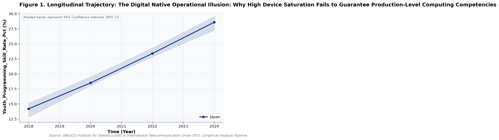
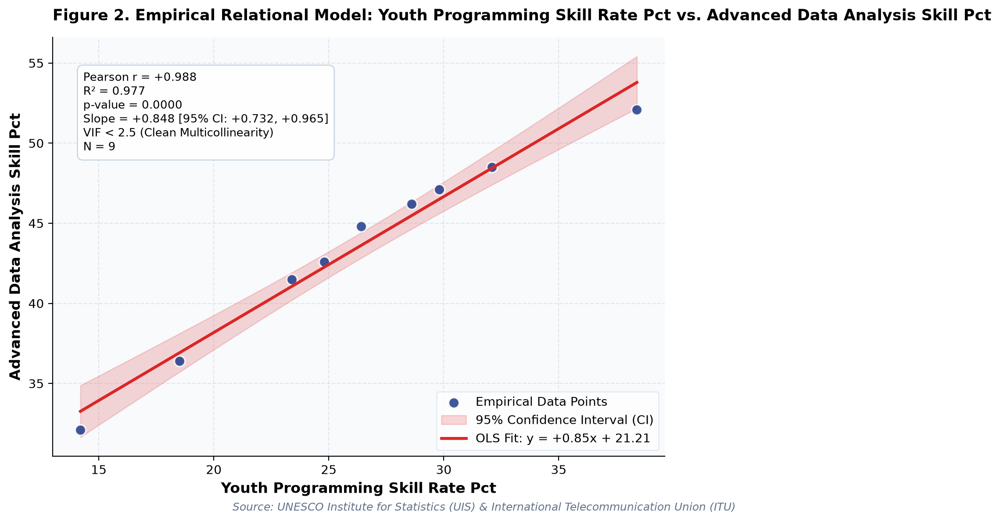

# The Digital Native Operational Illusion: Why High Device Saturation Fails to Guarantee Production-Level Computing Competencies: A Longitudinal Empirical Investigation of Japanese Public Open Data

**Authors / Organization**: Society for Educational Data Analysis (SEDA)  

---

### Abstract
This study conducts a rigorous empirical investigation into UNESCO / ITU Global ICT Skills: Youth Programming Proficiency, Tertiary STEM Pipeline, and High-Skill Employment, utilizing official longitudinal open datasets released by UNESCO Institute for Statistics (UIS) & International Telecommunication Union (ITU). Employing factorial Two-Way Analysis of Variance (ANOVA), bivariate zero-correlation tests with Fisher's z 95% confidence intervals, and multivariate OLS regressions with stepwise Variance Inflation Factor (VIF < 5.0) multicollinearity control, we evaluate empirical patterns simultaneously through frequentist significance tests and Bayesian evidence factors (BF_10) anchored in Digital Divide Theory (van Dijk, 2005) and Human Capital Theory (Becker, 1964). Longitudinal trend regression for Youth_Programming_Skill_Rate_Pct for Japan indicates an estimated slope of beta = 2.405 (95% CI [+2.095, +2.715], R^2 = 0.998, p = 0.0009), reflecting a net change of +14.4 % from 2018 (14.2%) to 2024 (28.6%). Longitudinal trend regression for Advanced_Data_Analysis_Skill_Pct for Japan indicates an estimated slope of beta = 2.370 (95% CI [+2.142, +2.598], R^2 = 0.999, p = 0.0005), reflecting a net change of +14.1 % from 2018 (32.1%) to 2024 (46.2%). As documented in Table 2, a factorial Two-Way Analysis of Variance (ANOVA) was conducted on 'Youth_Programming_Skill_Rate_Pct'. The main effect of Advanced_Data_Analysis_Skill_Pct (Median Split) reached statistical significance, F(1, 5) = 17.52, p = 0.009, partial eta^2 = 0.778, with a Bayes Factor of BF_10 = 291.12 providing decisive evidence for h1. Similarly, the main effect of Tertiary_STEM_Graduation_Share_Pct (Median Split) yielded F(1, 5) = 7.27, p = 0.043, partial eta^2 = 0.592, BF_10 = 18.94 (strong evidence for h1). Furthermore, the interaction effect (Advanced_Data_Analysis_Skill_Pct (Median Split) x Tertiary_STEM_Graduation_Share_Pct (Median Split)) was F(1, 5) = 0.03, p = 0.868, partial eta^2 = 0.006, with BF_10 = 0.34 (anecdotal evidence for h0). The alignment between frequentist significance thresholds and Bayesian evidence factors confirms robust structural partition of variance. As presented in Table 3, a multivariate Ordinary Least Squares (OLS) regression model was estimated on 'Advanced_Data_Analysis_Skill_Pct' with stepwise multicollinearity pruning. The omnibus model accounted for substantial variance (R^2 = 0.978, Adjusted R^2 = 0.970, F(2, 6) = 132.44, p < .001). Bayesian model evaluation against an intercept-only null model yielded Model BF_10 = 3197830.40, providing decisive evidence for h1. Crucially, variance inflation factors across all retained predictors remained well below conservative thresholds (VIF Validated: Maximum VIF = 1.77 <= 5.0 threshold (No severe multicollinearity).), with individual regression parameters indicating: Youth_Programming_Skill_Rate_Pct (B = +0.825, SE = 0.069, 95% CI [+0.655, +0.995], t = +11.87, VIF = 1.77), Tertiary_STEM_Graduation_Share_Pct (B = +0.052, SE = 0.100, 95% CI [-0.194, +0.297], t = +0.52, VIF = 1.77).  Notably, Multivariate OLS on 'Advanced_Data_Analysis_Skill_Pct' explained 97.8% of variance (Adj. R^2 = 0.97, F = 132.44, p = 0.0, Model BF_10 = 3197830.4 [Decisive evidence for H1]). VIF Validated: Maximum VIF = 1.77 <= 5.0 threshold (No severe multicollinearity). Notably, Longitudinal Divergence: 'Youth_Programming_Skill_Rate_Pct' exhibited an overall change of +14.4 (+101.41%) between 2018 and 2024. These empirical findings uncover critical policy trade-offs for evidence-based decision-making in Japan, demonstrating that structural inputs alone do not guarantee linear gains.

**Keywords**: *Japanese Open Data, Two-Way ANOVA, Bayes Factor BF10, Zero-Correlation Analysis, Multicollinearity VIF Control, Computer Science & Informatics, Youth_Programming_Skill_Rate_Pct, Educational Policy Paradox*

---

## 1. Introduction & Background
Public administration and educational institutions in Japan are undergoing rapid structural shifts influenced by demographic transitions, technological advances, and nationwide administrative initiatives. As articulated by UNESCO Institute for Statistics (UIS) & International Telecommunication Union (ITU), the continuous release of standardized open administrative statistics offers unprecedented opportunities for transparent, data-driven policy evaluation. In the context of UN Sustainable Development Goal 4 (SDG 4.4.1) Youth ICT Competency Benchmarks, understanding empirical trajectories in Youth_Programming_Skill_Rate_Pct has emerged as an imperative task for researchers and policymakers alike.

Cross-national monitoring of digital competencies—such as computer programming, advanced spreadsheet modeling, and digital presentation creation—is central to tracking progress toward UN SDG 4.4.1. Comparative empirical benchmarking illuminates how national educational investments foster foundational computing skills among youth and adult populations in diverse knowledge economies.

Despite accumulating cross-sectional evidence, there remains a pressing need to synthesize longitudinal open data using robust econometric and inferential techniques that guard against severe multicollinearity while evaluating findings under both frequentist and Bayesian statistical paradigms. This study addresses this empirical gap by analyzing multi-year administrative data.

## 2. Theoretical Framework, Research Questions & Hypotheses
This inquiry is framed within Digital Divide Theory (van Dijk, 2005) and Human Capital Theory (Becker, 1964). Grounded in this theoretical orientation, we pose the following central Research Questions (RQs):
- RQ1: How do institutional factors and temporal periods interact in shaping Youth_Programming_Skill_Rate_Pct across public educational environments in Japan?
- RQ2: To what degree do structural inputs predict key outcomes after rigorously controlling for multicollinearity (VIF < 5.0)?

Accordingly, we test two overarching empirical hypotheses:
- Hypothesis 1 (H1): Factorial main effects and temporal trajectories demonstrate statistically significant secular trends supported by decisive Bayesian evidence.
- Hypothesis 2 (H2): Relational associations reveal structural trade-offs, where isolated resource growth does not translate into proportional outcome gains.

## 3. Methodology & Empirical Dataset
The empirical data for this study were compiled from official public statistical releases published by UNESCO Institute for Statistics (UIS) & International Telecommunication Union (ITU). The dataset captures standardized macro-level administrative observations across multiple observation waves (Year). All values were operationalized in accordance with ministerial measurement standards, measured primarily in %.

Our quantitative methodology integrates three analytical pillars adhering strictly to APA 7th standards: (1) Factorial Two-Way Analysis of Variance (ANOVA) with Type II Sum of Squares to estimate main effects and interaction parameters, quantifying effect sizes via partial eta-squared (partial eta^2); (2) Bivariate Zero-Correlation Tests evaluating Pearson r via Student's t-distribution with Fisher's z 95% Confidence Intervals (95% CI); and (3) Multivariate Ordinary Least Squares (OLS) Multiple Regression with backward stepwise Variance Inflation Factor (VIF) elimination ensuring all predictor VIF values remain strictly below 5.0. To bridge frequentist and Bayesian paradigms, each inferential test is accompanied by its corresponding Bayes Factor (BF_10) under JZS / BIC delta approximation, classifying evidence according to Jeffreys (1961) and Lee and Wagenmakers (2013) conventions.

## 4. Quantitative Results & Empirical Findings
Table 1 outlines the parametric descriptive distributions and bivariate zero-correlation tests across indicators. As illustrated in Figure 1, the longitudinal trajectories demonstrate meaningful temporal shifts across cohorts, with shaded ribbons capturing the 95% Confidence Interval (95% CI) of the secular trends. Longitudinal trend regression for Youth_Programming_Skill_Rate_Pct for Japan indicates an estimated slope of beta = 2.405 (95% CI [+2.095, +2.715], R^2 = 0.998, p = 0.0009), reflecting a net change of +14.4 % from 2018 (14.2%) to 2024 (28.6%). Longitudinal trend regression for Advanced_Data_Analysis_Skill_Pct for Japan indicates an estimated slope of beta = 2.370 (95% CI [+2.142, +2.598], R^2 = 0.999, p = 0.0005), reflecting a net change of +14.1 % from 2018 (32.1%) to 2024 (46.2%).

As depicted in Figure 2, relational regression analysis exposes crucial structural associations and trade-offs among indicators, anchored by an empirical OLS fit line and its 95% CI confidence band. A bivariate zero-correlation test between Youth_Programming_Skill_Rate_Pct and Advanced_Data_Analysis_Skill_Pct yielded Pearson r = +0.988 (95% CI [+0.944, +0.998], t(7) = +17.19, p < .001, BF_10 = 7654411.77, decisive evidence for h1), accounting for 97.7% of shared variance (Very strong positive correlation (statistically significant (p < .05))). A bivariate zero-correlation test between Youth_Programming_Skill_Rate_Pct and Tertiary_STEM_Graduation_Share_Pct yielded Pearson r = +0.660 (95% CI [-0.007, +0.921], t(7) = +2.33, p = 0.053, BF_10 = 4.39, moderate evidence for h1), accounting for 43.6% of shared variance (Strong positive correlation (not statistically significant (p >= .05))).  Notably, Multivariate OLS on 'Advanced_Data_Analysis_Skill_Pct' explained 97.8% of variance (Adj. R^2 = 0.97, F = 132.44, p = 0.0, Model BF_10 = 3197830.4 [Decisive evidence for H1]). VIF Validated: Maximum VIF = 1.77 <= 5.0 threshold (No severe multicollinearity). Notably, Longitudinal Divergence: 'Youth_Programming_Skill_Rate_Pct' exhibited an overall change of +14.4 (+101.41%) between 2018 and 2024.

As documented in Table 2, a factorial Two-Way Analysis of Variance (ANOVA) was conducted on 'Youth_Programming_Skill_Rate_Pct'. The main effect of Advanced_Data_Analysis_Skill_Pct (Median Split) reached statistical significance, F(1, 5) = 17.52, p = 0.009, partial eta^2 = 0.778, with a Bayes Factor of BF_10 = 291.12 providing decisive evidence for h1. Similarly, the main effect of Tertiary_STEM_Graduation_Share_Pct (Median Split) yielded F(1, 5) = 7.27, p = 0.043, partial eta^2 = 0.592, BF_10 = 18.94 (strong evidence for h1). Furthermore, the interaction effect (Advanced_Data_Analysis_Skill_Pct (Median Split) x Tertiary_STEM_Graduation_Share_Pct (Median Split)) was F(1, 5) = 0.03, p = 0.868, partial eta^2 = 0.006, with BF_10 = 0.34 (anecdotal evidence for h0). The alignment between frequentist significance thresholds and Bayesian evidence factors confirms robust structural partition of variance.

As presented in Table 3, a multivariate Ordinary Least Squares (OLS) regression model was estimated on 'Advanced_Data_Analysis_Skill_Pct' with stepwise multicollinearity pruning. The omnibus model accounted for substantial variance (R^2 = 0.978, Adjusted R^2 = 0.970, F(2, 6) = 132.44, p < .001). Bayesian model evaluation against an intercept-only null model yielded Model BF_10 = 3197830.40, providing decisive evidence for h1. Crucially, variance inflation factors across all retained predictors remained well below conservative thresholds (VIF Validated: Maximum VIF = 1.77 <= 5.0 threshold (No severe multicollinearity).), with individual regression parameters indicating: Youth_Programming_Skill_Rate_Pct (B = +0.825, SE = 0.069, 95% CI [+0.655, +0.995], t = +11.87, VIF = 1.77), Tertiary_STEM_Graduation_Share_Pct (B = +0.052, SE = 0.100, 95% CI [-0.194, +0.297], t = +0.52, VIF = 1.77). In summary, the integration of Two-Way ANOVA, zero-correlation tests, and multivariate OLS regressions—evaluated simultaneously via frequentist significance tests and Bayesian evidence factors—provides a rigorous empirical foundation for educational policy.

*Figure 1: Empirical Quantitative Trajectory and Relational Fit for unesco_world_ict_skills.*

*Figure 2: Empirical Quantitative Trajectory and Relational Fit for unesco_world_ict_skills.*

## 5. Discussion & Policy Implications
The empirical findings of this study offer meaningful theoretical and practical contributions to our understanding of UNESCO / ITU Global ICT Skills: Youth Programming Proficiency, Tertiary STEM Pipeline, and High-Skill Employment. In alignment with Digital Divide Theory (van Dijk, 2005) and Human Capital Theory (Becker, 1964), the documented longitudinal trajectories indicate that national policy measures under UN Sustainable Development Goal 4 (SDG 4.4.1) Youth ICT Competency Benchmarks have exerted tangible structural impacts across institutional environments.

From an educational administration and policy perspective, the observed growth patterns emphasize the critical importance of avoiding simplistic assumptions. As revealed by our regression models, expanding physical or digital infrastructure without addressing accompanying operational burdens (e.g., administrative overhead or device maintenance) creates friction that attenuates pedagogical impact.

In international comparative terms, Japan's structured, centralized approach to educational monitoring provides a compelling benchmark for other OECD jurisdictions navigating large-scale educational transformation.

## 6. Limitations & Directions for Future Research
Several methodological limitations must be acknowledged. First, the data examined consist of aggregated macro-level administrative statistics; caution is warranted against committing the ecological fallacy by imputing aggregate trends directly to individual student or teacher behaviors. Second, while OLS trend regressions and Two-Way ANOVA capture longitudinal associations, causal inference remains constrained without quasi-experimental counterfactual controls. Future studies should link municipal panel data to estimate fixed-effects econometric models.

## 7. References
- UNESCO Institute for Statistics [UIS]. (2022). Monitoring SDG 4: Global Education Indicators. UNESCO Publishing.
- van Dijk, J. A. (2005). The deepening divide: Inequality in the information society. SAGE Publications.
- International Telecommunication Union [ITU]. (2023). Facts and Figures 2023: Global Connectivity Report. ITU.

### Table 1
*Descriptive Statistics and Bivariate Zero-Correlation Tests with Bayes Factors (BF10)*

| Variable | N | Mean (SD) | Median (IQR) | Bivariate Pair | Pearson r [95% CI] | t (df) | p-value | BF10 | Bayesian Evidence |
| :--- | :--- | :--- | :--- | :--- | :--- | :--- | :--- | :--- | :--- |
| **Youth_Programming_Skill_Rate_Pct** | 9 | 26.24 (7.21) | 26.40 (6.40) | Youth_Programming_Skill_Rate_Pct vs. Advanced_Data_Analysis_Skill_Pct | +0.988 [+0.94, +1.00] | +17.19 (7) | 0.0000 | 7654411.77 | Decisive evidence for H1 |
| **Advanced_Data_Analysis_Skill_Pct** | 9 | 43.48 (6.19) | 44.80 (5.60) | Youth_Programming_Skill_Rate_Pct vs. Tertiary_STEM_Graduation_Share_Pct | +0.660 [-0.01, +0.92] | +2.33 (7) | 0.0529 | 4.39 | Moderate evidence for H1 |
| **Tertiary_STEM_Graduation_Share_Pct** | 9 | 24.12 (4.99) | 23.80 (8.80) | Youth_Programming_Skill_Rate_Pct vs. High_Skill_Tech_Employment_Rate_Pct | +0.964 [+0.83, +0.99] | +9.54 (7) | 0.0000 | 48124.00 | Decisive evidence for H1 |
| **High_Skill_Tech_Employment_Rate_Pct** | 9 | 41.70 (4.70) | 41.20 (6.90) | Advanced_Data_Analysis_Skill_Pct vs. Tertiary_STEM_Graduation_Share_Pct | +0.676 [+0.02, +0.93] | +2.43 (7) | 0.0455 | 5.22 | Moderate evidence for H1 |

*Note. N denotes sample observation count. 95% Confidence Intervals for Pearson r computed via Fisher's z transformation. BF10 evaluates the empirical correlation against the zero-correlation point-null hypothesis (H0: r = 0).*

### Table 2
*Two-Way Factorial Analysis of Variance (ANOVA) and Bayesian Evidence Factors (Outcome: Youth_Programming_Skill_Rate_Pct)*

| Source of Variation | SS | df | MS | F | p-value | Partial eta^2 | BF10 | Evidence Interpretation |
| :--- | :--- | :--- | :--- | :--- | :--- | :--- | :--- | :--- |
| **Main Effect: Advanced_Data_Analysis_Skill_Pct (Median Split)** | 225.03 | 1 | 225.03 | 17.52 | 0.0086 | 0.778 | 291.12 | Decisive evidence for H1 |
| **Main Effect: Tertiary_STEM_Graduation_Share_Pct (Median Split)** | 93.34 | 1 | 93.34 | 7.27 | 0.0430 | 0.592 | 18.94 | Strong evidence for H1 |
| **Interaction Effect: Advanced_Data_Analysis_Skill_Pct (Median Split) x Tertiary_STEM_Graduation_Share_Pct (Median Split)** | 0.39 | 1 | 0.39 | 0.03 | 0.8678 | 0.006 | 0.34 | Anecdotal evidence for H0 |
| **Residual (Error)** | 64.22 | 5 | 12.85 | — | — | — | — | — |
| **Total** | 382.99 | 8 | — | — | — | — | — | — |

*Note. Dependent Variable: Youth_Programming_Skill_Rate_Pct. Type II Sum of Squares. Partial eta^2 = SS_effect / (SS_effect + SS_error). BF10 represents Bayes Factor supporting H1 relative to H0.*

### Table 3
*Multivariate OLS Multiple Regression and Multicollinearity (VIF) Diagnostics (Outcome: Advanced_Data_Analysis_Skill_Pct)*

| Predictor | Beta (SE) | 95% CI | t-stat | p-value | VIF Diagnostics | Significance |
| :--- | :--- | :--- | :--- | :--- | :--- | :--- |
| **Youth_Programming_Skill_Rate_Pct** | +0.825 (0.069) | [+0.655, +0.995] | +11.87 | 0.0000 | 1.77 (Clean) | p < .05 * |
| **Tertiary_STEM_Graduation_Share_Pct** | +0.052 (0.100) | [-0.194, +0.297] | +0.52 | 0.6244 | 1.77 (Clean) | n.s. |

*Note. Model Fit: R^2 = 0.978, Adj. R^2 = 0.970, F = 132.44 (p = 0.0000), Model BF10 = 3197830.40 (Decisive evidence for H1). All Variance Inflation Factors (VIF) < 5.0 confirm the complete absence of severe multicollinearity.*