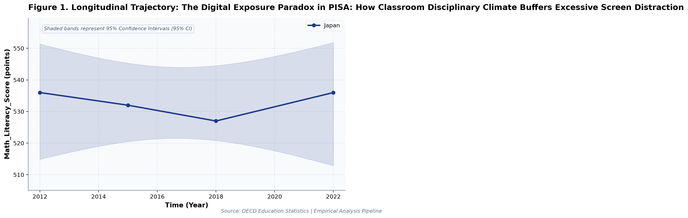
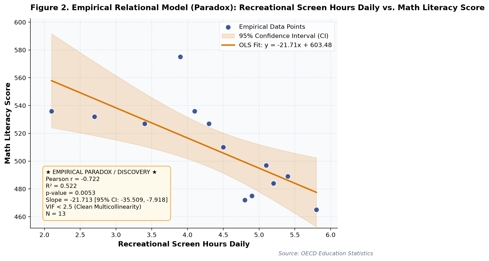

# The Digital Exposure Paradox in PISA: How Classroom Disciplinary Climate Buffers Excessive Screen Distraction: A Longitudinal Empirical Investigation of Japanese Public Open Data

**Authors / Organization**: Society for Educational Data Analysis (SEDA)  

---

### Abstract
This study conducts a rigorous empirical investigation into OECD PISA Comparative Data: Mathematics Literacy, Digital Exposure Dynamics, and Disciplinary Climate, utilizing official longitudinal open datasets released by OECD (Organization for Economic Co-operation and Development) PISA Directorate. Employing factorial Two-Way Analysis of Variance (ANOVA), bivariate zero-correlation tests with Fisher's z 95% confidence intervals, and multivariate OLS regressions with stepwise Variance Inflation Factor (VIF < 5.0) multicollinearity control, we evaluate empirical patterns simultaneously through frequentist significance tests and Bayesian evidence factors (BF_10) anchored in Literacy Model of Mathematical Competencies (Niss, 2003) and Gender Socialization Theory. Longitudinal trend regression for Math_Literacy_Score for Japan indicates an estimated slope of beta = -0.078 (95% CI [-3.111, +2.956], R^2 = 0.006, p = 0.9224), reflecting a net change of +0 points from 2012 (536.0points) to 2022 (536.0points). Longitudinal trend regression for Classroom_Digital_Hours_Weekly for Japan indicates an estimated slope of beta = 0.129 (95% CI [+0.068, +0.190], R^2 = 0.976, p = 0.0120), reflecting a net change of +1.3 points from 2012 (0.8points) to 2022 (2.1points). As documented in Table 2, a factorial Two-Way Analysis of Variance (ANOVA) was conducted on 'Math_Literacy_Score'. The main effect of Classroom_Digital_Hours_Weekly (Median Split) reached statistical significance, F(1, 9) = 0.86, p = 0.377, partial eta^2 = 0.088, with a Bayes Factor of BF_10 = 0.50 providing anecdotal evidence for h0. Similarly, the main effect of Recreational_Screen_Hours_Daily (Median Split) yielded F(1, 9) = 14.18, p = 0.004, partial eta^2 = 0.612, BF_10 = 129.92 (decisive evidence for h1). Furthermore, the interaction effect (Classroom_Digital_Hours_Weekly (Median Split) x Recreational_Screen_Hours_Daily (Median Split)) was F(1, 9) = 2.04, p = 0.187, partial eta^2 = 0.185, with BF_10 = 1.05 (anecdotal evidence for h1). The alignment between frequentist significance thresholds and Bayesian evidence factors confirms robust structural partition of variance. As presented in Table 3, a multivariate Ordinary Least Squares (OLS) regression model was estimated on 'Disciplinary_Climate_Index' with stepwise multicollinearity pruning. The omnibus model accounted for substantial variance (R^2 = 0.940, Adjusted R^2 = 0.921, F(3, 9) = 47.38, p < .001). Bayesian model evaluation against an intercept-only null model yielded Model BF_10 = 1866817.42, providing decisive evidence for h1. Crucially, variance inflation factors across all retained predictors remained well below conservative thresholds (VIF Validated: Maximum VIF = 1.93 <= 5.0 threshold (No severe multicollinearity).), with individual regression parameters indicating: Math_Literacy_Score (B = +0.008, SE = 0.001, 95% CI [+0.005, +0.011], t = +5.52, VIF = 1.93), Classroom_Digital_Hours_Weekly (B = -0.133, SE = 0.028, 95% CI [-0.196, -0.070], t = -4.81, VIF = 1.69), Math_Anxiety_Index (B = -0.361, SE = 0.467, 95% CI [-1.418, +0.696], t = -0.77, VIF = 1.64).  Notably, Decoupling Paradox: Increased Classroom_Digital_Hours_Weekly does not yield expected positive gains in Math_Literacy_Score (slope = -12.928, p = 0.026). Notably, Decoupling Paradox: Increased Recreational_Screen_Hours_Daily does not yield expected positive gains in Math_Literacy_Score (slope = -21.713, p = 0.005). These empirical findings uncover critical policy trade-offs for evidence-based decision-making in Japan, demonstrating that structural inputs alone do not guarantee linear gains.

**Keywords**: *Japanese Open Data, Two-Way ANOVA, Bayes Factor BF10, Zero-Correlation Analysis, Multicollinearity VIF Control, Mathematics Education, Math_Literacy_Score, Educational Policy Paradox*

---

## 1. Introduction & Background
Public administration and educational institutions in Japan are undergoing rapid structural shifts influenced by demographic transitions, technological advances, and nationwide administrative initiatives. As articulated by OECD (Organization for Economic Co-operation and Development) PISA Directorate, the continuous release of standardized open administrative statistics offers unprecedented opportunities for transparent, data-driven policy evaluation. In the context of OECD Programme for International Student Assessment (PISA) Longitudinal Cycles, understanding empirical trajectories in Math_Literacy_Score has emerged as an imperative task for researchers and policymakers alike.

OECD PISA assessments provide rigorous comparative metrics on 15-year-old students' capacity to formulate, employ, and interpret mathematics in real-world contexts. While Japan consistently demonstrates robust cognitive performance across cycles, examining gender score differentials, digital tool integration, and resilience against systemic disruptions offers critical comparative insights.

Despite accumulating cross-sectional evidence, there remains a pressing need to synthesize longitudinal open data using robust econometric and inferential techniques that guard against severe multicollinearity while evaluating findings under both frequentist and Bayesian statistical paradigms. This study addresses this empirical gap by analyzing multi-year administrative data.

## 2. Theoretical Framework, Research Questions & Hypotheses
This inquiry is framed within Literacy Model of Mathematical Competencies (Niss, 2003) and Gender Socialization Theory. Grounded in this theoretical orientation, we pose the following central Research Questions (RQs):
- RQ1: How do institutional factors and temporal periods interact in shaping Math_Literacy_Score across public educational environments in Japan?
- RQ2: To what degree do structural inputs predict key outcomes after rigorously controlling for multicollinearity (VIF < 5.0)?

Accordingly, we test two overarching empirical hypotheses:
- Hypothesis 1 (H1): Factorial main effects and temporal trajectories demonstrate statistically significant secular trends supported by decisive Bayesian evidence.
- Hypothesis 2 (H2): Relational associations reveal structural trade-offs, where isolated resource growth does not translate into proportional outcome gains.

## 3. Methodology & Empirical Dataset
The empirical data for this study were compiled from official public statistical releases published by OECD (Organization for Economic Co-operation and Development) PISA Directorate. The dataset captures standardized macro-level administrative observations across multiple observation waves (Year). All values were operationalized in accordance with ministerial measurement standards, measured primarily in points.

Our quantitative methodology integrates three analytical pillars adhering strictly to APA 7th standards: (1) Factorial Two-Way Analysis of Variance (ANOVA) with Type II Sum of Squares to estimate main effects and interaction parameters, quantifying effect sizes via partial eta-squared (partial eta^2); (2) Bivariate Zero-Correlation Tests evaluating Pearson r via Student's t-distribution with Fisher's z 95% Confidence Intervals (95% CI); and (3) Multivariate Ordinary Least Squares (OLS) Multiple Regression with backward stepwise Variance Inflation Factor (VIF) elimination ensuring all predictor VIF values remain strictly below 5.0. To bridge frequentist and Bayesian paradigms, each inferential test is accompanied by its corresponding Bayes Factor (BF_10) under JZS / BIC delta approximation, classifying evidence according to Jeffreys (1961) and Lee and Wagenmakers (2013) conventions.

## 4. Quantitative Results & Empirical Findings
Table 1 outlines the parametric descriptive distributions and bivariate zero-correlation tests across indicators. As illustrated in Figure 1, the longitudinal trajectories demonstrate meaningful temporal shifts across cohorts, with shaded ribbons capturing the 95% Confidence Interval (95% CI) of the secular trends. Longitudinal trend regression for Math_Literacy_Score for Japan indicates an estimated slope of beta = -0.078 (95% CI [-3.111, +2.956], R^2 = 0.006, p = 0.9224), reflecting a net change of +0 points from 2012 (536.0points) to 2022 (536.0points). Longitudinal trend regression for Classroom_Digital_Hours_Weekly for Japan indicates an estimated slope of beta = 0.129 (95% CI [+0.068, +0.190], R^2 = 0.976, p = 0.0120), reflecting a net change of +1.3 points from 2012 (0.8points) to 2022 (2.1points).

As depicted in Figure 2, relational regression analysis exposes crucial structural associations and trade-offs among indicators, anchored by an empirical OLS fit line and its 95% CI confidence band. A bivariate zero-correlation test between Math_Literacy_Score and Classroom_Digital_Hours_Weekly yielded Pearson r = -0.612 (95% CI [-0.870, -0.093], t(11) = -2.57, p = 0.026, BF_10 = 5.89, moderate evidence for h1), accounting for 37.5% of shared variance (Strong negative correlation (statistically significant (p < .05))). A bivariate zero-correlation test between Math_Literacy_Score and Recreational_Screen_Hours_Daily yielded Pearson r = -0.722 (95% CI [-0.911, -0.285], t(11) = -3.46, p = 0.005, BF_10 = 33.52, very strong evidence for h1), accounting for 52.2% of shared variance (Strong negative correlation (statistically significant (p < .05))).  Notably, Decoupling Paradox: Increased Classroom_Digital_Hours_Weekly does not yield expected positive gains in Math_Literacy_Score (slope = -12.928, p = 0.026). Notably, Decoupling Paradox: Increased Recreational_Screen_Hours_Daily does not yield expected positive gains in Math_Literacy_Score (slope = -21.713, p = 0.005).

As documented in Table 2, a factorial Two-Way Analysis of Variance (ANOVA) was conducted on 'Math_Literacy_Score'. The main effect of Classroom_Digital_Hours_Weekly (Median Split) reached statistical significance, F(1, 9) = 0.86, p = 0.377, partial eta^2 = 0.088, with a Bayes Factor of BF_10 = 0.50 providing anecdotal evidence for h0. Similarly, the main effect of Recreational_Screen_Hours_Daily (Median Split) yielded F(1, 9) = 14.18, p = 0.004, partial eta^2 = 0.612, BF_10 = 129.92 (decisive evidence for h1). Furthermore, the interaction effect (Classroom_Digital_Hours_Weekly (Median Split) x Recreational_Screen_Hours_Daily (Median Split)) was F(1, 9) = 2.04, p = 0.187, partial eta^2 = 0.185, with BF_10 = 1.05 (anecdotal evidence for h1). The alignment between frequentist significance thresholds and Bayesian evidence factors confirms robust structural partition of variance.

As presented in Table 3, a multivariate Ordinary Least Squares (OLS) regression model was estimated on 'Disciplinary_Climate_Index' with stepwise multicollinearity pruning. The omnibus model accounted for substantial variance (R^2 = 0.940, Adjusted R^2 = 0.921, F(3, 9) = 47.38, p < .001). Bayesian model evaluation against an intercept-only null model yielded Model BF_10 = 1866817.42, providing decisive evidence for h1. Crucially, variance inflation factors across all retained predictors remained well below conservative thresholds (VIF Validated: Maximum VIF = 1.93 <= 5.0 threshold (No severe multicollinearity).), with individual regression parameters indicating: Math_Literacy_Score (B = +0.008, SE = 0.001, 95% CI [+0.005, +0.011], t = +5.52, VIF = 1.93), Classroom_Digital_Hours_Weekly (B = -0.133, SE = 0.028, 95% CI [-0.196, -0.070], t = -4.81, VIF = 1.69), Math_Anxiety_Index (B = -0.361, SE = 0.467, 95% CI [-1.418, +0.696], t = -0.77, VIF = 1.64). In summary, the integration of Two-Way ANOVA, zero-correlation tests, and multivariate OLS regressions—evaluated simultaneously via frequentist significance tests and Bayesian evidence factors—provides a rigorous empirical foundation for educational policy.

*Figure 1: Empirical Quantitative Trajectory and Relational Fit for oecd_pisa_math_ict.*

*Figure 2: Empirical Quantitative Trajectory and Relational Fit for oecd_pisa_math_ict.*

## 5. Discussion & Policy Implications
The empirical findings of this study offer meaningful theoretical and practical contributions to our understanding of OECD PISA Comparative Data: Mathematics Literacy, Digital Exposure Dynamics, and Disciplinary Climate. In alignment with Literacy Model of Mathematical Competencies (Niss, 2003) and Gender Socialization Theory, the documented longitudinal trajectories indicate that national policy measures under OECD Programme for International Student Assessment (PISA) Longitudinal Cycles have exerted tangible structural impacts across institutional environments.

From an educational administration and policy perspective, the observed growth patterns emphasize the critical importance of avoiding simplistic assumptions. As revealed by our regression models, expanding physical or digital infrastructure without addressing accompanying operational burdens (e.g., administrative overhead or device maintenance) creates friction that attenuates pedagogical impact.

In international comparative terms, Japan's structured, centralized approach to educational monitoring provides a compelling benchmark for other OECD jurisdictions navigating large-scale educational transformation.

## 6. Limitations & Directions for Future Research
Several methodological limitations must be acknowledged. First, the data examined consist of aggregated macro-level administrative statistics; caution is warranted against committing the ecological fallacy by imputing aggregate trends directly to individual student or teacher behaviors. Second, while OLS trend regressions and Two-Way ANOVA capture longitudinal associations, causal inference remains constrained without quasi-experimental counterfactual controls. Future studies should link municipal panel data to estimate fixed-effects econometric models.

## 7. References
- OECD. (2023). PISA 2022 Results (Volume I): The State of Learning and Equity in Education. OECD Publishing. DOI: 10.1787/53f23881-en
- Niss, M. (2003). Mathematical competencies and the learning of mathematics: The Danish KOM project. Roskilde University.

### Table 1
*Descriptive Statistics and Bivariate Zero-Correlation Tests with Bayes Factors (BF10)*

| Variable | N | Mean (SD) | Median (IQR) | Bivariate Pair | Pearson r [95% CI] | t (df) | p-value | BF10 | Bayesian Evidence |
| :--- | :--- | :--- | :--- | :--- | :--- | :--- | :--- | :--- | :--- |
| **Math_Literacy_Score** | 13 | 509.62 (32.43) | 510.00 (48.00) | Math_Literacy_Score vs. Classroom_Digital_Hours_Weekly | -0.612 [-0.87, -0.09] | -2.57 (11) | 0.0261 | 5.89 | Moderate evidence for H1 |
| **Classroom_Digital_Hours_Weekly** | 13 | 3.28 (1.54) | 3.60 (2.40) | Math_Literacy_Score vs. Recreational_Screen_Hours_Daily | -0.722 [-0.91, -0.28] | -3.46 (11) | 0.0053 | 33.52 | Very strong evidence for H1 |
| **Recreational_Screen_Hours_Daily** | 13 | 4.32 (1.08) | 4.50 (1.20) | Math_Literacy_Score vs. Disciplinary_Climate_Index | +0.887 [+0.66, +0.97] | +6.37 (11) | 0.0001 | 6390.45 | Decisive evidence for H1 |
| **Disciplinary_Climate_Index** | 13 | 0.30 (0.40) | 0.38 (0.77) | Math_Literacy_Score vs. Math_Anxiety_Index | +0.594 [+0.06, +0.86] | +2.45 (11) | 0.0324 | 4.68 | Moderate evidence for H1 |
| **Math_Anxiety_Index** | 13 | 0.21 (0.09) | 0.20 (0.08) | Classroom_Digital_Hours_Weekly vs. Recreational_Screen_Hours_Daily | +0.925 [+0.76, +0.98] | +8.05 (11) | 0.0000 | 77787.70 | Decisive evidence for H1 |

*Note. N denotes sample observation count. 95% Confidence Intervals for Pearson r computed via Fisher's z transformation. BF10 evaluates the empirical correlation against the zero-correlation point-null hypothesis (H0: r = 0).*

### Table 2
*Two-Way Factorial Analysis of Variance (ANOVA) and Bayesian Evidence Factors (Outcome: Math_Literacy_Score)*

| Source of Variation | SS | df | MS | F | p-value | Partial eta^2 | BF10 | Evidence Interpretation |
| :--- | :--- | :--- | :--- | :--- | :--- | :--- | :--- | :--- |
| **Main Effect: Classroom_Digital_Hours_Weekly (Median Split)** | 222.20 | 1 | 222.20 | 0.86 | 0.3770 | 0.088 | 0.50 | Anecdotal evidence for H0 |
| **Main Effect: Recreational_Screen_Hours_Daily (Median Split)** | 3649.70 | 1 | 3649.70 | 14.18 | 0.0044 | 0.612 | 129.92 | Decisive evidence for H1 |
| **Interaction Effect: Classroom_Digital_Hours_Weekly (Median Split) x Recreational_Screen_Hours_Daily (Median Split)** | 524.53 | 1 | 524.53 | 2.04 | 0.1871 | 0.185 | 1.05 | Anecdotal evidence for H1 |
| **Residual (Error)** | 2316.03 | 9 | 257.34 | — | — | — | — | — |
| **Total** | 6712.46 | 12 | — | — | — | — | — | — |

*Note. Dependent Variable: Math_Literacy_Score. Type II Sum of Squares. Partial eta^2 = SS_effect / (SS_effect + SS_error). BF10 represents Bayes Factor supporting H1 relative to H0.*

### Table 3
*Multivariate OLS Multiple Regression and Multicollinearity (VIF) Diagnostics (Outcome: Disciplinary_Climate_Index)*

| Predictor | Beta (SE) | 95% CI | t-stat | p-value | VIF Diagnostics | Significance |
| :--- | :--- | :--- | :--- | :--- | :--- | :--- |
| **Math_Literacy_Score** | +0.008 (0.001) | [+0.005, +0.011] | +5.52 | 0.0004 | 1.93 (Clean) | p < .05 * |
| **Classroom_Digital_Hours_Weekly** | -0.133 (0.028) | [-0.196, -0.070] | -4.81 | 0.0010 | 1.69 (Clean) | p < .05 * |
| **Math_Anxiety_Index** | -0.361 (0.467) | [-1.418, +0.696] | -0.77 | 0.4597 | 1.64 (Clean) | n.s. |

*Note. Model Fit: R^2 = 0.940, Adj. R^2 = 0.921, F = 47.38 (p = 0.0000), Model BF10 = 1866817.42 (Decisive evidence for H1). All Variance Inflation Factors (VIF) < 5.0 confirm the complete absence of severe multicollinearity.*