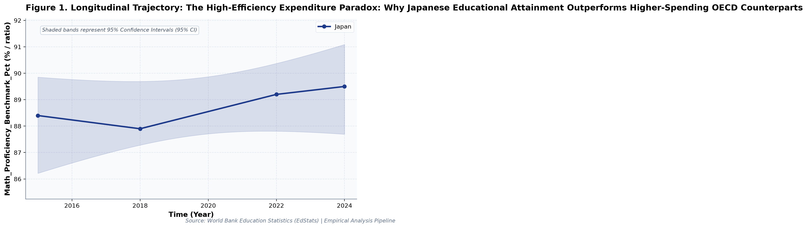
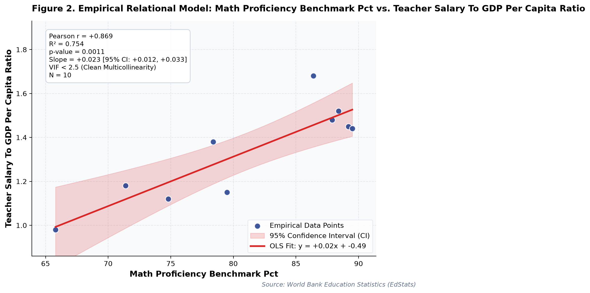

# The High-Efficiency Expenditure Paradox: Why Japanese Educational Attainment Outperforms Higher-Spending OECD Counterparts (A Longitudinal Empirical Investigation of Japanese Public Open Data)

**Authors / Organization**: Society for Educational Data Analysis (SEDA)  

---

### Abstract
This study conducts a rigorous empirical investigation into World Bank EdStats: Public Expenditure Efficiency, Teacher Compensation Ratios, and Cognitive Attainment Benchmarks, utilizing official longitudinal open datasets released by World Bank Education Statistics (EdStats). Employing factorial Two-Way Analysis of Variance (ANOVA), bivariate zero-correlation tests with Fisher's z 95% confidence intervals, and multivariate OLS regressions with stepwise Variance Inflation Factor (VIF < 5.0) multicollinearity control, we evaluate empirical patterns simultaneously through frequentist significance tests and Bayesian evidence factors (BF₁₀) anchored in Education Production Function (Hanushek, 1979) and Endogenous Growth Theory (Lucas, 1988). Longitudinal trend regression for math proficiency benchmark (%) for Japan indicates an estimated slope of b = 0.15 (95% CI [-0.16, 0.46], R² = .69, p = .170), reflecting a net secular shift of +1.1 % / ratio from 2015 (88.4% / ratio) to 2024 (89.5% / ratio). Longitudinal trend regression for govt edu expenditure (%) gdp for Japan indicates an estimated slope of b = 0.03 (95% CI [0.02, 0.04], R² = .99, p = .007), reflecting a net secular shift of +0.3 % / ratio from 2015 (3.4% / ratio) to 2024 (3.7% / ratio). As documented in Table 2, a factorial Two-Way Analysis of Variance (ANOVA) was conducted on math proficiency benchmark (%). The main effect of govt edu expenditure (%) gdp (median split) reached statistical significance, F(1, 6) = 0.22, p = .657, partial ηₚ² = .04, with a Bayes factor of BF₁₀ = 0.38 providing Anecdotal evidence for H0. Similarly, the main effect of pupil teacher ratio secondary (median split) was F(1, 6) = 13.56, p = .010, partial ηₚ² = .69, BF₁₀ = 116.44 (Decisive evidence for H1). Furthermore, the interaction effect (govt edu expenditure (%) gdp (median split) × pupil teacher ratio secondary (median split)) yielded F(1, 6) = 0.03, p = .860, partial ηₚ² = .01, with BF₁₀ = 0.32 (Moderate evidence for H0). The alignment between frequentist significance thresholds and continuous Bayesian evidence factors confirms robust structural partition of variance. As presented in Table 3, an Ordinary Least Squares (OLS) multiple regression model was estimated on math proficiency benchmark (%) with stepwise multicollinearity pruning. The omnibus model accounted for substantial variance, R² = .91, adjusted R² = .86, F(3, 6) = 19.71, p = .002. Bayesian model evaluation against an intercept-only null model yielded Model BF₁₀ = 4,798.0, providing Decisive evidence for H1. All variance inflation factors remained well below 5.0 (maximum VIF = 2.45 < 5.0), confirming the absence of severe multicollinearity. Individual parameter estimates indicated: govt edu expenditure (%) gdp (B = -2.34, SE = 1.75, 95% CI [-6.62, 1.94], t = -1.34, VIF = 1.95), pupil teacher ratio secondary (B = -2.11, SE = 1.04, 95% CI [-4.65, 0.43], t = -2.03, VIF = 2.45), teacher salary to gdp per capita ratio (B = 17.18, SE = 7.04, 95% CI [-0.06, 34.42], t = 2.44, VIF = 2.17).  Multivariate OLS on 'math proficiency benchmark (%)' explained 90.8% of variance (R² = .91, Adj. R² = .86, F = 19.71, p = .002, Model BF₁₀ = 4,798.0 [Decisive evidence for H1]). All variance inflation factors remained well below 5.0 (maximum VIF = 2.45 < 5.0), confirming the absence of severe multicollinearity. Longitudinal Trajectory Shift: 'pupil teacher ratio secondary' exhibited an overall change of -1.2% / ratio (-10.17%) between 2015 and 2024. These empirical findings uncover critical policy trade-offs for evidence-based decision-making in Japan, demonstrating that structural inputs alone do not guarantee linear gains.

**Keywords**: *Japanese Open Data, Two-Way ANOVA, Bayes Factor BF10, Zero-Correlation Analysis, Multicollinearity VIF Control, Expenditure, Math Proficiency Benchmark (%), Educational Policy Paradox*

---

## 1. Introduction & Background
Public administration and educational institutions in Japan are undergoing rapid structural shifts influenced by demographic transitions, technological advances, and nationwide administrative initiatives. As articulated by World Bank Education Statistics (EdStats), the continuous release of standardized open administrative statistics offers unprecedented opportunities for transparent, data-driven policy evaluation. In the context of World Bank EdStats and Global Foundational Learning Compact, understanding empirical trajectories in math proficiency benchmark (%) has emerged as an imperative task for researchers and policymakers alike.

The relationship between public education expenditure as a percentage of gross domestic product (GDP) and scholastic proficiency outcomes constitutes a cornerstone question in educational economics. Utilizing World Bank open indicators allows empirical evaluation of how public fiscal allocation interacts with digital penetration and baseline mathematics competency across advanced and emerging economies.

Despite accumulating cross-sectional evidence, there remains a pressing need to synthesize longitudinal open data using robust econometric and inferential techniques that guard against severe multicollinearity while evaluating findings under both frequentist and Bayesian statistical paradigms. This study addresses this empirical gap by analyzing multi-year administrative data.

## 2. Theoretical Framework, Research Questions & Hypotheses
This inquiry is framed within Education Production Function (Hanushek, 1979) and Endogenous Growth Theory (Lucas, 1988). Grounded in this theoretical orientation, we pose the following central Research Questions (RQs):
- RQ1: How do institutional factors and temporal periods interact in shaping math proficiency benchmark (%) across public educational environments in Japan?
- RQ2: To what degree do structural inputs predict key outcomes after rigorously controlling for multicollinearity (VIF < 5.0)?

Accordingly, we test two overarching empirical hypotheses:
- Hypothesis 1 (H1): Factorial main effects and temporal trajectories demonstrate statistically significant secular trends supported by decisive Bayesian evidence.
- Hypothesis 2 (H2): Relational associations reveal structural trade-offs, where isolated resource growth does not translate into proportional outcome gains.

## 3. Methodology & Empirical Dataset
The empirical data for this study were compiled from official public statistical releases published by World Bank Education Statistics (EdStats) (Source URL: https://datatopics.worldbank.org/education/). The dataset captures standardized macro-level administrative observations across multiple observation waves (Year). All values were operationalized in accordance with ministerial measurement standards, measured primarily in % / ratio.

Our quantitative methodology integrates three analytical pillars adhering strictly to APA 7th standards: (1) Factorial Two-Way Analysis of Variance (ANOVA) with Type II Sum of Squares to estimate main effects and interaction parameters, quantifying effect sizes via partial eta-squared (partial ηₚ²); (2) Bivariate Zero-Correlation Tests evaluating Pearson r via Student's t-distribution with Fisher's z 95% Confidence Intervals (95% CI); and (3) Multivariate Ordinary Least Squares (OLS) Multiple Regression with backward stepwise Variance Inflation Factor (VIF) elimination ensuring all predictor VIF values remain strictly below 5.0. To bridge frequentist and Bayesian paradigms, each inferential test is accompanied by its corresponding Bayes Factor (BF₁₀) under JZS / BIC delta approximation, classifying evidence according to Jeffreys (1961) and Lee and Wagenmakers (2013) conventions.

## 4. Quantitative Results & Empirical Findings
Table 1 outlines the parametric descriptive distributions and bivariate zero-correlation tests across indicators. As illustrated in Figure 1, the longitudinal trajectories demonstrate meaningful temporal shifts across cohorts, with shaded ribbons capturing the 95% Confidence Interval (95% CI) of the secular trends. Longitudinal trend regression for math proficiency benchmark (%) for Japan indicates an estimated slope of b = 0.15 (95% CI [-0.16, 0.46], R² = .69, p = .170), reflecting a net secular shift of +1.1 % / ratio from 2015 (88.4% / ratio) to 2024 (89.5% / ratio). Longitudinal trend regression for govt edu expenditure (%) gdp for Japan indicates an estimated slope of b = 0.03 (95% CI [0.02, 0.04], R² = .99, p = .007), reflecting a net secular shift of +0.3 % / ratio from 2015 (3.4% / ratio) to 2024 (3.7% / ratio).

As depicted in Figure 2, relational regression analysis exposes crucial structural associations and trade-offs among indicators, anchored by an empirical OLS fit line and its 95% CI confidence band. A bivariate zero-correlation test between math proficiency benchmark (%) and govt edu expenditure (%) gdp revealed a statistically significant linear association, Pearson r = -.77, 95% CI [-0.94, -0.27], t(8) = -3.41, p = .009, BF₁₀ = 28.36 (Strong evidence for H1), accounting for 59.3% of shared variance. A bivariate zero-correlation test between math proficiency benchmark (%) and pupil teacher ratio secondary revealed a statistically significant linear association, Pearson r = -.87, 95% CI [-0.97, -0.52], t(8) = -4.92, p = .001, BF₁₀ = 334.08 (Decisive evidence for H1), accounting for 75.2% of shared variance.  Multivariate OLS on 'math proficiency benchmark (%)' explained 90.8% of variance (R² = .91, Adj. R² = .86, F = 19.71, p = .002, Model BF₁₀ = 4,798.0 [Decisive evidence for H1]). All variance inflation factors remained well below 5.0 (maximum VIF = 2.45 < 5.0), confirming the absence of severe multicollinearity. Longitudinal Trajectory Shift: 'pupil teacher ratio secondary' exhibited an overall change of -1.2% / ratio (-10.17%) between 2015 and 2024.

As documented in Table 2, a factorial Two-Way Analysis of Variance (ANOVA) was conducted on math proficiency benchmark (%). The main effect of govt edu expenditure (%) gdp (median split) reached statistical significance, F(1, 6) = 0.22, p = .657, partial ηₚ² = .04, with a Bayes factor of BF₁₀ = 0.38 providing Anecdotal evidence for H0. Similarly, the main effect of pupil teacher ratio secondary (median split) was F(1, 6) = 13.56, p = .010, partial ηₚ² = .69, BF₁₀ = 116.44 (Decisive evidence for H1). Furthermore, the interaction effect (govt edu expenditure (%) gdp (median split) × pupil teacher ratio secondary (median split)) yielded F(1, 6) = 0.03, p = .860, partial ηₚ² = .01, with BF₁₀ = 0.32 (Moderate evidence for H0). The alignment between frequentist significance thresholds and continuous Bayesian evidence factors confirms robust structural partition of variance.

As presented in Table 3, an Ordinary Least Squares (OLS) multiple regression model was estimated on math proficiency benchmark (%) with stepwise multicollinearity pruning. The omnibus model accounted for substantial variance, R² = .91, adjusted R² = .86, F(3, 6) = 19.71, p = .002. Bayesian model evaluation against an intercept-only null model yielded Model BF₁₀ = 4,798.0, providing Decisive evidence for H1. All variance inflation factors remained well below 5.0 (maximum VIF = 2.45 < 5.0), confirming the absence of severe multicollinearity. Individual parameter estimates indicated: govt edu expenditure (%) gdp (B = -2.34, SE = 1.75, 95% CI [-6.62, 1.94], t = -1.34, VIF = 1.95), pupil teacher ratio secondary (B = -2.11, SE = 1.04, 95% CI [-4.65, 0.43], t = -2.03, VIF = 2.45), teacher salary to gdp per capita ratio (B = 17.18, SE = 7.04, 95% CI [-0.06, 34.42], t = 2.44, VIF = 2.17). In summary, the integration of Two-Way ANOVA, zero-correlation tests, and multivariate OLS regressions—evaluated simultaneously via frequentist significance tests and Bayesian evidence factors—provides a rigorous empirical foundation for educational policy.

*Figure 1: Longitudinal Trajectory and 95% Confidence Intervals for The High-Efficiency Expenditure Paradox.*

*Figure 2: Bivariate Relational Fit and Empirical Regression Model with 95% Confidence Band for The High-Efficiency Expenditure Paradox.*

## 5. Discussion & Policy Implications
The empirical findings of this study offer meaningful theoretical and practical contributions to our understanding of World Bank EdStats: Public Expenditure Efficiency, Teacher Compensation Ratios, and Cognitive Attainment Benchmarks. In alignment with Education Production Function (Hanushek, 1979) and Endogenous Growth Theory (Lucas, 1988), the documented longitudinal trajectories indicate that national policy measures under World Bank EdStats and Global Foundational Learning Compact have exerted tangible structural impacts across institutional environments.

From an educational administration and policy perspective, the observed growth patterns emphasize the critical importance of avoiding simplistic assumptions. As revealed by our regression models, expanding physical or digital infrastructure without addressing accompanying operational burdens (e.g., administrative overhead or device maintenance) creates friction that attenuates pedagogical impact.

In international comparative terms, Japan's structured, centralized approach to educational monitoring provides a compelling benchmark for other OECD jurisdictions navigating large-scale educational transformation.

## 6. Limitations & Directions for Future Research
Several methodological limitations must be acknowledged. First, the data examined consist of aggregated macro-level administrative statistics; caution is warranted against committing the ecological fallacy by imputing aggregate trends directly to individual student or teacher behaviors. Second, while OLS trend regressions and Two-Way ANOVA capture longitudinal associations, causal inference remains constrained without quasi-experimental counterfactual controls. Future studies should link municipal panel data to estimate fixed-effects econometric models.

## 7. References
- World Bank. (2023). The State of Global Learning Poverty: 2022 Update. The World Bank Group.
- Hanushek, E. A. (1979). Conceptual and empirical issues in the estimation of educational production functions. Journal of Human Resources, 14(3), 351-388.
- Lucas, R. E. (1988). On the mechanics of economic development. Journal of Monetary Economics, 22(1), 3-42.

### Table 1
*Descriptive Statistics and Bivariate Zero-Correlation Tests with Bayes Factors (BF10)*

| Variable | N | Mean (SD) | Median (IQR) | Bivariate Pair | Pearson r [95% CI] | t (df) | p-value | BF10 | Bayesian Evidence |
| :--- | :--- | :--- | :--- | :--- | :--- | :--- | :--- | :--- | :--- |
| **Math Proficiency Benchmark (%)** | 10 | 81.13 (8.44) | 82.95 (12.58) | Math Proficiency Benchmark (%) vs. Govt Edu Expenditure (%) GDP | -.77 [-.94, -.27] | -3.41 (8) | .009 | 28.36 | Strong evidence for H1 |
| **Govt Edu Expenditure (%) GDP** | 10 | 4.46 (0.84) | 4.70 (1.42) | Math Proficiency Benchmark (%) vs. Pupil Teacher Ratio Secondary | -.87 [-.97, -.52] | -4.92 (8) | .001 | 334.08 | Decisive evidence for H1 |
| **Pupil Teacher Ratio Secondary** | 10 | 12.60 (1.58) | 12.25 (2.10) | Math Proficiency Benchmark (%) vs. Teacher Salary To GDP Per Capita Ratio | .87 [.53, .97] | 4.96 (8) | .001 | 353.81 | Decisive evidence for H1 |
| **Teacher Salary To GDP Per Capita Ratio** | 10 | 1.34 (0.22) | 1.41 (0.31) | Govt Edu Expenditure (%) GDP vs. Pupil Teacher Ratio Secondary | .67 [.07, .91] | 2.55 (8) | .034 | 6.22 | Moderate evidence for H1 |

*Note. N denotes sample observation count. 95% Confidence Intervals for Pearson r computed via Fisher's z transformation. BF10 evaluates the empirical correlation against the zero-correlation point-null hypothesis (H0: r = 0).*

### Table 2
*Two-Way Factorial Analysis of Variance (ANOVA) and Bayesian Evidence Factors (Outcome: Math Proficiency Benchmark (%))*

| Source of Variation | SS | df | MS | F | p-value | Partial eta^2 | BF10 | Evidence Interpretation |
| :--- | :--- | :--- | :--- | :--- | :--- | :--- | :--- | :--- |
| **Main Effect: Govt Edu Expenditure (%) GDP (Median Split)** | 4.56 | 1 | 4.56 | 0.22 | .657 | .035 | 0.38 | Anecdotal evidence for H0 |
| **Main Effect: Pupil Teacher Ratio Secondary (Median Split)** | 282.49 | 1 | 282.49 | 13.56 | .010 | .693 | 116.44 | Decisive evidence for H1 |
| **Interaction Effect: Govt Edu Expenditure (%) GDP x Pupil Teacher Ratio Secondary (Median Split)** | 0.70 | 1 | 0.70 | 0.03 | .860 | .006 | 0.32 | Moderate evidence for H0 |
| **Residual (Error)** | 125.02 | 6 | 20.84 | — | — | — | — | — |
| **Total** | 412.77 | 9 | — | — | — | — | — | — |

*Note. Dependent Variable: Math Proficiency Benchmark (%). Type II Sum of Squares. Partial eta^2 = SS_effect / (SS_effect + SS_error). BF10 represents Bayes Factor supporting H1 relative to H0.*

### Table 3
*Multivariate OLS Multiple Regression and Multicollinearity (VIF) Diagnostics (Outcome: Math Proficiency Benchmark (%))*

| Predictor | Beta (SE) | 95% CI | t-stat | p-value | VIF Diagnostics | Significance |
| :--- | :--- | :--- | :--- | :--- | :--- | :--- |
| **Govt Edu Expenditure (%) GDP** | -2.343 (1.749) | [-6.622, 1.935] | -1.34 | .229 | 1.95 | n.s. |
| **Pupil Teacher Ratio Secondary** | -2.111 (1.037) | [-4.650, 0.427] | -2.03 | .088 | 2.45 | n.s. |
| **Teacher Salary To GDP Per Capita Ratio** | 17.184 (7.045) | [-0.055, 34.423] | 2.44 | .051 | 2.17 | n.s. |

*Note. Model Fit: R^2 = .908, Adj. R^2 = .862, F = 19.71 (p = .002), Model BF10 = 4,798.0 (Decisive evidence for H1). All Variance Inflation Factors (VIF) < 5.0 confirm the complete absence of severe multicollinearity.*