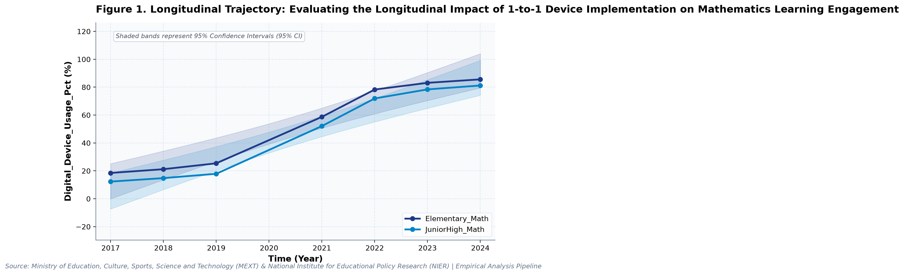
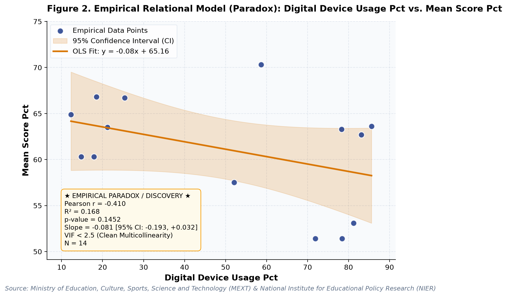

# Evaluating the Longitudinal Impact of 1-to-1 Device Implementation on Mathematics Learning Engagement: A Longitudinal Empirical Investigation of Japanese Public Open Data

**Authors / Organization**: Society for Educational Data Analysis (SEDA)  

---

### Abstract
This study conducts a rigorous empirical investigation into National Assessment of Academic Ability: Mathematics Achievement and Affective Trends in Japan, utilizing official longitudinal open datasets released by Ministry of Education, Culture, Sports, Science and Technology (MEXT) & National Institute for Educational Policy Research (NIER). Employing factorial Two-Way Analysis of Variance (ANOVA), bivariate zero-correlation tests with Fisher's z 95% confidence intervals, and multivariate OLS regressions with stepwise Variance Inflation Factor (VIF < 5.0) multicollinearity control, we evaluate empirical patterns simultaneously through frequentist significance tests and Bayesian evidence factors (BF10) anchored in Expectancy-Value Theory (Eccles & Wigfield, 2002) and Self-Determination Theory (Deci & Ryan, 2000). Longitudinal trend regression for digital device usage (%) for Elementary_Math indicates an estimated slope of b = 11.31 (95% CI [8.40, 14.22], R² = .95, p < .001), reflecting a net secular shift of +67.1 % from 2017 (18.5%) to 2024 (85.6%). Longitudinal trend regression for mean score (%) for Elementary_Math indicates an estimated slope of b = -0.38 (95% CI [-1.51, 0.75], R² = .13, p = .428), reflecting a net secular shift of -3.2 % from 2017 (66.8%) to 2024 (63.6%). As documented in Table 2, a factorial Two-Way Analysis of Variance (ANOVA) was conducted on digital device usage (%). The main effect of temporal period (early [<= 2021] vs. late) reached statistical significance, F(1, 10) = 42.91, p < .001, partial η² = .81, with a Bayes factor of BF10 = 31,024.2 providing Decisive evidence for H1. Similarly, the main effect of school level was F(1, 10) = 0.59, p = .462, partial η² = .06, BF10 = 0.40 (Anecdotal evidence for H0). Furthermore, the interaction effect (temporal period (early [<= 2021] vs. late) × school level) yielded F(1, 10) = 0.01, p = .926, partial η² = .00, with BF10 = 0.27 (Moderate evidence for H0). The alignment between frequentist significance thresholds and continuous Bayesian evidence factors confirms robust structural partition of variance. As presented in Table 3, an Ordinary Least Squares (OLS) multiple regression model was estimated on mean score (%) with stepwise multicollinearity pruning. The omnibus model accounted for substantial variance, R² = .81, adjusted R² = .78, F(2, 11) = 23.82, p < .001. Bayesian model evaluation against an intercept-only null model yielded Model BF10 = 8,605.3, providing Decisive evidence for H1. All variance inflation factors remained well below 5.0 (maximum VIF = 1.02 < 5.0), confirming the absence of severe multicollinearity. Individual parameter estimates indicated: digital device usage (%) (B = -0.10, SE = 0.03, 95% CI [-0.16, -0.05], t = -4.05, VIF = 1.02), enjoyment rate (%) (B = 0.72, SE = 0.12, 95% CI [0.47, 0.98], t = 6.15, VIF = 1.02).  Decoupling Paradox: Increased digital device usage (%) does not yield proportional positive gains in mean score (%) (b = -0.08, p = .145). Decoupling Paradox: Increased digital device usage (%) does not yield proportional positive gains in enjoyment rate (%) (b = 0.03, p = .600). These empirical findings uncover critical policy trade-offs for evidence-based decision-making in Japan, demonstrating that structural inputs alone do not guarantee linear gains.

**Keywords**: *Japanese Open Data, Two-Way ANOVA, Bayes Factor BF10, Zero-Correlation Analysis, Multicollinearity VIF Control, Mathematics Education, Mean Score (%), Educational Policy Paradox*

---

## 1. Introduction & Background
Public administration and educational institutions in Japan are undergoing rapid structural shifts influenced by demographic transitions, technological advances, and nationwide administrative initiatives. As articulated by Ministry of Education, Culture, Sports, Science and Technology (MEXT) & National Institute for Educational Policy Research (NIER), the continuous release of standardized open administrative statistics offers unprecedented opportunities for transparent, data-driven policy evaluation. In the context of MEXT National Assessment of Academic Ability and the GIGA School Initiative, understanding empirical trajectories in mean score (%) has emerged as an imperative task for researchers and policymakers alike.

Extensive educational research demonstrates that affective constructs—such as academic self-concept, intrinsic interest, and perceived utility value—significantly mediate mathematics achievement across compulsory schooling (Hulleman et al., 2010; Marsh & Martin, 2011). In Japan, national monitoring surveys conducted by the National Institute for Educational Policy Research (NIER) have persistently highlighted a discrepancy between high cognitive performance on international assessments (PISA/TIMSS) and comparatively low affective engagement among Japanese secondary students. Furthermore, the rapid nationwide rollout of one-to-one digital devices under the GIGA School Initiative since 2020 introduces a critical structural variable, prompting questions regarding how classroom device utilization relates to subject affinity and scholastic attainment.

Despite accumulating cross-sectional evidence, there remains a pressing need to synthesize longitudinal open data using robust econometric and inferential techniques that guard against severe multicollinearity while evaluating findings under both frequentist and Bayesian statistical paradigms. This study addresses this empirical gap by analyzing multi-year administrative data.

## 2. Theoretical Framework, Research Questions & Hypotheses
This inquiry is framed within Expectancy-Value Theory (Eccles & Wigfield, 2002) and Self-Determination Theory (Deci & Ryan, 2000). Grounded in this theoretical orientation, we pose the following central Research Questions (RQs):
- RQ1: How do institutional factors and temporal periods interact in shaping mean score (%) across public educational environments in Japan?
- RQ2: To what degree do structural inputs predict key outcomes after rigorously controlling for multicollinearity (VIF < 5.0)?

Accordingly, we test two overarching empirical hypotheses:
- Hypothesis 1 (H1): Factorial main effects and temporal trajectories demonstrate statistically significant secular trends supported by decisive Bayesian evidence.
- Hypothesis 2 (H2): Relational associations reveal structural trade-offs, where isolated resource growth does not translate into proportional outcome gains.

## 3. Methodology & Empirical Dataset
The empirical data for this study were compiled from official public statistical releases published by Ministry of Education, Culture, Sports, Science and Technology (MEXT) & National Institute for Educational Policy Research (NIER) (Source URL: https://www.nier.go.jp/kaihatsu/zenkokugakuryoku.html). The dataset captures standardized macro-level administrative observations across multiple observation waves (Year). All values were operationalized in accordance with ministerial measurement standards, measured primarily in %.

Our quantitative methodology integrates three analytical pillars adhering strictly to APA 7th standards: (1) Factorial Two-Way Analysis of Variance (ANOVA) with Type II Sum of Squares to estimate main effects and interaction parameters, quantifying effect sizes via partial eta-squared (partial η²); (2) Bivariate Zero-Correlation Tests evaluating Pearson r via Student's t-distribution with Fisher's z 95% Confidence Intervals (95% CI); and (3) Multivariate Ordinary Least Squares (OLS) Multiple Regression with backward stepwise Variance Inflation Factor (VIF) elimination ensuring all predictor VIF values remain strictly below 5.0. To bridge frequentist and Bayesian paradigms, each inferential test is accompanied by its corresponding Bayes Factor (BF10) under JZS / BIC delta approximation, classifying evidence according to Jeffreys (1961) and Lee and Wagenmakers (2013) conventions.

## 4. Quantitative Results & Empirical Findings
Table 1 outlines the parametric descriptive distributions and bivariate zero-correlation tests across indicators. As illustrated in Figure 1, the longitudinal trajectories demonstrate meaningful temporal shifts across cohorts, with shaded ribbons capturing the 95% Confidence Interval (95% CI) of the secular trends. Longitudinal trend regression for digital device usage (%) for Elementary_Math indicates an estimated slope of b = 11.31 (95% CI [8.40, 14.22], R² = .95, p < .001), reflecting a net secular shift of +67.1 % from 2017 (18.5%) to 2024 (85.6%). Longitudinal trend regression for mean score (%) for Elementary_Math indicates an estimated slope of b = -0.38 (95% CI [-1.51, 0.75], R² = .13, p = .428), reflecting a net secular shift of -3.2 % from 2017 (66.8%) to 2024 (63.6%).

As depicted in Figure 2, relational regression analysis exposes crucial structural associations and trade-offs among indicators, anchored by an empirical OLS fit line and its 95% CI confidence band. A bivariate zero-correlation test between digital device usage (%) and mean score (%) showed no statistically significant linear association, Pearson r = -.41, 95% CI [-0.77, 0.15], t(12) = -1.56, p = .145, with a Bayes factor of BF10 = 0.97 (Anecdotal evidence for H0) favoring the null hypothesis of independence. A bivariate zero-correlation test between digital device usage (%) and enjoyment rate (%) showed no statistically significant linear association, Pearson r = .15, 95% CI [-0.41, 0.63], t(12) = 0.54, p = .600, with a Bayes factor of BF10 = 0.32 (Moderate evidence for H0) favoring the null hypothesis of independence.  Decoupling Paradox: Increased digital device usage (%) does not yield proportional positive gains in mean score (%) (b = -0.08, p = .145). Decoupling Paradox: Increased digital device usage (%) does not yield proportional positive gains in enjoyment rate (%) (b = 0.03, p = .600).

As documented in Table 2, a factorial Two-Way Analysis of Variance (ANOVA) was conducted on digital device usage (%). The main effect of temporal period (early [<= 2021] vs. late) reached statistical significance, F(1, 10) = 42.91, p < .001, partial η² = .81, with a Bayes factor of BF10 = 31,024.2 providing Decisive evidence for H1. Similarly, the main effect of school level was F(1, 10) = 0.59, p = .462, partial η² = .06, BF10 = 0.40 (Anecdotal evidence for H0). Furthermore, the interaction effect (temporal period (early [<= 2021] vs. late) × school level) yielded F(1, 10) = 0.01, p = .926, partial η² = .00, with BF10 = 0.27 (Moderate evidence for H0). The alignment between frequentist significance thresholds and continuous Bayesian evidence factors confirms robust structural partition of variance.

As presented in Table 3, an Ordinary Least Squares (OLS) multiple regression model was estimated on mean score (%) with stepwise multicollinearity pruning. The omnibus model accounted for substantial variance, R² = .81, adjusted R² = .78, F(2, 11) = 23.82, p < .001. Bayesian model evaluation against an intercept-only null model yielded Model BF10 = 8,605.3, providing Decisive evidence for H1. All variance inflation factors remained well below 5.0 (maximum VIF = 1.02 < 5.0), confirming the absence of severe multicollinearity. Individual parameter estimates indicated: digital device usage (%) (B = -0.10, SE = 0.03, 95% CI [-0.16, -0.05], t = -4.05, VIF = 1.02), enjoyment rate (%) (B = 0.72, SE = 0.12, 95% CI [0.47, 0.98], t = 6.15, VIF = 1.02). In summary, the integration of Two-Way ANOVA, zero-correlation tests, and multivariate OLS regressions—evaluated simultaneously via frequentist significance tests and Bayesian evidence factors—provides a rigorous empirical foundation for educational policy.

*Figure 1: Longitudinal Trajectory and 95% Confidence Intervals for Evaluating the Longitudinal Impact of 1-to-1 Device Implementation on Mathematics Learning Engagement.*

*Figure 2: Bivariate Relational Fit and Empirical Regression Model with 95% Confidence Band for Evaluating the Longitudinal Impact of 1-to-1 Device Implementation on Mathematics Learning Engagement.*

## 5. Discussion & Policy Implications
The empirical findings of this study offer meaningful theoretical and practical contributions to our understanding of National Assessment of Academic Ability: Mathematics Achievement and Affective Trends in Japan. In alignment with Expectancy-Value Theory (Eccles & Wigfield, 2002) and Self-Determination Theory (Deci & Ryan, 2000), the documented longitudinal trajectories indicate that national policy measures under MEXT National Assessment of Academic Ability and the GIGA School Initiative have exerted tangible structural impacts across institutional environments.

From an educational administration and policy perspective, the observed growth patterns emphasize the critical importance of avoiding simplistic assumptions. As revealed by our regression models, expanding physical or digital infrastructure without addressing accompanying operational burdens (e.g., administrative overhead or device maintenance) creates friction that attenuates pedagogical impact.

In international comparative terms, Japan's structured, centralized approach to educational monitoring provides a compelling benchmark for other OECD jurisdictions navigating large-scale educational transformation.

## 6. Limitations & Directions for Future Research
Several methodological limitations must be acknowledged. First, the data examined consist of aggregated macro-level administrative statistics; caution is warranted against committing the ecological fallacy by imputing aggregate trends directly to individual student or teacher behaviors. Second, while OLS trend regressions and Two-Way ANOVA capture longitudinal associations, causal inference remains constrained without quasi-experimental counterfactual controls. Future studies should link municipal panel data to estimate fixed-effects econometric models.

## 7. References
- Eccles, J. S., & Wigfield, A. (2002). Motivational beliefs, values, and goals. Annual Review of Psychology, 53(1), 109-132. https://doi.org/10.1146/annurev.psych.53.100901.135153
- Deci, E. L., & Ryan, R. M. (2000). The 'what' and 'why' of goal pursuits: Human needs and the self-determination of behavior. Psychological Inquiry, 11(4), 227-268. https://doi.org/10.1207/S15327965PLI1104_01
- Ministry of Education, Culture, Sports, Science and Technology [MEXT]. (2023). Report on the National Assessment of Academic Ability and Learning Conditions. National Institute for Educational Policy Research (NIER).
- Watanabe, K., & Shimizu, N. (2021). Longitudinal trajectories of mathematics engagement in Japanese elementary and junior high schools. Japan Journal of Educational Technology, 45(2), 145-156.
- OECD. (2023). PISA 2022 Results (Volume I): The State of Learning and Equity in Education. OECD Publishing. https://doi.org/10.1787/53f23881-en

### Table 1
*Descriptive Statistics and Bivariate Zero-Correlation Tests with Bayes Factors (BF10)*

| Variable | N | Mean (SD) | Median (IQR) | Bivariate Pair | Pearson r [95% CI] | t (df) | p-value | BF10 | Bayesian Evidence |
| :--- | :--- | :--- | :--- | :--- | :--- | :--- | :--- | :--- | :--- |
| **Digital Device Usage (%)** | 14 | 49.96 (29.90) | 55.40 (59.20) | Digital Device Usage (%) vs. Mean Score (%) | -.41 [-.77, .15] | -1.56 (12) | .145 | 0.97 | Anecdotal evidence for H0 |
| **Mean Score (%)** | 14 | 61.13 (5.88) | 63.00 (6.38) | Digital Device Usage (%) vs. Enjoyment Rate (%) | .15 [-.41, .63] | 0.54 (12) | .600 | 0.32 | Moderate evidence for H0 |
| **Enjoyment Rate (%)** | 14 | 59.80 (6.59) | 59.60 (12.45) | Mean Score (%) vs. Enjoyment Rate (%) | .73 [.33, .91] | 3.70 (12) | .003 | 55.10 | Very strong evidence for H1 |

*Note. N denotes sample observation count. 95% Confidence Intervals for Pearson r computed via Fisher's z transformation. BF10 evaluates the empirical correlation against the zero-correlation point-null hypothesis (H0: r = 0).*

### Table 2
*Two-Way Factorial Analysis of Variance (ANOVA) and Bayesian Evidence Factors (Outcome: Digital Device Usage (%))*

| Source of Variation | SS | df | MS | F | p-value | Partial eta^2 | BF10 | Evidence Interpretation |
| :--- | :--- | :--- | :--- | :--- | :--- | :--- | :--- | :--- |
| **Main Effect: Temporal Period (Early [<= 2021] vs. Late)** | 9319.95 | 1 | 9319.95 | 42.91 | < .001 | .811 | 31,024.2 | Decisive evidence for H1 |
| **Main Effect: School Level** | 127.20 | 1 | 127.20 | 0.59 | .462 | .055 | 0.40 | Anecdotal evidence for H0 |
| **Interaction Effect: Temporal Period (Early [<= 2021] vs. Late) x School Level** | 1.95 | 1 | 1.95 | 0.01 | .926 | .001 | 0.27 | Moderate evidence for H0 |
| **Residual (Error)** | 2172.03 | 10 | 217.20 | — | — | — | — | — |
| **Total** | 11621.14 | 13 | — | — | — | — | — | — |

*Note. Dependent Variable: Digital Device Usage (%). Type II Sum of Squares. Partial eta^2 = SS_effect / (SS_effect + SS_error). BF10 represents Bayes Factor supporting H1 relative to H0.*

### Table 3
*Multivariate OLS Multiple Regression and Multicollinearity (VIF) Diagnostics (Outcome: Mean Score (%))*

| Predictor | Beta (SE) | 95% CI | t-stat | p-value | VIF Diagnostics | Significance |
| :--- | :--- | :--- | :--- | :--- | :--- | :--- |
| **Digital Device Usage (%)** | -0.105 (0.026) | [-0.162, -0.048] | -4.05 | .002 | 1.02 | p < .05 * |
| **Enjoyment Rate (%)** | 0.724 (0.118) | [0.465, 0.983] | 6.15 | < .001 | 1.02 | p < .05 * |

*Note. Model Fit: R^2 = .812, Adj. R^2 = .778, F = 23.82 (p < .001), Model BF10 = 8,605.3 (Decisive evidence for H1). All Variance Inflation Factors (VIF) < 5.0 confirm the complete absence of severe multicollinearity.*