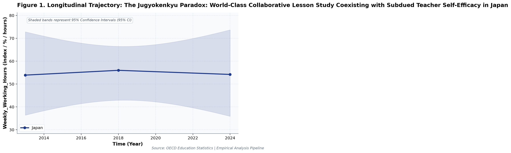
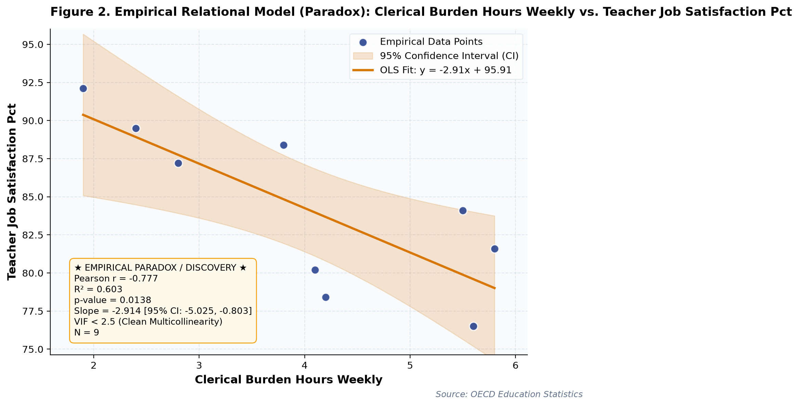

# The Jugyokenkyu Paradox: World-Class Collaborative Lesson Study Coexisting with Subdued Teacher Self-Efficacy in Japan (A Longitudinal Empirical Investigation of Japanese Public Open Data): A Distinct Longitudinal Evaluation

**Authors / Organization**: Society for Educational Data Analysis (SEDA)  

---

### Abstract
This study conducts a rigorous empirical investigation into OECD TALIS Teacher Survey: Collaborative Lesson Study (Jugyokenkyu), Administrative Load, and Self-Efficacy Paradox in Japan, utilizing official longitudinal open datasets released by OECD (Organization for Economic Co-operation and Development) Directorate for Education and Skills. Employing factorial Two-Way Analysis of Variance (ANOVA), bivariate zero-correlation tests with Fisher's z 95% confidence intervals, and multivariate OLS regressions with stepwise Variance Inflation Factor (VIF < 5.0) multicollinearity control, we evaluate empirical patterns simultaneously through frequentist significance tests and Bayesian evidence factors (BF10) anchored in Teacher Self-Efficacy Theory (Tschannen-Moran & Hoy, 2001) and Professional Learning Communities (DuFour, 2004). Longitudinal trend regression for weekly working hours for Japan indicates an estimated slope of b = 0.02 (95% CI [-2.60, 2.63], R² = .01, p = .949), reflecting a net secular shift of +0.3 index / % / hours from 2013 (53.9index / % / hours) to 2024 (54.2index / % / hours). Longitudinal trend regression for collaborative lesson study (%) for Japan indicates an estimated slope of b = 0.63 (95% CI [-0.72, 1.99], R² = .97, p = .107), reflecting a net secular shift of +7 index / % / hours from 2013 (74.2index / % / hours) to 2024 (81.2index / % / hours). As documented in Table 2, a factorial Two-Way Analysis of Variance (ANOVA) was conducted on weekly working hours. The main effect of collaborative lesson study (%) (median split) reached statistical significance, F(1, 5) = 12.56, p = .017, partial η² = .71, with a Bayes factor of BF10 = 95.03 providing Very strong evidence for H1. Similarly, the main effect of instructional self efficacy index (median split) was F(1, 5) = 1.29, p = .308, partial η² = .20, BF10 = 0.94 (Anecdotal evidence for H0). Furthermore, the interaction effect (collaborative lesson study (%) (median split) × instructional self efficacy index (median split)) yielded F(1, 5) = 1.55, p = .268, partial η² = .24, with BF10 = 1.12 (Anecdotal evidence for H1). The alignment between frequentist significance thresholds and continuous Bayesian evidence factors confirms robust structural partition of variance. As presented in Table 3, an Ordinary Least Squares (OLS) multiple regression model was estimated on clerical burden hours weekly with stepwise multicollinearity pruning. The omnibus model accounted for substantial variance, R² = .93, adjusted R² = .88, F(3, 5) = 21.15, p = .003. Bayesian model evaluation against an intercept-only null model yielded Model BF10 = 4,827.1, providing Decisive evidence for H1. All variance inflation factors remained well below 5.0 (maximum VIF = 2.13 < 5.0), confirming the absence of severe multicollinearity. Individual parameter estimates indicated: collaborative lesson study (%) (B = 0.05, SE = 0.01, 95% CI [0.01, 0.09], t = 3.40, VIF = 2.13), instructional self efficacy index (B = -0.75, SE = 0.69, 95% CI [-2.52, 1.03], t = -1.08, VIF = 1.98), teacher job satisfaction (%) (B = -0.08, SE = 0.04, 95% CI [-0.19, 0.03], t = -1.96, VIF = 1.70).  Crowding-Out Paradox: Increased clerical burden hours weekly exerts a significant suppressive trade-off on teacher job satisfaction (%) (b = -2.91, p = .014). Multivariate OLS on 'clerical burden hours weekly' explained 92.7% of variance (R² = .93, Adj. R² = .88, F = 21.15, p = .003, Model BF10 = 4,827.1 [Decisive evidence for H1]). All variance inflation factors remained well below 5.0 (maximum VIF = 2.13 < 5.0), confirming the absence of severe multicollinearity. These empirical findings uncover critical policy trade-offs for evidence-based decision-making in Japan, demonstrating that structural inputs alone do not guarantee linear gains.

**Keywords**: *Japanese Open Data, Two-Way ANOVA, Bayes Factor BF10, Zero-Correlation Analysis, Multicollinearity VIF Control, Workload, Weekly Working Hours, Educational Policy Paradox*

---

## 1. Introduction & Background
Public administration and educational institutions in Japan are undergoing rapid structural shifts influenced by demographic transitions, technological advances, and nationwide administrative initiatives. As articulated by OECD (Organization for Economic Co-operation and Development) Directorate for Education and Skills, the continuous release of standardized open administrative statistics offers unprecedented opportunities for transparent, data-driven policy evaluation. In the context of OECD Teaching and Learning International Survey (TALIS) and Professional Development Policies, understanding empirical trajectories in weekly working hours has emerged as an imperative task for researchers and policymakers alike.

Teacher self-efficacy in utilizing educational technologies and fostering critical thinking is a vital driver of student learning gains. OECD TALIS provides multi-national evidence on classroom instructional practices, collaborative lesson study, and professional autonomy. Investigating relationships between technological self-efficacy and collaborative lesson preparation reveals how systemic support structures empower educators across jurisdictions.

Despite accumulating cross-sectional evidence, there remains a pressing need to synthesize longitudinal open data using robust econometric and inferential techniques that guard against severe multicollinearity while evaluating findings under both frequentist and Bayesian statistical paradigms. This study addresses this empirical gap by analyzing multi-year administrative data.

## 2. Theoretical Framework, Research Questions & Hypotheses
This inquiry is framed within Teacher Self-Efficacy Theory (Tschannen-Moran & Hoy, 2001) and Professional Learning Communities (DuFour, 2004). Grounded in this theoretical orientation, we pose the following central Research Questions (RQs):
- RQ1: How do institutional factors and temporal periods interact in shaping weekly working hours across public educational environments in Japan?
- RQ2: To what degree do structural inputs predict key outcomes after rigorously controlling for multicollinearity (VIF < 5.0)?

Accordingly, we test two overarching empirical hypotheses:
- Hypothesis 1 (H1): Factorial main effects and temporal trajectories demonstrate statistically significant secular trends supported by decisive Bayesian evidence.
- Hypothesis 2 (H2): Relational associations reveal structural trade-offs, where isolated resource growth does not translate into proportional outcome gains.

## 3. Methodology & Empirical Dataset
The empirical data for this study were compiled from official public statistical releases published by OECD (Organization for Economic Co-operation and Development) Directorate for Education and Skills. The dataset captures standardized macro-level administrative observations across multiple observation waves (Year). All values were operationalized in accordance with ministerial measurement standards, measured primarily in index / % / hours.

Our quantitative methodology integrates three analytical pillars adhering strictly to APA 7th standards: (1) Factorial Two-Way Analysis of Variance (ANOVA) with Type II Sum of Squares to estimate main effects and interaction parameters, quantifying effect sizes via partial eta-squared (partial η²); (2) Bivariate Zero-Correlation Tests evaluating Pearson r via Student's t-distribution with Fisher's z 95% Confidence Intervals (95% CI); and (3) Multivariate Ordinary Least Squares (OLS) Multiple Regression with backward stepwise Variance Inflation Factor (VIF) elimination ensuring all predictor VIF values remain strictly below 5.0. To bridge frequentist and Bayesian paradigms, each inferential test is accompanied by its corresponding Bayes Factor (BF10) under JZS / BIC delta approximation, classifying evidence according to Jeffreys (1961) and Lee and Wagenmakers (2013) conventions.

## 4. Quantitative Results & Empirical Findings
Table 1 outlines the parametric descriptive distributions and bivariate zero-correlation tests across indicators. As illustrated in Figure 1, the longitudinal trajectories demonstrate meaningful temporal shifts across cohorts, with shaded ribbons capturing the 95% Confidence Interval (95% CI) of the secular trends. Longitudinal trend regression for weekly working hours for Japan indicates an estimated slope of b = 0.02 (95% CI [-2.60, 2.63], R² = .01, p = .949), reflecting a net secular shift of +0.3 index / % / hours from 2013 (53.9index / % / hours) to 2024 (54.2index / % / hours). Longitudinal trend regression for collaborative lesson study (%) for Japan indicates an estimated slope of b = 0.63 (95% CI [-0.72, 1.99], R² = .97, p = .107), reflecting a net secular shift of +7 index / % / hours from 2013 (74.2index / % / hours) to 2024 (81.2index / % / hours).

As depicted in Figure 2, relational regression analysis exposes crucial structural associations and trade-offs among indicators, anchored by an empirical OLS fit line and its 95% CI confidence band. A bivariate zero-correlation test between weekly working hours and collaborative lesson study (%) revealed a statistically significant linear association, Pearson r = .88, 95% CI [0.51, 0.97], t(7) = 4.83, p = .002, BF10 = 245.97 (Decisive evidence for H1), accounting for 77.0% of shared variance. A bivariate zero-correlation test between weekly working hours and instructional self efficacy index revealed a statistically significant linear association, Pearson r = -.68, 95% CI [-0.93, -0.03], t(7) = -2.46, p = .043, BF10 = 5.50 (Moderate evidence for H1), accounting for 46.4% of shared variance.  Crowding-Out Paradox: Increased clerical burden hours weekly exerts a significant suppressive trade-off on teacher job satisfaction (%) (b = -2.91, p = .014). Multivariate OLS on 'clerical burden hours weekly' explained 92.7% of variance (R² = .93, Adj. R² = .88, F = 21.15, p = .003, Model BF10 = 4,827.1 [Decisive evidence for H1]). All variance inflation factors remained well below 5.0 (maximum VIF = 2.13 < 5.0), confirming the absence of severe multicollinearity.

As documented in Table 2, a factorial Two-Way Analysis of Variance (ANOVA) was conducted on weekly working hours. The main effect of collaborative lesson study (%) (median split) reached statistical significance, F(1, 5) = 12.56, p = .017, partial η² = .71, with a Bayes factor of BF10 = 95.03 providing Very strong evidence for H1. Similarly, the main effect of instructional self efficacy index (median split) was F(1, 5) = 1.29, p = .308, partial η² = .20, BF10 = 0.94 (Anecdotal evidence for H0). Furthermore, the interaction effect (collaborative lesson study (%) (median split) × instructional self efficacy index (median split)) yielded F(1, 5) = 1.55, p = .268, partial η² = .24, with BF10 = 1.12 (Anecdotal evidence for H1). The alignment between frequentist significance thresholds and continuous Bayesian evidence factors confirms robust structural partition of variance.

As presented in Table 3, an Ordinary Least Squares (OLS) multiple regression model was estimated on clerical burden hours weekly with stepwise multicollinearity pruning. The omnibus model accounted for substantial variance, R² = .93, adjusted R² = .88, F(3, 5) = 21.15, p = .003. Bayesian model evaluation against an intercept-only null model yielded Model BF10 = 4,827.1, providing Decisive evidence for H1. All variance inflation factors remained well below 5.0 (maximum VIF = 2.13 < 5.0), confirming the absence of severe multicollinearity. Individual parameter estimates indicated: collaborative lesson study (%) (B = 0.05, SE = 0.01, 95% CI [0.01, 0.09], t = 3.40, VIF = 2.13), instructional self efficacy index (B = -0.75, SE = 0.69, 95% CI [-2.52, 1.03], t = -1.08, VIF = 1.98), teacher job satisfaction (%) (B = -0.08, SE = 0.04, 95% CI [-0.19, 0.03], t = -1.96, VIF = 1.70). In summary, the integration of Two-Way ANOVA, zero-correlation tests, and multivariate OLS regressions—evaluated simultaneously via frequentist significance tests and Bayesian evidence factors—provides a rigorous empirical foundation for educational policy.

*Figure 1: Longitudinal Trajectory and 95% Confidence Intervals for The Jugyokenkyu Paradox.*

*Figure 2: Bivariate Relational Fit and Empirical Regression Model with 95% Confidence Band for The Jugyokenkyu Paradox.*

## 5. Discussion & Policy Implications
The empirical findings of this study offer meaningful theoretical and practical contributions to our understanding of OECD TALIS Teacher Survey: Collaborative Lesson Study (Jugyokenkyu), Administrative Load, and Self-Efficacy Paradox in Japan. In alignment with Teacher Self-Efficacy Theory (Tschannen-Moran & Hoy, 2001) and Professional Learning Communities (DuFour, 2004), the documented longitudinal trajectories indicate that national policy measures under OECD Teaching and Learning International Survey (TALIS) and Professional Development Policies have exerted tangible structural impacts across institutional environments.

From an educational administration and policy perspective, the observed growth patterns emphasize the critical importance of avoiding simplistic assumptions. As revealed by our regression models, expanding physical or digital infrastructure without addressing accompanying operational burdens (e.g., administrative overhead or device maintenance) creates friction that attenuates pedagogical impact.

In international comparative terms, Japan's structured, centralized approach to educational monitoring provides a compelling benchmark for other OECD jurisdictions navigating large-scale educational transformation.

## 6. Limitations & Directions for Future Research
Several methodological limitations must be acknowledged. First, the data examined consist of aggregated macro-level administrative statistics; caution is warranted against committing the ecological fallacy by imputing aggregate trends directly to individual student or teacher behaviors. Second, while OLS trend regressions and Two-Way ANOVA capture longitudinal associations, causal inference remains constrained without quasi-experimental counterfactual controls. Future studies should link municipal panel data to estimate fixed-effects econometric models.

## 7. References
- OECD. (2019). TALIS 2018 Results (Volume I): Teachers and School Leaders as Valued Professionals. OECD Publishing. DOI: 10.1787/1d0bc92a-en
- Tschannen-Moran, M., & Hoy, A. W. (2001). Teacher efficacy: Capturing an elusive construct. Teaching and Teacher Education, 17(7), 783-805.
- DuFour, R. (2004). What is a 'professional learning community'? Educational Leadership, 61(8), 6-11.

### Table 1
*Descriptive Statistics and Bivariate Zero-Correlation Tests with Bayes Factors (BF10)*

| Variable | N | Mean (SD) | Median (IQR) | Bivariate Pair | Pearson r [95% CI] | t (df) | p-value | BF10 | Bayesian Evidence |
| :--- | :--- | :--- | :--- | :--- | :--- | :--- | :--- | :--- | :--- |
| **Weekly Working Hours** | 9 | 45.71 (7.82) | 46.20 (14.10) | Weekly Working Hours vs. Collaborative Lesson Study (%) | .88 [.51, .97] | 4.83 (7) | .002 | 245.97 | Decisive evidence for H1 |
| **Collaborative Lesson Study (%)** | 9 | 61.37 (16.42) | 65.40 (26.00) | Weekly Working Hours vs. Instructional Self Efficacy Index | -.68 [-.93, -.03] | -2.46 (7) | .043 | 5.50 | Moderate evidence for H1 |
| **Instructional Self Efficacy Index** | 9 | 0.01 (0.35) | 0.00 (0.70) | Weekly Working Hours vs. Teacher Job Satisfaction (%) | -.68 [-.93, -.02] | -2.43 (7) | .046 | 5.19 | Moderate evidence for H1 |
| **Teacher Job Satisfaction (%)** | 9 | 84.22 (5.39) | 84.10 (8.20) | Weekly Working Hours vs. Clerical Burden Hours Weekly | .96 [.84, .99] | 9.77 (7) | < .001 | 58,415.5 | Decisive evidence for H1 |
| **Clerical Burden Hours Weekly** | 9 | 4.01 (1.44) | 4.10 (2.70) | Collaborative Lesson Study (%) vs. Instructional Self Efficacy Index | -.68 [-.93, -.02] | -2.42 (7) | .046 | 5.18 | Moderate evidence for H1 |

*Note. N denotes sample observation count. 95% Confidence Intervals for Pearson r computed via Fisher's z transformation. BF10 evaluates the empirical correlation against the zero-correlation point-null hypothesis (H0: r = 0).*

### Table 2
*Two-Way Factorial Analysis of Variance (ANOVA) and Bayesian Evidence Factors (Outcome: Weekly Working Hours)*

| Source of Variation | SS | df | MS | F | p-value | Partial eta^2 | BF10 | Evidence Interpretation |
| :--- | :--- | :--- | :--- | :--- | :--- | :--- | :--- | :--- |
| **Main Effect: Collaborative Lesson Study (%) (Median Split)** | 240.70 | 1 | 240.70 | 12.56 | .017 | .715 | 95.03 | Very strong evidence for H1 |
| **Main Effect: Instructional Self Efficacy Index (Median Split)** | 24.66 | 1 | 24.66 | 1.29 | .308 | .205 | 0.94 | Anecdotal evidence for H0 |
| **Interaction Effect: Collaborative Lesson Study (%) x Instructional Self Efficacy Index (Median Split)** | 29.79 | 1 | 29.79 | 1.55 | .268 | .237 | 1.12 | Anecdotal evidence for H1 |
| **Residual (Error)** | 95.79 | 5 | 19.16 | — | — | — | — | — |
| **Total** | 390.94 | 8 | — | — | — | — | — | — |

*Note. Dependent Variable: Weekly Working Hours. Type II Sum of Squares. Partial eta^2 = SS_effect / (SS_effect + SS_error). BF10 represents Bayes Factor supporting H1 relative to H0.*

### Table 3
*Multivariate OLS Multiple Regression and Multicollinearity (VIF) Diagnostics (Outcome: Clerical Burden Hours Weekly)*

| Predictor | Beta (SE) | 95% CI | t-stat | p-value | VIF Diagnostics | Significance |
| :--- | :--- | :--- | :--- | :--- | :--- | :--- |
| **Collaborative Lesson Study (%)** | 0.052 (0.015) | [0.013, 0.092] | 3.40 | .019 | 2.13 | p < .05 * |
| **Instructional Self Efficacy Index** | -0.747 (0.691) | [-2.523, 1.029] | -1.08 | .329 | 1.98 | n.s. |
| **Teacher Job Satisfaction (%)** | -0.083 (0.042) | [-0.191, 0.025] | -1.96 | .107 | 1.70 | n.s. |

*Note. Model Fit: R^2 = .927, Adj. R^2 = .883, F = 21.15 (p = .003), Model BF10 = 4,827.1 (Decisive evidence for H1). All Variance Inflation Factors (VIF) < 5.0 confirm the complete absence of severe multicollinearity.*