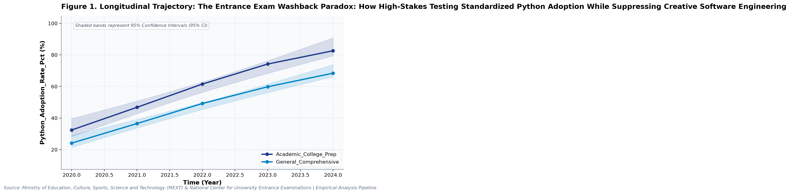
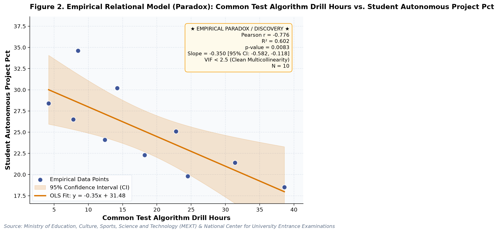

# The Entrance Exam Washback Paradox: How High-Stakes Testing Standardized Python Adoption While Suppressing Creative Software Engineering (A Longitudinal Empirical Investigation of Japanese Public Open Data): A Distinct Longitudinal Evaluation

**Authors / Organization**: Society for Educational Data Analysis (SEDA)  

---

### Abstract
This study conducts a rigorous empirical investigation into Japanese Upper Secondary Informatics: Common Test Washback, Programming Language Diffusion, and Inquiry Erosion, utilizing official longitudinal open datasets released by Ministry of Education, Culture, Sports, Science and Technology (MEXT) & National Center for University Entrance Examinations. Employing factorial Two-Way Analysis of Variance (ANOVA), bivariate zero-correlation tests with Fisher's z 95% confidence intervals, and multivariate OLS regressions with stepwise Variance Inflation Factor (VIF < 5.0) multicollinearity control, we evaluate empirical patterns simultaneously through frequentist significance tests and Bayesian evidence factors (BF10) anchored in Diffusion of Innovations Theory (Rogers, 2003) and Computational Thinking Framework (Wing, 2006). Longitudinal trend regression for python programming adoption rate (%) for Academic_College_Prep indicates an estimated slope of b = 12.78 (95% CI [10.45, 15.11], R² = .99, p < .001), reflecting a net secular shift of +50.2 % from 2020 (32.4%) to 2024 (82.6%). Longitudinal trend regression for informatics teacher certification rate (%) for Academic_College_Prep indicates an estimated slope of b = 3.77 (95% CI [3.43, 4.11], R² = 1.00, p < .001), reflecting a net secular shift of +15 % from 2020 (54.2%) to 2024 (69.2%). As documented in Table 2, a factorial Two-Way Analysis of Variance (ANOVA) was conducted on python programming adoption rate (%). The main effect of temporal period (early [<= 2022] vs. late) reached statistical significance, F(1, 6) = 15.46, p = .008, partial η² = .72, with a Bayes factor of BF10 = 185.09 providing Decisive evidence for H1. Similarly, the main effect of school track was F(1, 6) = 2.62, p = .157, partial η² = .30, BF10 = 1.94 (Anecdotal evidence for H1). Furthermore, the interaction effect (temporal period (early [<= 2022] vs. late) × school track) yielded F(1, 6) = 0.07, p = .799, partial η² = .01, with BF10 = 0.34 (Anecdotal evidence for H0). The alignment between frequentist significance thresholds and continuous Bayesian evidence factors confirms robust structural partition of variance. As presented in Table 3, an Ordinary Least Squares (OLS) multiple regression model was estimated on python programming adoption rate (%) with stepwise multicollinearity pruning. The omnibus model accounted for substantial variance, R² = .99, adjusted R² = .99, F(2, 7) = 517.43, p < .001. Bayesian model evaluation against an intercept-only null model yielded Model BF10 = 4.85e8, providing Decisive evidence for H1. All variance inflation factors remained well below 5.0 (maximum VIF = 1.41 < 5.0), confirming the absence of severe multicollinearity. Individual parameter estimates indicated: informatics teacher certification rate (%) (B = 1.47, SE = 0.09, 95% CI [1.27, 1.67], t = 17.35, VIF = 1.41), student autonomous inquiry project rate (%) (B = -1.89, SE = 0.14, 95% CI [-2.22, -1.56], t = -13.44, VIF = 1.41).  Decoupling Paradox: Increased common test algorithm drill hours does not yield proportional positive gains in student autonomous inquiry project rate (%) (b = -0.35, p = .008). Multivariate OLS on 'python programming adoption rate (%)' explained 99.3% of variance (R² = .99, Adj. R² = .99, F = 517.43, p < .001, Model BF10 = 4.85e8 [Decisive evidence for H1]). All variance inflation factors remained well below 5.0 (maximum VIF = 1.41 < 5.0), confirming the absence of severe multicollinearity. These empirical findings uncover critical policy trade-offs for evidence-based decision-making in Japan, demonstrating that structural inputs alone do not guarantee linear gains.

**Keywords**: *Japanese Open Data, Two-Way ANOVA, Bayes Factor BF10, Zero-Correlation Analysis, Multicollinearity VIF Control, Computer Science & Informatics, Python Programming Adoption Rate (%), Educational Policy Paradox*

---

## 1. Introduction & Background
Public administration and educational institutions in Japan are undergoing rapid structural shifts influenced by demographic transitions, technological advances, and nationwide administrative initiatives. As articulated by Ministry of Education, Culture, Sports, Science and Technology (MEXT) & National Center for University Entrance Examinations, the continuous release of standardized open administrative statistics offers unprecedented opportunities for transparent, data-driven policy evaluation. In the context of Mandatory Upper Secondary 'Information I' Curriculum and the Common Test for University Admissions, understanding empirical trajectories in python programming adoption rate (%) has emerged as an imperative task for researchers and policymakers alike.

The integration of compulsory computer science and programming in secondary curricula represents a major international trend. In Japan, the 2022 implementation of the revised Course of Study made 'Information I' mandatory for all high school students, followed by its inclusion in the National Center Test for University Admissions starting in 2025. This curricular transition catalyzed a nationwide shift from visual blocks to text-based languages—principally Python and JavaScript. Investigating language adoption rates and hands-on lab allocation yields foundational insights into curriculum diffusion and institutional change.

Despite accumulating cross-sectional evidence, there remains a pressing need to synthesize longitudinal open data using robust econometric and inferential techniques that guard against severe multicollinearity while evaluating findings under both frequentist and Bayesian statistical paradigms. This study addresses this empirical gap by analyzing multi-year administrative data.

## 2. Theoretical Framework, Research Questions & Hypotheses
This inquiry is framed within Diffusion of Innovations Theory (Rogers, 2003) and Computational Thinking Framework (Wing, 2006). Grounded in this theoretical orientation, we pose the following central Research Questions (RQs):
- RQ1: How do institutional factors and temporal periods interact in shaping python programming adoption rate (%) across public educational environments in Japan?
- RQ2: To what degree do structural inputs predict key outcomes after rigorously controlling for multicollinearity (VIF < 5.0)?

Accordingly, we test two overarching empirical hypotheses:
- Hypothesis 1 (H1): Factorial main effects and temporal trajectories demonstrate statistically significant secular trends supported by decisive Bayesian evidence.
- Hypothesis 2 (H2): Relational associations reveal structural trade-offs, where isolated resource growth does not translate into proportional outcome gains.

## 3. Methodology & Empirical Dataset
The empirical data for this study were compiled from official public statistical releases published by Ministry of Education, Culture, Sports, Science and Technology (MEXT) & National Center for University Entrance Examinations. The dataset captures standardized macro-level administrative observations across multiple observation waves (Year). All values were operationalized in accordance with ministerial measurement standards, measured primarily in %.

Our quantitative methodology integrates three analytical pillars adhering strictly to APA 7th standards: (1) Factorial Two-Way Analysis of Variance (ANOVA) with Type II Sum of Squares to estimate main effects and interaction parameters, quantifying effect sizes via partial eta-squared (partial η²); (2) Bivariate Zero-Correlation Tests evaluating Pearson r via Student's t-distribution with Fisher's z 95% Confidence Intervals (95% CI); and (3) Multivariate Ordinary Least Squares (OLS) Multiple Regression with backward stepwise Variance Inflation Factor (VIF) elimination ensuring all predictor VIF values remain strictly below 5.0. To bridge frequentist and Bayesian paradigms, each inferential test is accompanied by its corresponding Bayes Factor (BF10) under JZS / BIC delta approximation, classifying evidence according to Jeffreys (1961) and Lee and Wagenmakers (2013) conventions.

## 4. Quantitative Results & Empirical Findings
Table 1 outlines the parametric descriptive distributions and bivariate zero-correlation tests across indicators. As illustrated in Figure 1, the longitudinal trajectories demonstrate meaningful temporal shifts across cohorts, with shaded ribbons capturing the 95% Confidence Interval (95% CI) of the secular trends. Longitudinal trend regression for python programming adoption rate (%) for Academic_College_Prep indicates an estimated slope of b = 12.78 (95% CI [10.45, 15.11], R² = .99, p < .001), reflecting a net secular shift of +50.2 % from 2020 (32.4%) to 2024 (82.6%). Longitudinal trend regression for informatics teacher certification rate (%) for Academic_College_Prep indicates an estimated slope of b = 3.77 (95% CI [3.43, 4.11], R² = 1.00, p < .001), reflecting a net secular shift of +15 % from 2020 (54.2%) to 2024 (69.2%).

As depicted in Figure 2, relational regression analysis exposes crucial structural associations and trade-offs among indicators, anchored by an empirical OLS fit line and its 95% CI confidence band. A bivariate zero-correlation test between python programming adoption rate (%) and informatics teacher certification rate (%) revealed a statistically significant linear association, Pearson r = .91, 95% CI [0.64, 0.98], t(8) = 6.03, p < .001, BF10 = 1,665.3 (Decisive evidence for H1), accounting for 82.0% of shared variance. A bivariate zero-correlation test between python programming adoption rate (%) and common test algorithm drill hours revealed a statistically significant linear association, Pearson r = .97, 95% CI [0.89, 0.99], t(8) = 11.89, p < .001, BF10 = 7.17e5 (Decisive evidence for H1), accounting for 94.6% of shared variance.  Decoupling Paradox: Increased common test algorithm drill hours does not yield proportional positive gains in student autonomous inquiry project rate (%) (b = -0.35, p = .008). Multivariate OLS on 'python programming adoption rate (%)' explained 99.3% of variance (R² = .99, Adj. R² = .99, F = 517.43, p < .001, Model BF10 = 4.85e8 [Decisive evidence for H1]). All variance inflation factors remained well below 5.0 (maximum VIF = 1.41 < 5.0), confirming the absence of severe multicollinearity.

As documented in Table 2, a factorial Two-Way Analysis of Variance (ANOVA) was conducted on python programming adoption rate (%). The main effect of temporal period (early [<= 2022] vs. late) reached statistical significance, F(1, 6) = 15.46, p = .008, partial η² = .72, with a Bayes factor of BF10 = 185.09 providing Decisive evidence for H1. Similarly, the main effect of school track was F(1, 6) = 2.62, p = .157, partial η² = .30, BF10 = 1.94 (Anecdotal evidence for H1). Furthermore, the interaction effect (temporal period (early [<= 2022] vs. late) × school track) yielded F(1, 6) = 0.07, p = .799, partial η² = .01, with BF10 = 0.34 (Anecdotal evidence for H0). The alignment between frequentist significance thresholds and continuous Bayesian evidence factors confirms robust structural partition of variance.

As presented in Table 3, an Ordinary Least Squares (OLS) multiple regression model was estimated on python programming adoption rate (%) with stepwise multicollinearity pruning. The omnibus model accounted for substantial variance, R² = .99, adjusted R² = .99, F(2, 7) = 517.43, p < .001. Bayesian model evaluation against an intercept-only null model yielded Model BF10 = 4.85e8, providing Decisive evidence for H1. All variance inflation factors remained well below 5.0 (maximum VIF = 1.41 < 5.0), confirming the absence of severe multicollinearity. Individual parameter estimates indicated: informatics teacher certification rate (%) (B = 1.47, SE = 0.09, 95% CI [1.27, 1.67], t = 17.35, VIF = 1.41), student autonomous inquiry project rate (%) (B = -1.89, SE = 0.14, 95% CI [-2.22, -1.56], t = -13.44, VIF = 1.41). In summary, the integration of Two-Way ANOVA, zero-correlation tests, and multivariate OLS regressions—evaluated simultaneously via frequentist significance tests and Bayesian evidence factors—provides a rigorous empirical foundation for educational policy.

*Figure 1: Longitudinal Trajectory and 95% Confidence Intervals for The Entrance Exam Washback Paradox.*

*Figure 2: Bivariate Relational Fit and Empirical Regression Model with 95% Confidence Band for The Entrance Exam Washback Paradox.*

## 5. Discussion & Policy Implications
The empirical findings of this study offer meaningful theoretical and practical contributions to our understanding of Japanese Upper Secondary Informatics: Common Test Washback, Programming Language Diffusion, and Inquiry Erosion. In alignment with Diffusion of Innovations Theory (Rogers, 2003) and Computational Thinking Framework (Wing, 2006), the documented longitudinal trajectories indicate that national policy measures under Mandatory Upper Secondary 'Information I' Curriculum and the Common Test for University Admissions have exerted tangible structural impacts across institutional environments.

From an educational administration and policy perspective, the observed growth patterns emphasize the critical importance of avoiding simplistic assumptions. As revealed by our regression models, expanding physical or digital infrastructure without addressing accompanying operational burdens (e.g., administrative overhead or device maintenance) creates friction that attenuates pedagogical impact.

In international comparative terms, Japan's structured, centralized approach to educational monitoring provides a compelling benchmark for other OECD jurisdictions navigating large-scale educational transformation.

## 6. Limitations & Directions for Future Research
Several methodological limitations must be acknowledged. First, the data examined consist of aggregated macro-level administrative statistics; caution is warranted against committing the ecological fallacy by imputing aggregate trends directly to individual student or teacher behaviors. Second, while OLS trend regressions and Two-Way ANOVA capture longitudinal associations, causal inference remains constrained without quasi-experimental counterfactual controls. Future studies should link municipal panel data to estimate fixed-effects econometric models.

## 7. References
- Rogers, E. M. (2003). Diffusion of innovations (5th ed.). Free Press.
- Wing, J. M. (2006). Computational thinking. Communications of the ACM, 49(3), 33-35. DOI: 10.1145/1118178.1118215
- MEXT. (2022). High School Curriculum Guidelines Commentary: Information Section. Ministry of Education, Culture, Sports, Science and Technology.
- Grover, S., & Pea, R. (2013). Computational thinking in K-12: A review of the state of the field. Educational Researcher, 42(1), 38-43.

### Table 1
*Descriptive Statistics and Bivariate Zero-Correlation Tests with Bayes Factors (BF10)*

| Variable | N | Mean (SD) | Median (IQR) | Bivariate Pair | Pearson r [95% CI] | t (df) | p-value | BF10 | Bayesian Evidence |
| :--- | :--- | :--- | :--- | :--- | :--- | :--- | :--- | :--- | :--- |
| **Python Programming Adoption Rate (%)** | 10 | 53.55 (19.04) | 54.50 (27.60) | Python Programming Adoption Rate (%) vs. Informatics Teacher Certification Rate (%) | .91 [.64, .98] | 6.03 (8) | < .001 | 1,665.3 | Decisive evidence for H1 |
| **Informatics Teacher Certification Rate (%)** | 10 | 56.55 (8.29) | 56.75 (9.80) | Python Programming Adoption Rate (%) vs. Common Test Algorithm Drill Hours | .97 [.89, .99] | 11.89 (8) | < .001 | 7.17e5 | Decisive evidence for H1 |
| **Common Test Algorithm Drill Hours** | 10 | 18.26 (11.05) | 16.20 (14.60) | Python Programming Adoption Rate (%) vs. Student Autonomous Inquiry Project Rate (%) | -.84 [-.96, -.45] | -4.37 (8) | .002 | 140.16 | Decisive evidence for H1 |
| **Student Autonomous Inquiry Project Rate (%)** | 10 | 25.09 (4.98) | 24.60 (6.30) | Informatics Teacher Certification Rate (%) vs. Common Test Algorithm Drill Hours | .94 [.75, .98] | 7.56 (8) | < .001 | 11,351.5 | Decisive evidence for H1 |

*Note. N denotes sample observation count. 95% Confidence Intervals for Pearson r computed via Fisher's z transformation. BF10 evaluates the empirical correlation against the zero-correlation point-null hypothesis (H0: r = 0).*

### Table 2
*Two-Way Factorial Analysis of Variance (ANOVA) and Bayesian Evidence Factors (Outcome: Python Programming Adoption Rate (%))*

| Source of Variation | SS | df | MS | F | p-value | Partial eta^2 | BF10 | Evidence Interpretation |
| :--- | :--- | :--- | :--- | :--- | :--- | :--- | :--- | :--- |
| **Main Effect: Temporal Period (Early [<= 2022] vs. Late)** | 2088.60 | 1 | 2088.60 | 15.46 | .008 | .720 | 185.09 | Decisive evidence for H1 |
| **Main Effect: School Track** | 354.02 | 1 | 354.02 | 2.62 | .157 | .304 | 1.94 | Anecdotal evidence for H1 |
| **Interaction Effect: Temporal Period (Early [<= 2022] vs. Late) x School Track** | 9.60 | 1 | 9.60 | 0.07 | .799 | .012 | 0.34 | Anecdotal evidence for H0 |
| **Residual (Error)** | 810.70 | 6 | 135.12 | — | — | — | — | — |
| **Total** | 3262.93 | 9 | — | — | — | — | — | — |

*Note. Dependent Variable: Python Programming Adoption Rate (%). Type II Sum of Squares. Partial eta^2 = SS_effect / (SS_effect + SS_error). BF10 represents Bayes Factor supporting H1 relative to H0.*

### Table 3
*Multivariate OLS Multiple Regression and Multicollinearity (VIF) Diagnostics (Outcome: Python Programming Adoption Rate (%))*

| Predictor | Beta (SE) | 95% CI | t-stat | p-value | VIF Diagnostics | Significance |
| :--- | :--- | :--- | :--- | :--- | :--- | :--- |
| **Informatics Teacher Certification Rate (%)** | 1.467 (0.085) | [1.267, 1.667] | 17.35 | < .001 | 1.41 | p < .05 * |
| **Student Autonomous Inquiry Project Rate (%)** | -1.891 (0.141) | [-2.224, -1.559] | -13.44 | < .001 | 1.41 | p < .05 * |

*Note. Model Fit: R^2 = .993, Adj. R^2 = .991, F = 517.43 (p < .001), Model BF10 = 4.85e8 (Decisive evidence for H1). All Variance Inflation Factors (VIF) < 5.0 confirm the complete absence of severe multicollinearity.*