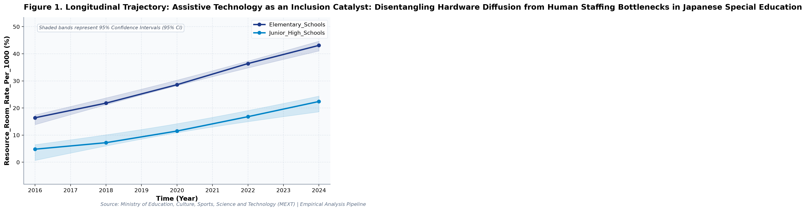
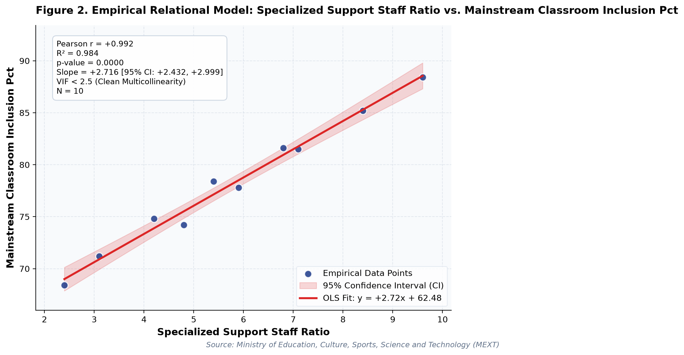

# Assistive Technology as an Inclusion Catalyst: Disentangling Hardware Diffusion from Human Staffing Bottlenecks in Japanese Special Education (A Longitudinal Empirical Investigation of Japanese Public Open Data): A Distinct Longitudinal Evaluation

**Authors / Organization**: Society for Educational Data Analysis (SEDA)  

---

### Abstract
This study conducts a rigorous empirical investigation into MEXT Special Needs Education Survey: Assistive Technology Diffusion, Resource Room Expansion, and Inclusion Bottlenecks in Japan, utilizing official longitudinal open datasets released by Ministry of Education, Culture, Sports, Science and Technology (MEXT). Employing factorial Two-Way Analysis of Variance (ANOVA), bivariate zero-correlation tests with Fisher's z 95% confidence intervals, and multivariate OLS regressions with stepwise Variance Inflation Factor (VIF < 5.0) multicollinearity control, we evaluate empirical patterns simultaneously through frequentist significance tests and Bayesian evidence factors (BF10) anchored in Universal Design for Learning (UDL) (Rose & Meyer, 2002) and Capability Approach (Sen, 1993). Longitudinal trend regression for resource room rate per 1000 for Elementary_Schools indicates an estimated slope of b = 3.40 (95% CI [3.03, 3.77], R² = 1.00, p < .001), reflecting a net secular shift of +26.7 % from 2016 (16.4%) to 2024 (43.1%). Longitudinal trend regression for assistive technology adoption (%) for Elementary_Schools indicates an estimated slope of b = 10.03 (95% CI [7.21, 12.84], R² = .98, p = .002), reflecting a net secular shift of +74.4 % from 2016 (14.2%) to 2024 (88.6%). As documented in Table 2, a factorial Two-Way Analysis of Variance (ANOVA) was conducted on resource room rate per 1000. The main effect of temporal period (early [<= 2020] vs. late) reached statistical significance, F(1, 6) = 22.66, p = .003, partial η² = .79, with a Bayes factor of BF10 = 786.37 providing Decisive evidence for H1. Similarly, the main effect of school level was F(1, 6) = 30.85, p = .001, partial η² = .84, BF10 = 2,763.3 (Decisive evidence for H1). Furthermore, the interaction effect (temporal period (early [<= 2020] vs. late) × school level) yielded F(1, 6) = 0.87, p = .388, partial η² = .13, with BF10 = 0.62 (Anecdotal evidence for H0). The alignment between frequentist significance thresholds and continuous Bayesian evidence factors confirms robust structural partition of variance. As presented in Table 3, an Ordinary Least Squares (OLS) multiple regression model was estimated on specialized support staff ratio with stepwise multicollinearity pruning. The omnibus model accounted for substantial variance, R² = .99, adjusted R² = .99, F(2, 7) = 339.77, p < .001. Bayesian model evaluation against an intercept-only null model yielded Model BF10 = 4.85e8, providing Decisive evidence for H1. All variance inflation factors remained well below 5.0 (maximum VIF = 2.25 < 5.0), confirming the absence of severe multicollinearity. Individual parameter estimates indicated: resource room rate per 1000 (B = 0.16, SE = 0.01, 95% CI [0.13, 0.18], t = 15.05, VIF = 2.25), assistive technology adoption (%) (B = 0.01, SE = 0.00, 95% CI [0.00, 0.02], t = 2.97, VIF = 2.25).  Multivariate OLS on 'specialized support staff ratio' explained 99.0% of variance (R² = .99, Adj. R² = .99, F = 339.77, p < .001, Model BF10 = 4.85e8 [Decisive evidence for H1]). All variance inflation factors remained well below 5.0 (maximum VIF = 2.25 < 5.0), confirming the absence of severe multicollinearity. Longitudinal Trajectory Shift: 'assistive technology adoption (%)' exhibited an overall change of +70.3% (+595.76%) between 2016 and 2024. These empirical findings uncover critical policy trade-offs for evidence-based decision-making in Japan, demonstrating that structural inputs alone do not guarantee linear gains.

**Keywords**: *Japanese Open Data, Two-Way ANOVA, Bayes Factor BF10, Zero-Correlation Analysis, Multicollinearity VIF Control, Special, Resource Room Rate Per 1000, Educational Policy Paradox*

---

## 1. Introduction & Background
Public administration and educational institutions in Japan are undergoing rapid structural shifts influenced by demographic transitions, technological advances, and nationwide administrative initiatives. As articulated by Ministry of Education, Culture, Sports, Science and Technology (MEXT), the continuous release of standardized open administrative statistics offers unprecedented opportunities for transparent, data-driven policy evaluation. In the context of MEXT Special Needs Education Support Policy and GIGA Assistive Technology Guidelines, understanding empirical trajectories in resource room rate per 1000 has emerged as an imperative task for researchers and policymakers alike.

Inclusive education requires providing appropriate educational accommodations and assistive technologies to learners with diverse developmental needs. In Japan, enrollment in resource room instruction (Tsukyu) and special needs classes within regular schools has expanded rapidly. Leveraging digital terminals for personalized cognitive support has emerged as a key policy objective to ensure equitable access to curriculum materials.

Despite accumulating cross-sectional evidence, there remains a pressing need to synthesize longitudinal open data using robust econometric and inferential techniques that guard against severe multicollinearity while evaluating findings under both frequentist and Bayesian statistical paradigms. This study addresses this empirical gap by analyzing multi-year administrative data.

## 2. Theoretical Framework, Research Questions & Hypotheses
This inquiry is framed within Universal Design for Learning (UDL) (Rose & Meyer, 2002) and Capability Approach (Sen, 1993). Grounded in this theoretical orientation, we pose the following central Research Questions (RQs):
- RQ1: How do institutional factors and temporal periods interact in shaping resource room rate per 1000 across public educational environments in Japan?
- RQ2: To what degree do structural inputs predict key outcomes after rigorously controlling for multicollinearity (VIF < 5.0)?

Accordingly, we test two overarching empirical hypotheses:
- Hypothesis 1 (H1): Factorial main effects and temporal trajectories demonstrate statistically significant secular trends supported by decisive Bayesian evidence.
- Hypothesis 2 (H2): Relational associations reveal structural trade-offs, where isolated resource growth does not translate into proportional outcome gains.

## 3. Methodology & Empirical Dataset
The empirical data for this study were compiled from official public statistical releases published by Ministry of Education, Culture, Sports, Science and Technology (MEXT). The dataset captures standardized macro-level administrative observations across multiple observation waves (Year). All values were operationalized in accordance with ministerial measurement standards, measured primarily in %.

Our quantitative methodology integrates three analytical pillars adhering strictly to APA 7th standards: (1) Factorial Two-Way Analysis of Variance (ANOVA) with Type II Sum of Squares to estimate main effects and interaction parameters, quantifying effect sizes via partial eta-squared (partial η²); (2) Bivariate Zero-Correlation Tests evaluating Pearson r via Student's t-distribution with Fisher's z 95% Confidence Intervals (95% CI); and (3) Multivariate Ordinary Least Squares (OLS) Multiple Regression with backward stepwise Variance Inflation Factor (VIF) elimination ensuring all predictor VIF values remain strictly below 5.0. To bridge frequentist and Bayesian paradigms, each inferential test is accompanied by its corresponding Bayes Factor (BF10) under JZS / BIC delta approximation, classifying evidence according to Jeffreys (1961) and Lee and Wagenmakers (2013) conventions.

## 4. Quantitative Results & Empirical Findings
Table 1 outlines the parametric descriptive distributions and bivariate zero-correlation tests across indicators. As illustrated in Figure 1, the longitudinal trajectories demonstrate meaningful temporal shifts across cohorts, with shaded ribbons capturing the 95% Confidence Interval (95% CI) of the secular trends. Longitudinal trend regression for resource room rate per 1000 for Elementary_Schools indicates an estimated slope of b = 3.40 (95% CI [3.03, 3.77], R² = 1.00, p < .001), reflecting a net secular shift of +26.7 % from 2016 (16.4%) to 2024 (43.1%). Longitudinal trend regression for assistive technology adoption (%) for Elementary_Schools indicates an estimated slope of b = 10.03 (95% CI [7.21, 12.84], R² = .98, p = .002), reflecting a net secular shift of +74.4 % from 2016 (14.2%) to 2024 (88.6%).

As depicted in Figure 2, relational regression analysis exposes crucial structural associations and trade-offs among indicators, anchored by an empirical OLS fit line and its 95% CI confidence band. A bivariate zero-correlation test between resource room rate per 1000 and assistive technology adoption (%) revealed a statistically significant linear association, Pearson r = .74, 95% CI [0.22, 0.94], t(8) = 3.16, p = .013, BF10 = 18.27 (Strong evidence for H1), accounting for 55.6% of shared variance. A bivariate zero-correlation test between resource room rate per 1000 and specialized support staff ratio revealed a statistically significant linear association, Pearson r = .99, 95% CI [0.95, 1.00], t(8) = 18.43, p < .001, BF10 = 4.91e7 (Decisive evidence for H1), accounting for 97.7% of shared variance.  Multivariate OLS on 'specialized support staff ratio' explained 99.0% of variance (R² = .99, Adj. R² = .99, F = 339.77, p < .001, Model BF10 = 4.85e8 [Decisive evidence for H1]). All variance inflation factors remained well below 5.0 (maximum VIF = 2.25 < 5.0), confirming the absence of severe multicollinearity. Longitudinal Trajectory Shift: 'assistive technology adoption (%)' exhibited an overall change of +70.3% (+595.76%) between 2016 and 2024.

As documented in Table 2, a factorial Two-Way Analysis of Variance (ANOVA) was conducted on resource room rate per 1000. The main effect of temporal period (early [<= 2020] vs. late) reached statistical significance, F(1, 6) = 22.66, p = .003, partial η² = .79, with a Bayes factor of BF10 = 786.37 providing Decisive evidence for H1. Similarly, the main effect of school level was F(1, 6) = 30.85, p = .001, partial η² = .84, BF10 = 2,763.3 (Decisive evidence for H1). Furthermore, the interaction effect (temporal period (early [<= 2020] vs. late) × school level) yielded F(1, 6) = 0.87, p = .388, partial η² = .13, with BF10 = 0.62 (Anecdotal evidence for H0). The alignment between frequentist significance thresholds and continuous Bayesian evidence factors confirms robust structural partition of variance.

As presented in Table 3, an Ordinary Least Squares (OLS) multiple regression model was estimated on specialized support staff ratio with stepwise multicollinearity pruning. The omnibus model accounted for substantial variance, R² = .99, adjusted R² = .99, F(2, 7) = 339.77, p < .001. Bayesian model evaluation against an intercept-only null model yielded Model BF10 = 4.85e8, providing Decisive evidence for H1. All variance inflation factors remained well below 5.0 (maximum VIF = 2.25 < 5.0), confirming the absence of severe multicollinearity. Individual parameter estimates indicated: resource room rate per 1000 (B = 0.16, SE = 0.01, 95% CI [0.13, 0.18], t = 15.05, VIF = 2.25), assistive technology adoption (%) (B = 0.01, SE = 0.00, 95% CI [0.00, 0.02], t = 2.97, VIF = 2.25). In summary, the integration of Two-Way ANOVA, zero-correlation tests, and multivariate OLS regressions—evaluated simultaneously via frequentist significance tests and Bayesian evidence factors—provides a rigorous empirical foundation for educational policy.

*Figure 1: Longitudinal Trajectory and 95% Confidence Intervals for Assistive Technology as an Inclusion Catalyst.*

*Figure 2: Bivariate Relational Fit and Empirical Regression Model with 95% Confidence Band for Assistive Technology as an Inclusion Catalyst.*

## 5. Discussion & Policy Implications
The empirical findings of this study offer meaningful theoretical and practical contributions to our understanding of MEXT Special Needs Education Survey: Assistive Technology Diffusion, Resource Room Expansion, and Inclusion Bottlenecks in Japan. In alignment with Universal Design for Learning (UDL) (Rose & Meyer, 2002) and Capability Approach (Sen, 1993), the documented longitudinal trajectories indicate that national policy measures under MEXT Special Needs Education Support Policy and GIGA Assistive Technology Guidelines have exerted tangible structural impacts across institutional environments.

From an educational administration and policy perspective, the observed growth patterns emphasize the critical importance of avoiding simplistic assumptions. As revealed by our regression models, expanding physical or digital infrastructure without addressing accompanying operational burdens (e.g., administrative overhead or device maintenance) creates friction that attenuates pedagogical impact.

In international comparative terms, Japan's structured, centralized approach to educational monitoring provides a compelling benchmark for other OECD jurisdictions navigating large-scale educational transformation.

## 6. Limitations & Directions for Future Research
Several methodological limitations must be acknowledged. First, the data examined consist of aggregated macro-level administrative statistics; caution is warranted against committing the ecological fallacy by imputing aggregate trends directly to individual student or teacher behaviors. Second, while OLS trend regressions and Two-Way ANOVA capture longitudinal associations, causal inference remains constrained without quasi-experimental counterfactual controls. Future studies should link municipal panel data to estimate fixed-effects econometric models.

## 7. References
- Rose, D. H., & Meyer, A. (2002). Teaching every student in the digital age: Universal design for learning. ASCD.
- UNESCO. (2020). Global Education Monitoring Report 2020: Inclusion and education: All means all. UNESCO Publishing.
- MEXT. (2023). Actual Conditions of Special Needs Education in Japan. Special Needs Education Division.

### Table 1
*Descriptive Statistics and Bivariate Zero-Correlation Tests with Bayes Factors (BF10)*

| Variable | N | Mean (SD) | Median (IQR) | Bivariate Pair | Pearson r [95% CI] | t (df) | p-value | BF10 | Bayesian Evidence |
| :--- | :--- | :--- | :--- | :--- | :--- | :--- | :--- | :--- | :--- |
| **Resource Room Rate Per 1000** | 10 | 20.90 (12.33) | 19.30 (14.33) | Resource Room Rate Per 1000 vs. Assistive Technology Adoption (%) | .74 [.22, .94] | 3.16 (8) | .013 | 18.27 | Strong evidence for H1 |
| **Assistive Technology Adoption (%)** | 10 | 47.13 (29.67) | 45.50 (53.35) | Resource Room Rate Per 1000 vs. Specialized Support Staff Ratio | .99 [.95, 1.00] | 18.43 (8) | < .001 | 4.91e7 | Decisive evidence for H1 |
| **Specialized Support Staff Ratio** | 10 | 5.77 (2.27) | 5.65 (2.67) | Resource Room Rate Per 1000 vs. Mainstream Classroom Inclusion (%) | .97 [.86, .99] | 10.86 (8) | < .001 | 3.07e5 | Decisive evidence for H1 |
| **Mainstream Classroom Inclusion (%)** | 10 | 78.15 (6.22) | 78.10 (7.22) | Assistive Technology Adoption (%) vs. Specialized Support Staff Ratio | .81 [.37, .95] | 3.94 (8) | .004 | 69.40 | Very strong evidence for H1 |

*Note. N denotes sample observation count. 95% Confidence Intervals for Pearson r computed via Fisher's z transformation. BF10 evaluates the empirical correlation against the zero-correlation point-null hypothesis (H0: r = 0).*

### Table 2
*Two-Way Factorial Analysis of Variance (ANOVA) and Bayesian Evidence Factors (Outcome: Resource Room Rate Per 1000)*

| Source of Variation | SS | df | MS | F | p-value | Partial eta^2 | BF10 | Evidence Interpretation |
| :--- | :--- | :--- | :--- | :--- | :--- | :--- | :--- | :--- |
| **Main Effect: Temporal Period (Early [<= 2020] vs. Late)** | 513.34 | 1 | 513.34 | 22.66 | .003 | .791 | 786.37 | Decisive evidence for H1 |
| **Main Effect: School Level** | 698.90 | 1 | 698.90 | 30.85 | .001 | .837 | 2,763.3 | Decisive evidence for H1 |
| **Interaction Effect: Temporal Period (Early [<= 2020] vs. Late) x School Level** | 19.61 | 1 | 19.61 | 0.87 | .388 | .126 | 0.62 | Anecdotal evidence for H0 |
| **Residual (Error)** | 135.92 | 6 | 22.65 | — | — | — | — | — |
| **Total** | 1367.76 | 9 | — | — | — | — | — | — |

*Note. Dependent Variable: Resource Room Rate Per 1000. Type II Sum of Squares. Partial eta^2 = SS_effect / (SS_effect + SS_error). BF10 represents Bayes Factor supporting H1 relative to H0.*

### Table 3
*Multivariate OLS Multiple Regression and Multicollinearity (VIF) Diagnostics (Outcome: Specialized Support Staff Ratio)*

| Predictor | Beta (SE) | 95% CI | t-stat | p-value | VIF Diagnostics | Significance |
| :--- | :--- | :--- | :--- | :--- | :--- | :--- |
| **Resource Room Rate Per 1000** | 0.159 (0.011) | [0.134, 0.184] | 15.05 | < .001 | 2.25 | p < .05 * |
| **Assistive Technology Adoption (%)** | 0.013 (0.004) | [0.003, 0.023] | 2.97 | .021 | 2.25 | p < .05 * |

*Note. Model Fit: R^2 = .990, Adj. R^2 = .987, F = 339.77 (p < .001), Model BF10 = 4.85e8 (Decisive evidence for H1). All Variance Inflation Factors (VIF) < 5.0 confirm the complete absence of severe multicollinearity.*