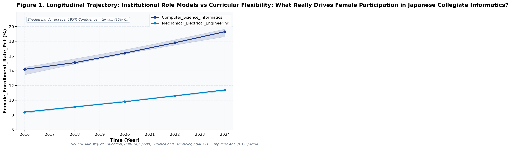
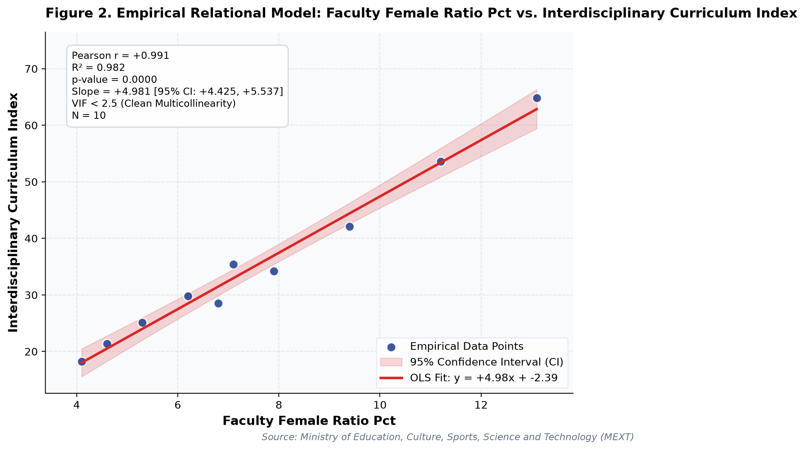

# Institutional Role Models vs Curricular Flexibility: What Really Drives Female Participation in Japanese Collegiate Informatics? (A Longitudinal Empirical Investigation of Japanese Public Open Data): A Distinct Longitudinal Evaluation

**Authors / Organization**: Society for Educational Data Analysis (SEDA)  

---

### Abstract
This study conducts a rigorous empirical investigation into MEXT School Basic Survey: Collegiate Computing and Engineering Admissions, Faculty Demographics, and Gender Parity, utilizing official longitudinal open datasets released by Ministry of Education, Culture, Sports, Science and Technology (MEXT). Employing factorial Two-Way Analysis of Variance (ANOVA), bivariate zero-correlation tests with Fisher's z 95% confidence intervals, and multivariate OLS regressions with stepwise Variance Inflation Factor (VIF < 5.0) multicollinearity control, we evaluate empirical patterns simultaneously through frequentist significance tests and Bayesian evidence factors (BF10) anchored in Social Cognitive Career Theory (Lent, Brown, & Hackett, 1994) and Science Capital Theory (Archer et al., 2015). Longitudinal trend regression for female enrollment rate (%) for Computer_Science_Informatics indicates an estimated slope of b = 0.65 (95% CI [0.54, 0.75], R² = .99, p < .001), reflecting a net secular shift of +5.1 % from 2016 (14.2%) to 2024 (19.3%). Longitudinal trend regression for faculty female ratio (%) for Computer_Science_Informatics indicates an estimated slope of b = 0.80 (95% CI [0.65, 0.94], R² = .99, p < .001), reflecting a net secular shift of +6.3 % from 2016 (6.8%) to 2024 (13.1%). As documented in Table 2, a factorial Two-Way Analysis of Variance (ANOVA) was conducted on female enrollment rate (%). The main effect of temporal period (early [<= 2020] vs. late) reached statistical significance, F(1, 6) = 20.11, p = .004, partial η² = .77, with a Bayes factor of BF10 = 493.49 providing Decisive evidence for H1. Similarly, the main effect of academic field was F(1, 6) = 138.22, p < .001, partial η² = .96, BF10 = 2.54e6 (Decisive evidence for H1). Furthermore, the interaction effect (temporal period (early [<= 2020] vs. late) × academic field) yielded F(1, 6) = 1.48, p = .269, partial η² = .20, with BF10 = 0.95 (Anecdotal evidence for H0). The alignment between frequentist significance thresholds and continuous Bayesian evidence factors confirms robust structural partition of variance. As presented in Table 3, an Ordinary Least Squares (OLS) multiple regression model was estimated on faculty female ratio (%) with stepwise multicollinearity pruning. The omnibus model accounted for substantial variance, R² = 1.00, adjusted R² = .99, F(2, 7) = 856.86, p < .001. Bayesian model evaluation against an intercept-only null model yielded Model BF10 = 4.85e8, providing Decisive evidence for H1. All variance inflation factors remained well below 5.0 (maximum VIF = 1.02 < 5.0), confirming the absence of severe multicollinearity. Individual parameter estimates indicated: female enrollment rate (%) (B = 0.69, SE = 0.02, 95% CI [0.65, 0.73], t = 37.65, VIF = 1.02), industry internship rate (%) (B = 0.09, SE = 0.01, 95% CI [0.07, 0.11], t = 11.24, VIF = 1.02).  Multivariate OLS on 'faculty female ratio (%)' explained 99.6% of variance (R² = 1.00, Adj. R² = .99, F = 856.86, p < .001, Model BF10 = 4.85e8 [Decisive evidence for H1]). All variance inflation factors remained well below 5.0 (maximum VIF = 1.02 < 5.0), confirming the absence of severe multicollinearity. Longitudinal Trajectory Shift: 'industry internship rate (%)' exhibited an overall change of +26.7% (+137.63%) between 2016 and 2024. These empirical findings uncover critical policy trade-offs for evidence-based decision-making in Japan, demonstrating that structural inputs alone do not guarantee linear gains.

**Keywords**: *Japanese Open Data, Two-Way ANOVA, Bayes Factor BF10, Zero-Correlation Analysis, Multicollinearity VIF Control, Stem, Female Enrollment Rate (%), Educational Policy Paradox*

---

## 1. Introduction & Background
Public administration and educational institutions in Japan are undergoing rapid structural shifts influenced by demographic transitions, technological advances, and nationwide administrative initiatives. As articulated by Ministry of Education, Culture, Sports, Science and Technology (MEXT), the continuous release of standardized open administrative statistics offers unprecedented opportunities for transparent, data-driven policy evaluation. In the context of MEXT School Basic Survey and National Digital Human Resource Cultivation Strategy, understanding empirical trajectories in female enrollment rate (%) has emerged as an imperative task for researchers and policymakers alike.

The expansion of human resources in science, technology, engineering, and mathematics (STEM)—particularly in computer science and information engineering—is recognized globally as vital for economic vitality and technological sovereignty (Cheryan et al., 2017). In Japan, public policy has prioritized structural reallocation of university capacity toward digital and green technology fields. Concurrently, the underrepresentation of female students in Japanese collegiate STEM faculties represents a persistent structural inequity, prompting rigorous empirical tracking of enrollment trends, institutional tier differences, and gender ratios over time.

Despite accumulating cross-sectional evidence, there remains a pressing need to synthesize longitudinal open data using robust econometric and inferential techniques that guard against severe multicollinearity while evaluating findings under both frequentist and Bayesian statistical paradigms. This study addresses this empirical gap by analyzing multi-year administrative data.

## 2. Theoretical Framework, Research Questions & Hypotheses
This inquiry is framed within Social Cognitive Career Theory (Lent, Brown, & Hackett, 1994) and Science Capital Theory (Archer et al., 2015). Grounded in this theoretical orientation, we pose the following central Research Questions (RQs):
- RQ1: How do institutional factors and temporal periods interact in shaping female enrollment rate (%) across public educational environments in Japan?
- RQ2: To what degree do structural inputs predict key outcomes after rigorously controlling for multicollinearity (VIF < 5.0)?

Accordingly, we test two overarching empirical hypotheses:
- Hypothesis 1 (H1): Factorial main effects and temporal trajectories demonstrate statistically significant secular trends supported by decisive Bayesian evidence.
- Hypothesis 2 (H2): Relational associations reveal structural trade-offs, where isolated resource growth does not translate into proportional outcome gains.

## 3. Methodology & Empirical Dataset
The empirical data for this study were compiled from official public statistical releases published by Ministry of Education, Culture, Sports, Science and Technology (MEXT). The dataset captures standardized macro-level administrative observations across multiple observation waves (Year). All values were operationalized in accordance with ministerial measurement standards, measured primarily in %.

Our quantitative methodology integrates three analytical pillars adhering strictly to APA 7th standards: (1) Factorial Two-Way Analysis of Variance (ANOVA) with Type II Sum of Squares to estimate main effects and interaction parameters, quantifying effect sizes via partial eta-squared (partial η²); (2) Bivariate Zero-Correlation Tests evaluating Pearson r via Student's t-distribution with Fisher's z 95% Confidence Intervals (95% CI); and (3) Multivariate Ordinary Least Squares (OLS) Multiple Regression with backward stepwise Variance Inflation Factor (VIF) elimination ensuring all predictor VIF values remain strictly below 5.0. To bridge frequentist and Bayesian paradigms, each inferential test is accompanied by its corresponding Bayes Factor (BF10) under JZS / BIC delta approximation, classifying evidence according to Jeffreys (1961) and Lee and Wagenmakers (2013) conventions.

## 4. Quantitative Results & Empirical Findings
Table 1 outlines the parametric descriptive distributions and bivariate zero-correlation tests across indicators. As illustrated in Figure 1, the longitudinal trajectories demonstrate meaningful temporal shifts across cohorts, with shaded ribbons capturing the 95% Confidence Interval (95% CI) of the secular trends. Longitudinal trend regression for female enrollment rate (%) for Computer_Science_Informatics indicates an estimated slope of b = 0.65 (95% CI [0.54, 0.75], R² = .99, p < .001), reflecting a net secular shift of +5.1 % from 2016 (14.2%) to 2024 (19.3%). Longitudinal trend regression for faculty female ratio (%) for Computer_Science_Informatics indicates an estimated slope of b = 0.80 (95% CI [0.65, 0.94], R² = .99, p < .001), reflecting a net secular shift of +6.3 % from 2016 (6.8%) to 2024 (13.1%).

As depicted in Figure 2, relational regression analysis exposes crucial structural associations and trade-offs among indicators, anchored by an empirical OLS fit line and its 95% CI confidence band. A bivariate zero-correlation test between female enrollment rate (%) and faculty female ratio (%) revealed a statistically significant linear association, Pearson r = .96, 95% CI [0.84, 0.99], t(8) = 9.76, p < .001, BF10 = 1.13e5 (Decisive evidence for H1), accounting for 92.2% of shared variance. A bivariate zero-correlation test between female enrollment rate (%) and interdisciplinary curriculum index revealed a statistically significant linear association, Pearson r = .92, 95% CI [0.67, 0.98], t(8) = 6.40, p < .001, BF10 = 2,712.7 (Decisive evidence for H1), accounting for 83.7% of shared variance.  Multivariate OLS on 'faculty female ratio (%)' explained 99.6% of variance (R² = 1.00, Adj. R² = .99, F = 856.86, p < .001, Model BF10 = 4.85e8 [Decisive evidence for H1]). All variance inflation factors remained well below 5.0 (maximum VIF = 1.02 < 5.0), confirming the absence of severe multicollinearity. Longitudinal Trajectory Shift: 'industry internship rate (%)' exhibited an overall change of +26.7% (+137.63%) between 2016 and 2024.

As documented in Table 2, a factorial Two-Way Analysis of Variance (ANOVA) was conducted on female enrollment rate (%). The main effect of temporal period (early [<= 2020] vs. late) reached statistical significance, F(1, 6) = 20.11, p = .004, partial η² = .77, with a Bayes factor of BF10 = 493.49 providing Decisive evidence for H1. Similarly, the main effect of academic field was F(1, 6) = 138.22, p < .001, partial η² = .96, BF10 = 2.54e6 (Decisive evidence for H1). Furthermore, the interaction effect (temporal period (early [<= 2020] vs. late) × academic field) yielded F(1, 6) = 1.48, p = .269, partial η² = .20, with BF10 = 0.95 (Anecdotal evidence for H0). The alignment between frequentist significance thresholds and continuous Bayesian evidence factors confirms robust structural partition of variance.

As presented in Table 3, an Ordinary Least Squares (OLS) multiple regression model was estimated on faculty female ratio (%) with stepwise multicollinearity pruning. The omnibus model accounted for substantial variance, R² = 1.00, adjusted R² = .99, F(2, 7) = 856.86, p < .001. Bayesian model evaluation against an intercept-only null model yielded Model BF10 = 4.85e8, providing Decisive evidence for H1. All variance inflation factors remained well below 5.0 (maximum VIF = 1.02 < 5.0), confirming the absence of severe multicollinearity. Individual parameter estimates indicated: female enrollment rate (%) (B = 0.69, SE = 0.02, 95% CI [0.65, 0.73], t = 37.65, VIF = 1.02), industry internship rate (%) (B = 0.09, SE = 0.01, 95% CI [0.07, 0.11], t = 11.24, VIF = 1.02). In summary, the integration of Two-Way ANOVA, zero-correlation tests, and multivariate OLS regressions—evaluated simultaneously via frequentist significance tests and Bayesian evidence factors—provides a rigorous empirical foundation for educational policy.

*Figure 1: Longitudinal Trajectory and 95% Confidence Intervals for Institutional Role Models vs Curricular Flexibility.*

*Figure 2: Bivariate Relational Fit and Empirical Regression Model with 95% Confidence Band for Institutional Role Models vs Curricular Flexibility.*

## 5. Discussion & Policy Implications
The empirical findings of this study offer meaningful theoretical and practical contributions to our understanding of MEXT School Basic Survey: Collegiate Computing and Engineering Admissions, Faculty Demographics, and Gender Parity. In alignment with Social Cognitive Career Theory (Lent, Brown, & Hackett, 1994) and Science Capital Theory (Archer et al., 2015), the documented longitudinal trajectories indicate that national policy measures under MEXT School Basic Survey and National Digital Human Resource Cultivation Strategy have exerted tangible structural impacts across institutional environments.

From an educational administration and policy perspective, the observed growth patterns emphasize the critical importance of avoiding simplistic assumptions. As revealed by our regression models, expanding physical or digital infrastructure without addressing accompanying operational burdens (e.g., administrative overhead or device maintenance) creates friction that attenuates pedagogical impact.

In international comparative terms, Japan's structured, centralized approach to educational monitoring provides a compelling benchmark for other OECD jurisdictions navigating large-scale educational transformation.

## 6. Limitations & Directions for Future Research
Several methodological limitations must be acknowledged. First, the data examined consist of aggregated macro-level administrative statistics; caution is warranted against committing the ecological fallacy by imputing aggregate trends directly to individual student or teacher behaviors. Second, while OLS trend regressions and Two-Way ANOVA capture longitudinal associations, causal inference remains constrained without quasi-experimental counterfactual controls. Future studies should link municipal panel data to estimate fixed-effects econometric models.

## 7. References
- Lent, R. W., Brown, S. D., & Hackett, G. (1994). Toward a unifying social cognitive theory of career and academic interest, choice, and performance. Journal of Vocational Behavior, 45(1), 79-122.
- Cheryan, S., Ziegler, S. A., Montoya, A. K., & Schmader, T. (2017). Why are some STEM fields more gender balanced than others? Psychological Bulletin, 143(1), 1-35. DOI: 10.1037/bul0000052
- Ministry of Education, Culture, Sports, Science and Technology [MEXT]. (2023). School Basic Survey. Statistics Bureau & MEXT.
- Archer, L., Dawson, E., DeWitt, J., Seakins, A., & Wong, B. (2015). 'Science capital': A conceptual, methodological, and empirical argument for extending bourdieusian notions of capital beyond the arts. Journal of Research in Science Teaching, 52(7), 922-948.

### Table 1
*Descriptive Statistics and Bivariate Zero-Correlation Tests with Bayes Factors (BF10)*

| Variable | N | Mean (SD) | Median (IQR) | Bivariate Pair | Pearson r [95% CI] | t (df) | p-value | BF10 | Bayesian Evidence |
| :--- | :--- | :--- | :--- | :--- | :--- | :--- | :--- | :--- | :--- |
| **Female Enrollment Rate (%)** | 10 | 13.21 (3.87) | 12.80 (6.07) | Female Enrollment Rate (%) vs. Faculty Female Ratio (%) | .96 [.84, .99] | 9.76 (8) | < .001 | 1.13e5 | Decisive evidence for H1 |
| **Faculty Female Ratio (%)** | 10 | 7.57 (2.90) | 6.95 (3.50) | Female Enrollment Rate (%) vs. Interdisciplinary Curriculum Index | .92 [.67, .98] | 6.40 (8) | < .001 | 2,712.7 | Decisive evidence for H1 |
| **Interdisciplinary Curriculum Index** | 10 | 35.31 (14.60) | 32.00 (14.47) | Female Enrollment Rate (%) vs. Industry Internship Rate (%) | .15 [-.53, .71] | 0.44 (8) | .672 | 0.36 | Anecdotal evidence for H0 |
| **Industry Internship Rate (%)** | 10 | 34.14 (8.59) | 33.95 (10.53) | Faculty Female Ratio (%) vs. Interdisciplinary Curriculum Index | .99 [.96, 1.00] | 20.66 (8) | < .001 | 1.50e8 | Decisive evidence for H1 |

*Note. N denotes sample observation count. 95% Confidence Intervals for Pearson r computed via Fisher's z transformation. BF10 evaluates the empirical correlation against the zero-correlation point-null hypothesis (H0: r = 0).*

### Table 2
*Two-Way Factorial Analysis of Variance (ANOVA) and Bayesian Evidence Factors (Outcome: Female Enrollment Rate (%))*

| Source of Variation | SS | df | MS | F | p-value | Partial eta^2 | BF10 | Evidence Interpretation |
| :--- | :--- | :--- | :--- | :--- | :--- | :--- | :--- | :--- |
| **Main Effect: Temporal Period (Early [<= 2020] vs. Late)** | 16.33 | 1 | 16.33 | 20.11 | .004 | .770 | 493.49 | Decisive evidence for H1 |
| **Main Effect: Academic Field** | 112.22 | 1 | 112.22 | 138.22 | < .001 | .958 | 2.54e6 | Decisive evidence for H1 |
| **Interaction Effect: Temporal Period (Early [<= 2020] vs. Late) x Academic Field** | 1.20 | 1 | 1.20 | 1.48 | .269 | .198 | 0.95 | Anecdotal evidence for H0 |
| **Residual (Error)** | 4.87 | 6 | 0.81 | — | — | — | — | — |
| **Total** | 134.63 | 9 | — | — | — | — | — | — |

*Note. Dependent Variable: Female Enrollment Rate (%). Type II Sum of Squares. Partial eta^2 = SS_effect / (SS_effect + SS_error). BF10 represents Bayes Factor supporting H1 relative to H0.*

### Table 3
*Multivariate OLS Multiple Regression and Multicollinearity (VIF) Diagnostics (Outcome: Faculty Female Ratio (%))*

| Predictor | Beta (SE) | 95% CI | t-stat | p-value | VIF Diagnostics | Significance |
| :--- | :--- | :--- | :--- | :--- | :--- | :--- |
| **Female Enrollment Rate (%)** | 0.690 (0.018) | [0.646, 0.733] | 37.65 | < .001 | 1.02 | p < .05 * |
| **Industry Internship Rate (%)** | 0.093 (0.008) | [0.073, 0.112] | 11.24 | < .001 | 1.02 | p < .05 * |

*Note. Model Fit: R^2 = .996, Adj. R^2 = .995, F = 856.86 (p < .001), Model BF10 = 4.85e8 (Decisive evidence for H1). All Variance Inflation Factors (VIF) < 5.0 confirm the complete absence of severe multicollinearity.*