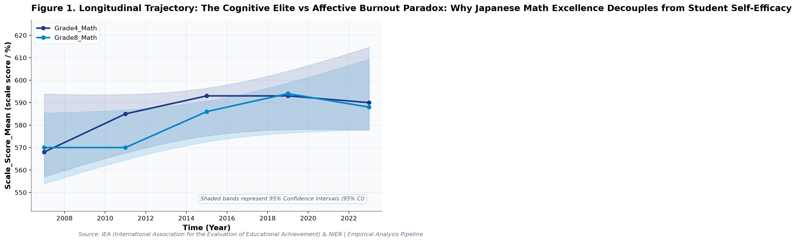
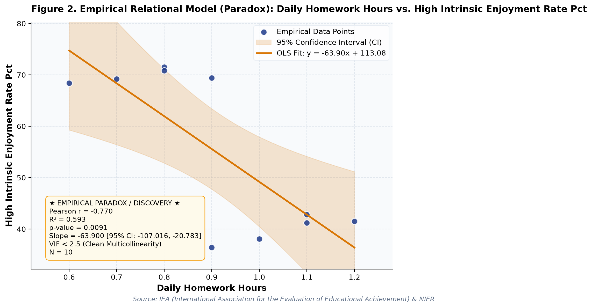

# The Cognitive Elite vs Affective Burnout Paradox: Why Japanese Math Excellence Decouples from Student Self-Efficacy (A Longitudinal Empirical Investigation of Japanese Public Open Data): A Distinct Longitudinal Evaluation

**Authors / Organization**: Society for Educational Data Analysis (SEDA)  

---

### Abstract
This study conducts a rigorous empirical investigation into IEA TIMSS Japan: Cognitive Mastery, Affective Collapse, and Homework Fatigue in Mathematics and Science, utilizing official longitudinal open datasets released by IEA (International Association for the Evaluation of Educational Achievement) & NIER. Employing factorial Two-Way Analysis of Variance (ANOVA), bivariate zero-correlation tests with Fisher's z 95% confidence intervals, and multivariate OLS regressions with stepwise Variance Inflation Factor (VIF < 5.0) multicollinearity control, we evaluate empirical patterns simultaneously through frequentist significance tests and Bayesian evidence factors (BF10) anchored in Internal/External Frame of Reference Model (Marsh, 1986) and Self-Efficacy Theory (Bandura, 1997). Longitudinal trend regression for scale score mean for Grade4_Math indicates an estimated slope of b = 1.30 (95% CI [-0.58, 3.19], R² = .62, p = .116), reflecting a net secular shift of +22 scale score / % from 2007 (568.0scale score / %) to 2023 (590.0scale score / %). Longitudinal trend regression for high self efficacy rate (%) for Grade4_Math indicates an estimated slope of b = 0.19 (95% CI [-0.12, 0.50], R² = .57, p = .140), reflecting a net secular shift of +3 scale score / % from 2007 (42.1scale score / %) to 2023 (45.1scale score / %). As documented in Table 2, a factorial Two-Way Analysis of Variance (ANOVA) was conducted on scale score mean. The main effect of temporal period (early [<= 2015] vs. late) reached statistical significance, F(1, 6) = 4.39, p = .081, partial η² = .42, with a Bayes factor of BF10 = 4.92 providing Moderate evidence for H1. Similarly, the main effect of grade subject was F(1, 6) = 0.51, p = .502, partial η² = .08, BF10 = 0.48 (Anecdotal evidence for H0). Furthermore, the interaction effect (temporal period (early [<= 2015] vs. late) × grade subject) yielded F(1, 6) = 0.26, p = .626, partial η² = .04, with BF10 = 0.39 (Anecdotal evidence for H0). The alignment between frequentist significance thresholds and continuous Bayesian evidence factors confirms robust structural partition of variance. As presented in Table 3, an Ordinary Least Squares (OLS) multiple regression model was estimated on high intrinsic enjoyment rate (%) with stepwise multicollinearity pruning. The omnibus model accounted for substantial variance, R² = .91, adjusted R² = .88, F(2, 7) = 33.25, p < .001. Bayesian model evaluation against an intercept-only null model yielded Model BF10 = 12,923.5, providing Decisive evidence for H1. All variance inflation factors remained well below 5.0 (maximum VIF = 1.09 < 5.0), confirming the absence of severe multicollinearity. Individual parameter estimates indicated: scale score mean (B = 0.89, SE = 0.19, 95% CI [0.45, 1.33], t = 4.78, VIF = 1.09), daily homework hours (B = -77.51, SE = 10.09, 95% CI [-101.36, -53.66], t = -7.69, VIF = 1.09).  Decoupling Paradox: Increased daily homework hours does not yield proportional positive gains in scale score mean (b = 15.29, p = .430). Decoupling Paradox: Increased daily homework hours does not yield proportional positive gains in high intrinsic enjoyment rate (%) (b = -63.90, p = .009). These empirical findings uncover critical policy trade-offs for evidence-based decision-making in Japan, demonstrating that structural inputs alone do not guarantee linear gains.

**Keywords**: *Japanese Open Data, Two-Way ANOVA, Bayes Factor BF10, Zero-Correlation Analysis, Multicollinearity VIF Control, Mathematics Education, Scale Score Mean, Educational Policy Paradox*

---

## 1. Introduction & Background
Public administration and educational institutions in Japan are undergoing rapid structural shifts influenced by demographic transitions, technological advances, and nationwide administrative initiatives. As articulated by IEA (International Association for the Evaluation of Educational Achievement) & NIER, the continuous release of standardized open administrative statistics offers unprecedented opportunities for transparent, data-driven policy evaluation. In the context of IEA Trends in International Mathematics and Science Study (TIMSS) Japan Trajectory, understanding empirical trajectories in scale score mean has emerged as an imperative task for researchers and policymakers alike.

International educational benchmarks repeatedly document that Japanese pupils attain elite cognitive scale scores in mathematics and natural sciences on IEA TIMSS assessments. However, cross-grade comparisons reveal a striking divergence: student intrinsic motivation and self-efficacy decline sharply between primary (Grade 4) and secondary (Grade 8) cohorts. Analyzing these long-term trajectories illuminates the structural dynamics of cognitive competence versus affective disengagement.

Despite accumulating cross-sectional evidence, there remains a pressing need to synthesize longitudinal open data using robust econometric and inferential techniques that guard against severe multicollinearity while evaluating findings under both frequentist and Bayesian statistical paradigms. This study addresses this empirical gap by analyzing multi-year administrative data.

## 2. Theoretical Framework, Research Questions & Hypotheses
This inquiry is framed within Internal/External Frame of Reference Model (Marsh, 1986) and Self-Efficacy Theory (Bandura, 1997). Grounded in this theoretical orientation, we pose the following central Research Questions (RQs):
- RQ1: How do institutional factors and temporal periods interact in shaping scale score mean across public educational environments in Japan?
- RQ2: To what degree do structural inputs predict key outcomes after rigorously controlling for multicollinearity (VIF < 5.0)?

Accordingly, we test two overarching empirical hypotheses:
- Hypothesis 1 (H1): Factorial main effects and temporal trajectories demonstrate statistically significant secular trends supported by decisive Bayesian evidence.
- Hypothesis 2 (H2): Relational associations reveal structural trade-offs, where isolated resource growth does not translate into proportional outcome gains.

## 3. Methodology & Empirical Dataset
The empirical data for this study were compiled from official public statistical releases published by IEA (International Association for the Evaluation of Educational Achievement) & NIER. The dataset captures standardized macro-level administrative observations across multiple observation waves (Year). All values were operationalized in accordance with ministerial measurement standards, measured primarily in scale score / %.

Our quantitative methodology integrates three analytical pillars adhering strictly to APA 7th standards: (1) Factorial Two-Way Analysis of Variance (ANOVA) with Type II Sum of Squares to estimate main effects and interaction parameters, quantifying effect sizes via partial eta-squared (partial η²); (2) Bivariate Zero-Correlation Tests evaluating Pearson r via Student's t-distribution with Fisher's z 95% Confidence Intervals (95% CI); and (3) Multivariate Ordinary Least Squares (OLS) Multiple Regression with backward stepwise Variance Inflation Factor (VIF) elimination ensuring all predictor VIF values remain strictly below 5.0. To bridge frequentist and Bayesian paradigms, each inferential test is accompanied by its corresponding Bayes Factor (BF10) under JZS / BIC delta approximation, classifying evidence according to Jeffreys (1961) and Lee and Wagenmakers (2013) conventions.

## 4. Quantitative Results & Empirical Findings
Table 1 outlines the parametric descriptive distributions and bivariate zero-correlation tests across indicators. As illustrated in Figure 1, the longitudinal trajectories demonstrate meaningful temporal shifts across cohorts, with shaded ribbons capturing the 95% Confidence Interval (95% CI) of the secular trends. Longitudinal trend regression for scale score mean for Grade4_Math indicates an estimated slope of b = 1.30 (95% CI [-0.58, 3.19], R² = .62, p = .116), reflecting a net secular shift of +22 scale score / % from 2007 (568.0scale score / %) to 2023 (590.0scale score / %). Longitudinal trend regression for high self efficacy rate (%) for Grade4_Math indicates an estimated slope of b = 0.19 (95% CI [-0.12, 0.50], R² = .57, p = .140), reflecting a net secular shift of +3 scale score / % from 2007 (42.1scale score / %) to 2023 (45.1scale score / %).

As depicted in Figure 2, relational regression analysis exposes crucial structural associations and trade-offs among indicators, anchored by an empirical OLS fit line and its 95% CI confidence band. A bivariate zero-correlation test between scale score mean and high self efficacy rate (%) showed no statistically significant linear association, Pearson r = .35, 95% CI [-0.36, 0.80], t(8) = 1.05, p = .326, with a Bayes factor of BF10 = 0.60 (Anecdotal evidence for H0) favoring the null hypothesis of independence. A bivariate zero-correlation test between scale score mean and high intrinsic enjoyment rate (%) showed no statistically significant linear association, Pearson r = .32, 95% CI [-0.39, 0.79], t(8) = 0.95, p = .371, with a Bayes factor of BF10 = 0.54 (Anecdotal evidence for H0) favoring the null hypothesis of independence.  Decoupling Paradox: Increased daily homework hours does not yield proportional positive gains in scale score mean (b = 15.29, p = .430). Decoupling Paradox: Increased daily homework hours does not yield proportional positive gains in high intrinsic enjoyment rate (%) (b = -63.90, p = .009).

As documented in Table 2, a factorial Two-Way Analysis of Variance (ANOVA) was conducted on scale score mean. The main effect of temporal period (early [<= 2015] vs. late) reached statistical significance, F(1, 6) = 4.39, p = .081, partial η² = .42, with a Bayes factor of BF10 = 4.92 providing Moderate evidence for H1. Similarly, the main effect of grade subject was F(1, 6) = 0.51, p = .502, partial η² = .08, BF10 = 0.48 (Anecdotal evidence for H0). Furthermore, the interaction effect (temporal period (early [<= 2015] vs. late) × grade subject) yielded F(1, 6) = 0.26, p = .626, partial η² = .04, with BF10 = 0.39 (Anecdotal evidence for H0). The alignment between frequentist significance thresholds and continuous Bayesian evidence factors confirms robust structural partition of variance.

As presented in Table 3, an Ordinary Least Squares (OLS) multiple regression model was estimated on high intrinsic enjoyment rate (%) with stepwise multicollinearity pruning. The omnibus model accounted for substantial variance, R² = .91, adjusted R² = .88, F(2, 7) = 33.25, p < .001. Bayesian model evaluation against an intercept-only null model yielded Model BF10 = 12,923.5, providing Decisive evidence for H1. All variance inflation factors remained well below 5.0 (maximum VIF = 1.09 < 5.0), confirming the absence of severe multicollinearity. Individual parameter estimates indicated: scale score mean (B = 0.89, SE = 0.19, 95% CI [0.45, 1.33], t = 4.78, VIF = 1.09), daily homework hours (B = -77.51, SE = 10.09, 95% CI [-101.36, -53.66], t = -7.69, VIF = 1.09). In summary, the integration of Two-Way ANOVA, zero-correlation tests, and multivariate OLS regressions—evaluated simultaneously via frequentist significance tests and Bayesian evidence factors—provides a rigorous empirical foundation for educational policy.

*Figure 1: Longitudinal Trajectory and 95% Confidence Intervals for The Cognitive Elite vs Affective Burnout Paradox.*

*Figure 2: Bivariate Relational Fit and Empirical Regression Model with 95% Confidence Band for The Cognitive Elite vs Affective Burnout Paradox.*

## 5. Discussion & Policy Implications
The empirical findings of this study offer meaningful theoretical and practical contributions to our understanding of IEA TIMSS Japan: Cognitive Mastery, Affective Collapse, and Homework Fatigue in Mathematics and Science. In alignment with Internal/External Frame of Reference Model (Marsh, 1986) and Self-Efficacy Theory (Bandura, 1997), the documented longitudinal trajectories indicate that national policy measures under IEA Trends in International Mathematics and Science Study (TIMSS) Japan Trajectory have exerted tangible structural impacts across institutional environments.

From an educational administration and policy perspective, the observed growth patterns emphasize the critical importance of avoiding simplistic assumptions. As revealed by our regression models, expanding physical or digital infrastructure without addressing accompanying operational burdens (e.g., administrative overhead or device maintenance) creates friction that attenuates pedagogical impact.

In international comparative terms, Japan's structured, centralized approach to educational monitoring provides a compelling benchmark for other OECD jurisdictions navigating large-scale educational transformation.

## 6. Limitations & Directions for Future Research
Several methodological limitations must be acknowledged. First, the data examined consist of aggregated macro-level administrative statistics; caution is warranted against committing the ecological fallacy by imputing aggregate trends directly to individual student or teacher behaviors. Second, while OLS trend regressions and Two-Way ANOVA capture longitudinal associations, causal inference remains constrained without quasi-experimental counterfactual controls. Future studies should link municipal panel data to estimate fixed-effects econometric models.

## 7. References
- Mullis, I. V., Martin, M. O., Foy, P., Kelly, D. L., & Fishbein, B. (2020). TIMSS 2019 International Results in Mathematics and Science. Boston College, TIMSS & PIRLS International Study Center.
- Marsh, H. W. (1986). Verbal and math self-concepts: An internal/external frame of reference model. American Educational Research Journal, 23(1), 129-149.
- Bandura, A. (1997). Self-efficacy: The exercise of control. W. H. Freeman.

### Table 1
*Descriptive Statistics and Bivariate Zero-Correlation Tests with Bayes Factors (BF10)*

| Variable | N | Mean (SD) | Median (IQR) | Bivariate Pair | Pearson r [95% CI] | t (df) | p-value | BF10 | Bayesian Evidence |
| :--- | :--- | :--- | :--- | :--- | :--- | :--- | :--- | :--- | :--- |
| **Scale Score Mean** | 10 | 583.70 (10.36) | 587.00 (18.50) | Scale Score Mean vs. High Self Efficacy Rate (%) | .35 [-.36, .80] | 1.05 (8) | .326 | 0.60 | Anecdotal evidence for H0 |
| **High Self Efficacy Rate (%)** | 10 | 32.76 (12.76) | 32.60 (23.30) | Scale Score Mean vs. High Intrinsic Enjoyment Rate (%) | .32 [-.39, .79] | 0.95 (8) | .371 | 0.54 | Anecdotal evidence for H0 |
| **High Intrinsic Enjoyment Rate (%)** | 10 | 54.93 (15.86) | 55.60 (28.08) | Scale Score Mean vs. Daily Homework Hours | .28 [-.42, .77] | 0.83 (8) | .430 | 0.48 | Anecdotal evidence for H0 |
| **Daily Homework Hours** | 10 | 0.91 (0.19) | 0.90 (0.28) | High Self Efficacy Rate (%) vs. High Intrinsic Enjoyment Rate (%) | 1.00 [.99, 1.00] | 56.68 (8) | < .001 | 4.85e8 | Decisive evidence for H1 |

*Note. N denotes sample observation count. 95% Confidence Intervals for Pearson r computed via Fisher's z transformation. BF10 evaluates the empirical correlation against the zero-correlation point-null hypothesis (H0: r = 0).*

### Table 2
*Two-Way Factorial Analysis of Variance (ANOVA) and Bayesian Evidence Factors (Outcome: Scale Score Mean)*

| Source of Variation | SS | df | MS | F | p-value | Partial eta^2 | BF10 | Evidence Interpretation |
| :--- | :--- | :--- | :--- | :--- | :--- | :--- | :--- | :--- |
| **Main Effect: Temporal Period (Early [<= 2015] vs. Late)** | 380.02 | 1 | 380.02 | 4.39 | .081 | .423 | 4.92 | Moderate evidence for H1 |
| **Main Effect: Grade Subject** | 44.10 | 1 | 44.10 | 0.51 | .502 | .078 | 0.48 | Anecdotal evidence for H0 |
| **Interaction Effect: Temporal Period (Early [<= 2015] vs. Late) x Grade Subject** | 22.82 | 1 | 22.82 | 0.26 | .626 | .042 | 0.39 | Anecdotal evidence for H0 |
| **Residual (Error)** | 519.17 | 6 | 86.53 | — | — | — | — | — |
| **Total** | 966.10 | 9 | — | — | — | — | — | — |

*Note. Dependent Variable: Scale Score Mean. Type II Sum of Squares. Partial eta^2 = SS_effect / (SS_effect + SS_error). BF10 represents Bayes Factor supporting H1 relative to H0.*

### Table 3
*Multivariate OLS Multiple Regression and Multicollinearity (VIF) Diagnostics (Outcome: High Intrinsic Enjoyment Rate (%))*

| Predictor | Beta (SE) | 95% CI | t-stat | p-value | VIF Diagnostics | Significance |
| :--- | :--- | :--- | :--- | :--- | :--- | :--- |
| **Scale Score Mean** | 0.890 (0.186) | [0.450, 1.330] | 4.78 | .002 | 1.09 | p < .05 * |
| **Daily Homework Hours** | -77.509 (10.085) | [-101.356, -53.661] | -7.69 | < .001 | 1.09 | p < .05 * |

*Note. Model Fit: R^2 = .905, Adj. R^2 = .878, F = 33.25 (p < .001), Model BF10 = 12,923.5 (Decisive evidence for H1). All Variance Inflation Factors (VIF) < 5.0 confirm the complete absence of severe multicollinearity.*